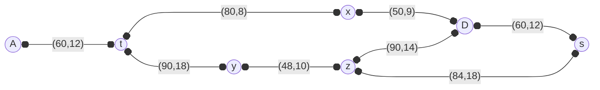

## تمرین ۴

در توپولوژی زیر، سه الگوریتم EIGRP و OSPF و RIP را بر روی مسیرهای بین مبدا A و مقصد S اجرا کنید.

مسیرهای موجود از A به S:

* $P_1$ :  A -> t -> x -> D -> S
* $P_2$ :  A -> t -> x -> D -> z -> S
* $P_3$ :  A -> t -> y -> z -> S
* $P_4$ :  A -> t -> y -> z -> D -> S

### RIP

- هزینه را برابر تعداد پرش در نظر میگیریم.
- همگی با یک پرش به همسایه‌های خود می‌روند.
- روتر A از طریق t متوجه می‌شود با 2 پرش می‌تواند به x و y برسد.
- روتر t متوجه می‌شود با 2 پرش می‌تواند به z و D برسد.
- روتر x متوجه می‌شود با 2 پرش می‌تواند به A و y و s برسد.
- روتر y متوجه می‌شود با 2 پرش می‌تواند به A و D و s برسد.
- روتر z متوجه می‌شود با 2 پرش می‌تواند به t و x و D و s برسد.
- روتر D متوجه می‌شود با 2 پرش می‌تواند به z و t و y برسد.
- روتر s متوجه می‌شود با 2 پرش می‌تواند به x و z و y و D برسد.
- سپس یافته‌های خود را با هم به اشتراک می‌گذارند و کم‌ترین تعداد پرش را در نظر می‌گیرند.
- روتر A متوجه می‌شود با 2+2=4 پرش از طریق مسیر A->t->x->D->S به مقصد برسد.
     و با 4=2+2 پرش از طریق مسیر A->t->y->z->S به مقصد برسد.

> [!NOTE:] الگوریتم از توپولوژی شبکه اطلاعی ندارد و باید از همسایه‌ها تعداد پرش‌ها را محاسبه کند.

بهترین مسیرها، $P_1$ و $P_3$ هستند که می‌توان یکی را انتخاب کرد یا load balance کرد.

### OSPF

ابتدا هزینه‌های هر مسیر رو محاسبه میکنیم (reference bandwidth = 100)

$P_1$ :  A -> t -> x -> D -> S
$Metric_{P1} = \dfrac{100}{60} + \dfrac{100}{80} + \dfrac{100}{50} + \dfrac{100}{60} \approx 6.584$

$P_2$ :  A -> t -> x -> D -> z -> S
$Metric_{P_2} = \dfrac{100}{60} + \dfrac{100}{80} + \dfrac{100}{50} + \dfrac{100}{90} + \dfrac{100}{84} \approx 7.218$

$P_3$ :  A -> t -> y -> z -> S
$Metric_{P_3} = \dfrac{100}{60} + \dfrac{100}{90}  + \dfrac{100}{48} + \dfrac{100}{84} \approx 6.051$

$P_4$ :  A -> t -> y -> z -> D -> S
$Metric_{P_4} = \dfrac{100}{60} + \dfrac{100}{90} + \dfrac{100}{48} + \dfrac{100}{90} + \dfrac{100}{60} = 7.639$

بنابر این بهترین مسیر، مسیر $P_3$ است.

### EIGRP

$P_1$ :  A -> t -> x -> D -> S

$LeastBandwidth(P_1) = min\{60, 80, 50, 60\} = 50$
$CumulativeDelay(P_1) = 12 + 8 + 9 + 12 = 41$
$Metric(P_1) = \Big(\dfrac{10^7}{LeastBandwidth(P_1)} + CumulativeDelay(P_1)\Big) \times 256 = \Big(\dfrac{10^7}{50} + 41\Big) \times 256 = 51,210,496$

$P_2$ :  A -> t -> x -> D -> z -> S

$LeastBandwidth(P_2) = min\{60, 80, 50, 90, 84\} = 50$
$CumulativeDelay(P_2) = 12 + 8 + 9 + 14 + 18 = 61$
$Metric(P_2) = \Big(\dfrac{10^7}{LeastBandwidth(P_2)} + CumulativeDelay(P_2)\Big) \times 256 = \Big(\dfrac{10^7}{50} + 61\Big) \times 256 = 51,215,616$

$P_3$ :  A -> t -> y -> z -> S

$LeastBandwidth(P_3) = min\{60, 90, 48, 84\} = 48$ 
$CumulativeDelay(P_3) = 12 + 18 + 10 + 18 = 58$
$Metric(P_3) = \Big(\dfrac{10^7}{LeastBandwidth(P_3)} + CumulativeDelay(P_3)\Big) \times 256 = \Big(\dfrac{10^7}{48} + 58\Big) \times 256 \approx 53,348,181$

$P_4$ :  A -> t -> y -> z -> D -> S

$LeastBandwidth(P_4) = min\{60, 90, 48, 90, 60\} = 48$ 
$CumulativeDelay(P_4) = 12 + 18 + 10 + 14 + 12 = 66$
$Metric(P_4) = \Big(\dfrac{10^7}{LeastBandwidth(P_4)} + CumulativeDelay(P_4)\Big) \times 256 = \Big(\dfrac{10^7}{48} + 66\Big) \times 256 \approx 53,350,229$

کمترین Metric یعنی $P_1$ به عنوان مسیر انتخاب میشود.
