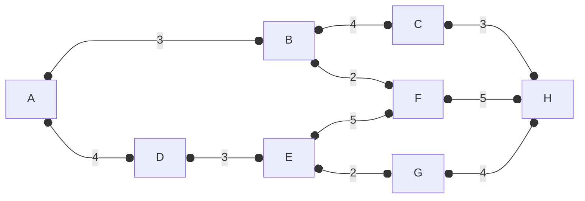

## تمرین ۳
با استفاده از LS و DV،‌ مسیر منتخب برای روتینگ را مشخص کنید. مبدا گره A و مقصد گره H است.

$P_1$  :  A -> B -> C -> H
$P_2$  :  A -> B -> F -> H
$P_3$  :  A -> D -> E -> G -> H
$P_4$  : A -> D -> E -> F -> H

### Link State (LS)

$P_1$  :  A -> B -> C -> H
$Cost(P_1) = 3 + 4 + 3 = 10$

$P_2$  :  A -> B -> F -> H
$Cost(P_2) = 3 + 2 + 5 = 10$

$P_3$  :  A -> D -> E -> G -> H
$Cost(P_3) = 4 + 3 + 2 + 4 = 13$

$P_4$  : A -> D -> E -> F -> H
$Cost(P_4) = 4 + 3 + 5 + 5 = 17$

بنابراین یکی از مسیرهای $P_1$ یا $P_2$ انتخاب خواهد شد.

### Distance Vector (DV)

ابتدا
- روتر A متوجه می‌شود به B و D با هزینه‌های 3 و 4 متصل است.
- روتر B متوجه می‌شود به A و C و F با هزینه‌های 3 و 4 و 2 متصل است.
- روتر C متوجه می‌شود به B و H با هزینه‌های 4 و 3 متصل است.
- روتر D متوجه می‌شود به A و E با هزینه‌های 4 و 3 متصل است.
- روتر E متوجه می‌شود به D و F و G با هزینه‌های 3 و 5 و 2 متصل است.
- روتر F متوجه می‌شود به B و E و H با هزینه‌های 2 و 5 و 5 متصل است.
- روتر G متوجه می‌شود به E و H با هزینه‌های 2 و 4 متصل است.
- روتر H متوجه می‌شود به C و F و G با هزینه‌های 3 و 5 و 4 متصل است.

سپس هر روتر جدول همسایه‌های خود را دریافت می‌کند:
- روتر A لیست B و D را دریافت می‌کند و متوجه میشود به B به C، هزینه 4 و به F، هزینه 2 را دارد.
      و از D متوجه می‌شود به E با هزینه 3 راه دارد.
      پس: 
	$A\rightarrow B = 3 = 3(B)$
	$A\rightarrow D = 4 = 4(D)$
	
	$A\rightarrow C = 3+4 = 7 (B)$
	$A\rightarrow F = 3 + 2 = 5(B)$
	
	$A \rightarrow E = 4 + 3 = 7(D)$

- روتر B لیست A و C و F را دریافت می‌کند:
       از روتر C متوجه می‌شود به H با هزینه 3 مسیر هست.
       از روتر F متوجه می‌شود به E و H با هزینه‌های 5 و 5 مسیر هست.

	$B\rightarrow A = 3 = 3(A)$
	$B\rightarrow C = 4 = 4(C)$
	$B\rightarrow F = 2 = 2(F)$
	
	$B\rightarrow H = 4 + 3 = 7(C) *$
	
	$B \rightarrow H = 2 + 5 = 7(F) *$
	$B\rightarrow E = 2 + 5 = 7(F)$

- روتر C لیست B و H را دریافت می‌کند:
      از روتر H متوجه می‌شود به F و G با هزینه‌های 5 و 4 مسیر هست.
	$C\rightarrow B = 4 = 4(B)$
	$C\rightarrow H = 3 = 3(H)$
	
	$C\rightarrow F = 3 + 5 = 8(H)$
	$C\rightarrow G = 3 + 4 = 7(H)$
- روتر D لیست A و  E را دریافت می‌کند:
      از روتر E متوجه می‌شود به F و G با هزینه‌های 5 و 2 مسیر هست.
	$D\rightarrow A = 4 = 4(A)$
	$D\rightarrow E = 3 = 3(E)$
	
	$D\rightarrow F = 3 + 5 = 8(E)$
	$D\rightarrow G = 3 + 2 = 5(E)$

- روتر  E لیست D و F و G را دریافت می‌کند:
       از روتر D متوجه می‌شود به A با هزینه‌های 4 مسیر هست.
       از روتر F متوجه می‌شود به B و H با هزینه‌های 2 و 5 مسیر هست.
       از روتر G متوجه می‌شود به H با هزینه 4 مسیر هست.
	$E\rightarrow D = 3 = 3(D)$
	$E\rightarrow F = 5 = 5(F)$
	$E\rightarrow G = 2 = 2(G)$
	
	$E\rightarrow A = 3 + 4 = 7(D)$
	$E\rightarrow B = 5 + 2 = 7(F)$
	$E\rightarrow H = 5 + 5 = 10(F)$
	$E\rightarrow H = 2+4 = 6(G)$
   
- روتر F لیست B و E و H را دریافت می‌کند:
     از روتر B متوجه می‌شود به A و C با هزینه‌های 3 و 4 مسیر هست.
     از روتر E متوجه می‌شود به D و G با هزینه‌های 3 و 2 مسیر هست.
     از روتر H متوجه می‌شود به C و G با هزینه‌های 3 و 4 مسیر هست.
	$F\rightarrow B = 2 = 2(B)$
	$F\rightarrow E = 5 = 5(E)$
	$F\rightarrow H = 5 = 5(H)$
	
	$F\rightarrow A = 2 + 3 = 5(B)$
	$F\rightarrow C = 2 + 4 = 6(B)$
	$F\rightarrow D = 5 + 3 = 8(E)$
	$F\rightarrow G = 5 + 2 = 7(E)$
	$F\rightarrow C = 5 + 3 = 8(H)$
	$F\rightarrow G = 5 + 4 = 8(H)$

- روتر G لیست E و H را دریافت می‌کند:
     از روتر E متوجه می‌شود به D و F با هزینه‌های 3 و 5 مسیر هست.
     از روتر H متوجه می‌شود به C و F با هزینه‌های 3 و 5 مسیر هست.

	$G\rightarrow E = 2 = 2(E)$
	$G\rightarrow H = 4 = 4 (H)$
	
	$G\rightarrow D = 2 + 3 = 5(E)$
	$G\rightarrow F = 2 + 5 = 7(E)$
	$G\rightarrow C = 4 + 3 = 7(H)$
	$G\rightarrow F = 4 + 5 = 9(H)$

-  روتر H لیست C و F و G را دریافت می‌کند:
     از روتر C متوجه می‌شود به B با هزینه‌ 4 مسیر هست.
     از روتر F متوجه می‌شود به B و E با هزینه‌های 2 و 5 مسیر هست.
     از روتر G متوجه می‌شود به E با هزینه‌ 2 مسیر هست.
	$H\rightarrow C = 3 = 3(C)$
	$H\rightarrow F = 5 = 5 (F)$
	$H\rightarrow G = 4 = 4(G)$
	
	$H\rightarrow B = 3 + 4 = 7(C)$
	$H\rightarrow B = 5 + 2= 7(F)$
	$H\rightarrow E = 5 + 5 = 7(F)$
	$H\rightarrow E = 4 + 2 = 6(G)$

سپس دوباره هر کدام از روترها مسیرهای همدیگه رو بازپرسی میکنن و تکمیل میکنن.

جدول برای A:

| مقصد |   Cost | Hop   |
| :--- | -----: | :---- |
| A    |      0 | A     |
| B    |      3 | B     |
| C    |      7 | B     |
| D    |      4 | D     |
| E    |      7 | D     |
| F    |      5 | B     |
| G    |      9 | D     |
| H    | **10** | **B** |

جدول برای B:

| مقصد | Cost | Hop |
| :--- | ---: | :-- |
| A    |    3 | A   |
| B    |    0 | B   |
| C    |    4 | C   |
| D    |    7 | A   |
| E    |    7 | F   |
| F    |    2 | F   |
| G    |    9 | F   |
| H    |    7 | C   |

جدول برای C:

| مقصد | Cost | Hop |
| :--- | ---: | :-- |
| A    |    7 | B   |
| B    |    4 | B   |
| C    |    0 | C   |
| D    |   11 | B   |
| E    |    9 | H   |
| F    |    6 | B   |
| G    |    7 | H   |
| H    |    3 | H   |

جدول برای D:

| مقصد | Cost | Hop |
| :--- | ---: | :-- |
| A    |    4 | A   |
| B    |    7 | A   |
| C    |   11 | A   |
| D    |    0 | D   |
| E    |    3 | E   |
| F    |    8 | E   |
| G    |    5 | E   |
| H    |    9 | E   |

جدول برای E:

| مقصد | Cost | Hop |
| :--- | ---: | :-- |
| A    |    7 | D   |
| B    |    7 | F   |
| C    |   11 | F   |
| D    |    3 | D   |
| E    |    0 | E   |
| F    |    5 | F   |
| G    |    2 | G   |
| H    |    6 | G   |

جدول برای F:

| مقصد | Cost | Hop |
| :--- | ---: | :-- |
| A    |    5 | B   |
| B    |    2 | B   |
| C    |    6 | B   |
| D    |    8 | E   |
| E    |    5 | E   |
| F    |    0 | F   |
| G    |    7 | E   |
| H    |    5 | H   |

جدول برای G:

| مقصد | Cost | Hop |
| :--- | ---: | :-- |
| A    |    9 | E   |
| B    |    9 | E   |
| C    |   12 | H   |
| D    |    5 | E   |
| E    |    2 | E   |
| F    |    7 | E   |
| G    |    0 | G   |
| H    |    4 | H   |

جدول برای H:

| مقصد | Cost | Hop |
| :--- | ---: | :-- |
| A    |   10 | C   |
| B    |    7 | C   |
| C    |    3 | C   |
| D    |   11 | G   |
| E    |    6 | G   |
| F    |    5 | F   |
| G    |    4 | G   |
| H    |    0 | H   |

پس برای H به B خواهد رفت ابتدا و پس از آن باید به جدول B نگاه کرد.
پس برای H به C خواهد رفت و پس از آن باید به جدول C نگاه کرد که به H مستقیم خواهد رفت.

> [!NOTE] مسیر B->C->H و مسیر B->F->H هم‌هزینه هستند و ما C را انتخاب کردیم (می‌توان لودبالانس کرد).

تمرین بعدی: [[EIGRP - OSPF - RIP]]