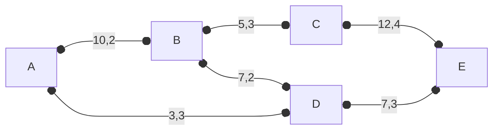

## تمرین ۱

در شکل زیر بر روی هر یال، پهنای باند موجود و تاخیر انتشار بسته درج شده است.  

اگر قرار باشد پیام P=46 واحد داده از مبدأ A به مقصد E منتقل شود:

- کدام مسیر بیشترین سرعت انتقال داده را دارد؟

$P_1 = (A, B, C, E)$
$delay_{p_1} = 2 + 3 + 4 = 9$
$b = min(10, 5, 12) = 5$
$Time(P_1) = 9 + \lceil \dfrac{46}{5} \rceil - 1  = 9 + 10  - 1 = 18$
$Datarate(P_1) = \dfrac{46}{18} \approx 2.56$

$P_2 = (A, B, D, E)$
$delay_{p_2} = 2 + 2 + 3 = 7$
$b = min(10, 7, 7) = 7$
$Time(P_2) = 7 + \lceil \dfrac{46}{7} \rceil - 1  = 7 + 7  - 1 = 13$
$Datarate(P_2) = \dfrac{46}{13} \approx 3.54$

$P_3 = (A, D, E)$
$delay_{p_3} = 3 + 3 = 6$
$b = min(3, 7) = 3$
$Time(P_3) = 6 + \lceil \dfrac{46}{3} \rceil - 1  = 6 + 16  - 1 = 21$
$Datarate(P_3) = \dfrac{46}{21} \approx 2.19$

$P_4 = (A,D,B,C,E)$
$delay_{p_3} = 3 + 2 + 3 + 4 = 12$
$b = min(3,7,5,12) = 3$
$Time(P_4) = 12 + \lceil \dfrac{46}{3} \rceil - 1  = 27$
$Datarate(P_4) = 46/27 \approx 1.70$

مسیر $P_2 = (A, B, D, E)$ بیشترین سرعت انتقال داده را دارد.

- کوتاه‌ترین مسیر کدام است؟
کوتاه ترین مسیر $P_3 = (A, D, E)$ است.

- طولانی‌ترین مسیر کدام است؟
بلندترین مسیر، مسیر $P_4$ است.

---

## تمرین ۲

فرض کنید در حین انتقال داده از گره D 
20 درصد داده به دلیل نویز حذف می‌شود.
در این صورت این پیام برای اینکه به صورت کامل از A به B برسد، کدام مسیر سریع‌تر است و مناسب‌تر است؟

$P_{send} \times 0.8 = 46 \rightarrow P_{send} = \dfrac{46}{0.8} = 57.5 \approx 58$

$P_1 = (A,B)$
$delay(P_1) = 2$
$b = 10$
$Time(P_1) = 2 + \lceil \dfrac{46}{10} \rceil - 1 = 2 + 5 - 1 = 6$
$DataRate(P_1) = \dfrac{46}{6} \approx 7.67$

$P_2 = (A,D,B)$
$delay(P_2) = 3 + 2 = 5$
$b = min(3, 7) = 3$
$Time(P_2) = 5 + \lceil \dfrac{58}{3} \rceil - 1 = 5 + 20 - 1 = 24$
$DataRate(P_2) = \dfrac{46}{24} \approx 1.92$

$P_3 = (A,D,E,C,B)$
$delay(P_3) = 3 + 3 + 4 + 3 = 13$
$b = min(3,7,12,5) = 3$
$Time(P_3) = 13 + \lceil \dfrac{58}{3} \rceil - 1 = 13 + 20 - 1 = 32$
$DataRate(P_3) = \dfrac{46}{32} \approx 1.44$

مسیر مستقیم $P_1 = (A,B)$ سریع‌تر است.

تمرین بعدی: [[LS - DV]]
