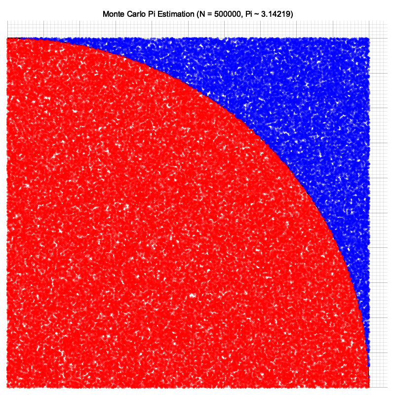

# Monte Carlo 3 - Pi Estimation

Rust simulation for estimating the value of $\pi$ using Monte Carlo integration on a quarter circle inscribed in a unit square.

## Problem Description

Given a unit square with side length $r=1$ and an inscribed quarter circle of radius $r=1$:

- Area of quarter circle: $\frac{\pi r^2}{4}$
- Area of square: $r^2$
- Ratio of areas:
  $$\frac{\text{Area of quarter circle}}{\text{Area of square}} = \frac{\pi / 4}{1} = \frac{n}{N}$$
  $$\implies \pi \approx \frac{4n}{N}$$

Where:
- $N$ = total random points generated inside the square ($X, Y \in [0, 1)$).
- $n$ = number of points landing inside the quarter circle ($X^2 + Y^2 \le r^2$).

> **Note**: Uniform sampling is mandatory. Non-uniform sampling produces significant error in $\pi$ estimation.

---

## Files

| File | Description |
| --- | --- |
| `Cargo.toml` | Package definition with `plotters` and `rand` dependencies. |
| `src/main.rs` | Monte Carlo estimation, uniform vs non-uniform comparison, and chart plotting. |
| `image.png` | Scatter plot visualization of Monte Carlo points (red = inside, blue = outside). |



---

## Run

From this directory:

```bash
cargo run
```
