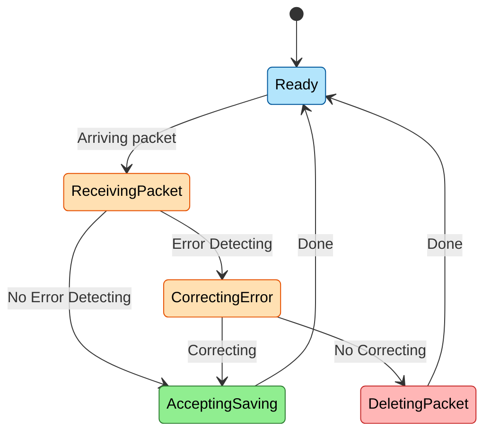

## تمرین ۳: تحلیل ارور شبکه با Z

**مجموعه حالت‌های سیستم** (سیستم می‌تواند در یکی از این پنج حالت قرار داشته باشد):

$$
\text{States} = \{\text{Ready}, \text{ReceivingPacket}, \text{AcceptingAndSavingPacket}, \text{CorrectingError}, \text{DeletingPacket}\}
$$

**حالت پیش‌فرض** (سیستم در ابتدا در حالت آماده قرار دارد و منتظر رسیدن بسته است):

$$
\text{DefaultState} = \{\text{Ready}\}
$$

**مجموعه رویدادها یا تراکنش‌ها** (رخدادهایی که باعث تغییر حالت سیستم می‌شوند):

$$
\text{Events} = \{\text{ArrivingPacket}, \text{ErrorDetecting}, \text{NoErrorDetecting}, \text{Correcting}, \text{NoCorrecting}, \text{Done}\}
$$

**رسیدن بسته** (با ورود بسته، سیستم از حالت آماده به حالت دریافت بسته منتقل می‌شود):

$$
\text{ArrivingPacket}: \{\text{Ready}\} \rightarrow \{\text{ReceivingPacket}\}
$$

**عدم تشخیص خطا** (اگر بسته دریافت‌شده سالم باشد، مستقیماً پذیرفته و ذخیره می‌شود):

$$
\text{NoErrorDetecting}: \{\text{ReceivingPacket}\} \rightarrow \{\text{AcceptingAndSavingPacket}\}
$$

**تشخیص خطا** (در صورت وجود خطا در بسته، سیستم وارد مرحله اصلاح خطا می‌شود):

$$
\text{ErrorDetecting}: \{\text{ReceivingPacket}\} \rightarrow \{\text{CorrectingError}\}
$$

**اصلاح موفق خطا** (اگر خطا قابل اصلاح باشد، بسته پس از اصلاح پذیرفته و ذخیره می‌شود):

$$
\text{Correcting}: \{\text{CorrectingError}\} \rightarrow \{\text{AcceptingAndSavingPacket}\}
$$

**عدم امکان اصلاح خطا** (اگر خطا قابل اصلاح نباشد، بسته حذف می‌شود):

$$
\text{NoCorrecting}: \{\text{CorrectingError}\} \rightarrow \{\text{DeletingPacket}\}
$$

**اتمام پردازش** (پس از پذیرش و ذخیره یا حذف بسته، سیستم به حالت آماده بازمی‌گردد تا بسته بعدی را دریافت کند):

$$
\text{Done}: \{\text{AcceptingAndSavingPacket}, \text{DeletingPacket}\} \rightarrow \{\text{Ready}\}
$$

---

### سناریو ۱: بسته سالم (بدون خطا)

$$
\text{CurrentState} = \text{DefaultState} = \{\text{Ready}\}
$$

**رسیدن بسته:**

$$
\text{NextState} = \text{ArrivingPacket}(\text{CurrentState}) = \{\text{ReceivingPacket}\}
$$

$$
\text{CurrentState} = \{\text{ReceivingPacket}\}
$$

**عدم تشخیص خطا:**

$$
\text{NextState} = \text{NoErrorDetecting}(\text{CurrentState}) = \{\text{AcceptingAndSavingPacket}\}
$$

$$
\text{CurrentState} = \{\text{AcceptingAndSavingPacket}\}
$$

**اتمام پردازش:**

$$
\text{NextState} = \text{Done}(\text{CurrentState}) = \{\text{Ready}\}
$$

$$
\text{CurrentState} = \{\text{Ready}\}
$$

نتیجه: بسته **پذیرفته و ذخیره** شد و سیستم آماده دریافت بسته بعدی است.

---

### سناریو ۲: بسته با خطا (قابل اصلاح)

$$
\text{CurrentState} = \{\text{Ready}\}
$$

**رسیدن بسته:**

$$
\text{NextState} = \text{ArrivingPacket}(\text{CurrentState}) = \{\text{ReceivingPacket}\}
$$

$$
\text{CurrentState} = \{\text{ReceivingPacket}\}
$$

**تشخیص خطا:**

$$
\text{NextState} = \text{ErrorDetecting}(\text{CurrentState}) = \{\text{CorrectingError}\}
$$

$$
\text{CurrentState} = \{\text{CorrectingError}\}
$$

**اصلاح موفق:**

$$
\text{NextState} = \text{Correcting}(\text{CurrentState}) = \{\text{AcceptingAndSavingPacket}\}
$$

$$
\text{CurrentState} = \{\text{AcceptingAndSavingPacket}\}
$$

**اتمام پردازش:**

$$
\text{NextState} = \text{Done}(\text{CurrentState}) = \{\text{Ready}\}
$$

$$
\text{CurrentState} = \{\text{Ready}\}
$$

نتیجه: بسته پس از **اصلاح خطا** پذیرفته و ذخیره شد.

---

### سناریو ۳: بسته با خطا (غیرقابل اصلاح)

$$
\text{CurrentState} = \{\text{Ready}\}
$$

**رسیدن بسته:**

$$
\text{NextState} = \text{ArrivingPacket}(\text{CurrentState}) = \{\text{ReceivingPacket}\}
$$

$$
\text{CurrentState} = \{\text{ReceivingPacket}\}
$$

**تشخیص خطا:**

$$
\text{NextState} = \text{ErrorDetecting}(\text{CurrentState}) = \{\text{CorrectingError}\}
$$

$$
\text{CurrentState} = \{\text{CorrectingError}\}
$$

**عدم امکان اصلاح:**

$$
\text{NextState} = \text{NoCorrecting}(\text{CurrentState}) = \{\text{DeletingPacket}\}
$$

$$
\text{CurrentState} = \{\text{DeletingPacket}\}
$$

**اتمام پردازش:**

$$
\text{NextState} = \text{Done}(\text{CurrentState}) = \{\text{Ready}\}
$$

$$
\text{CurrentState} = \{\text{Ready}\}
$$

نتیجه: بسته به دلیل عدم امکان اصلاح **حذف** شد.

تمرین بعدی: [[کنترل سلامت کارت در سیستم ATM]]