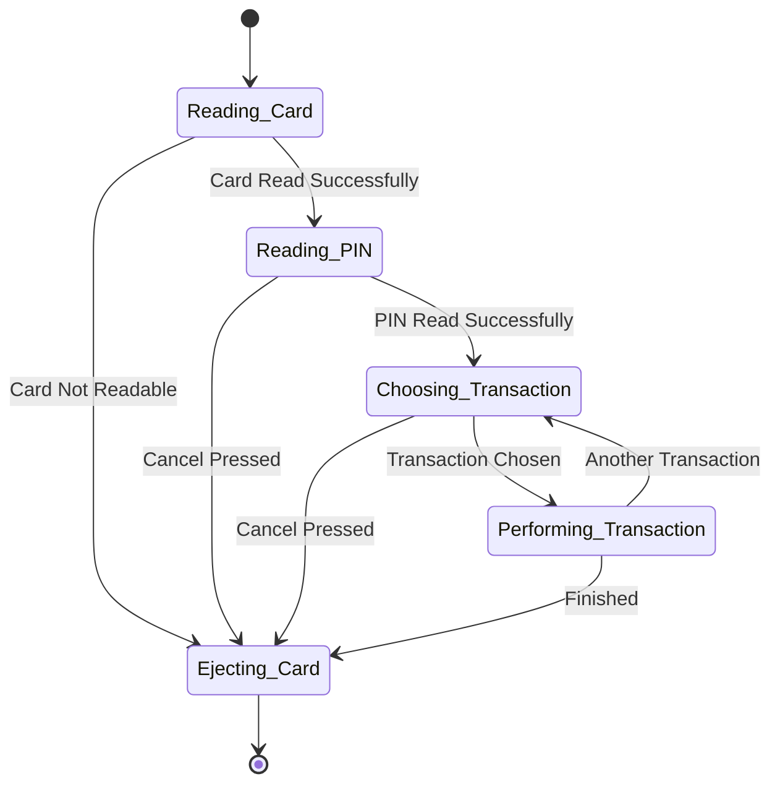
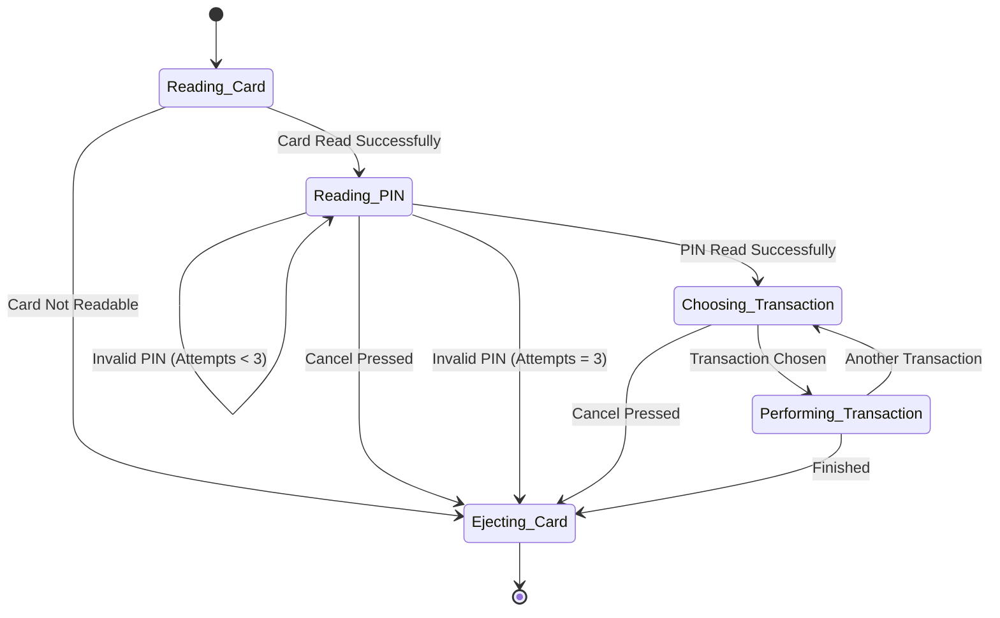

## تمرین ۵: رمزکارت و مدل به زبان Z

#### اضافه کردن غلط بودن رمز کارت به مدل زیر و نوشتن مدل به زبان Z

#### پاسخ:

به مدل بخش چک کردن رمز کارت اضافه می‌کنیم:

تحلیل با زبان Z:

$$States = \{ReadingCard, ReadingPIN, ChoosingTransaction, PerformingTransaction, EjectingCard\}$$

$$DefaultState = \{ReadingCard\}$$

$$MaxAttempts = 3$$

وقتی در حالت ReadingCard هستیم:
$$\text{NextState} = \{ s \in States \mid (s = ReadingPIN \land IsCardValid) \lor (s = EjectingCard \land \neg IsCardValid) \}$$

وقتی در حالت ReadingPin هستیم:

اگر IsPinCorrect = true بود:
$$\text{NextState} = \{ s \in States \mid s = ChoosingTransaction \land NextAttempts=MaxAttempts \}$$

اگر IsPinCorrect = false بود:
$$\text{NextState} = \{ s \in States \land NextAttempts = NextAttempts + 1 \mid (s = ReadingPIN \land \text{NextAttempts} < \text{MaxAttempts}) \lor (s = EjectingCard \land \text{NextAttempts} = \text{MaxAttempts}) \}$$

وقتی در حالت ChoosingTransaction هستیم:

$$\text{NextState} = \{ s \in States \mid (s = PerformingTransaction \land IsTransactionChosen) \lor (s = EjectingCard \land IsCanceled) \}$$

وقتی در حالت PerformingTransaction هستیم:
$$NextState = \{ s\in States \mid (s = ChoosingTransaction \land IsAnotherTransaction) \lor (s = EjectingCard \land IsFinished)  \}$$

تمرین بعدی: [[هابیل و خباز]]

