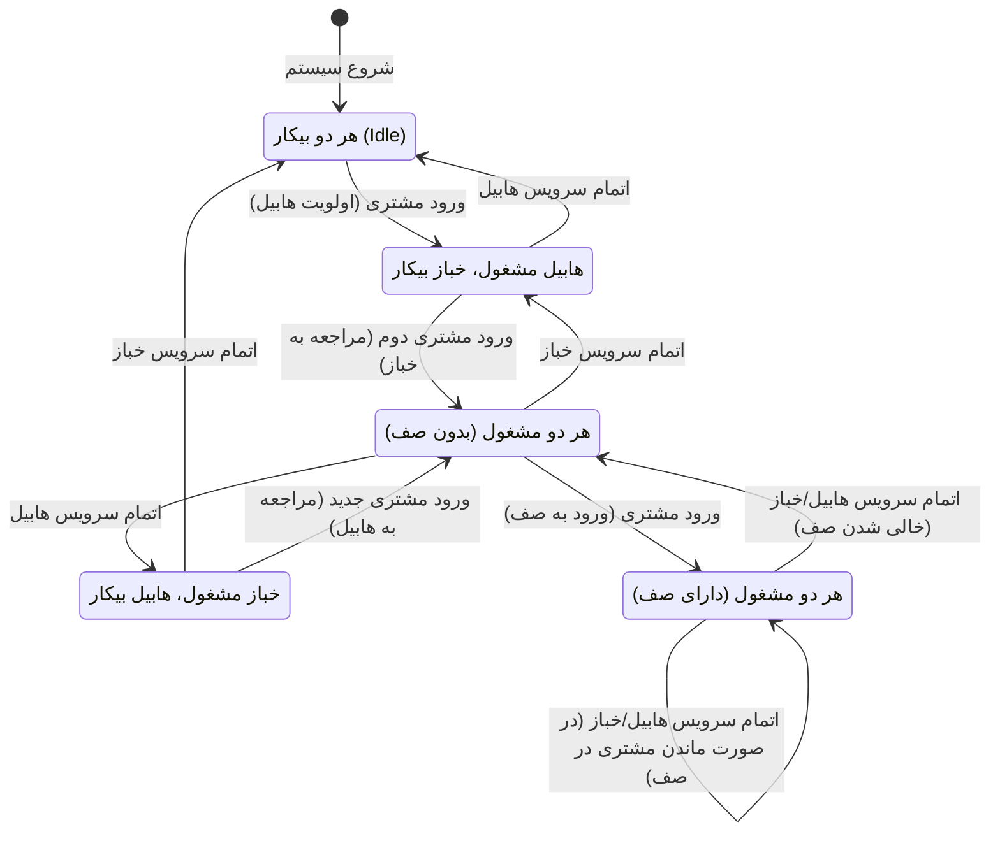

## تمرین ۶: هابیل و خباز

#### مدل هابیل و خباز را با نمایش State Chart مدلسازی کنید.

#### پاسخ:

```mermaid
stateDiagram-v2
    direction TB
    state "هر دو بیکار (Idle)" as Idle
    state "هابیل مشغول، خباز بیکار" as HabilBusy
    state "خباز مشغول، هابیل بیکار" as KhabazBusy
    state "هر دو مشغول (بدون صف)" as BothBusy
    state "هر دو مشغول (دارای صف)" as Queuing

    [*] --> Idle : شروع سیستم
    
    Idle --> HabilBusy : ورود مشتری (اولویت هابیل)
    
    HabilBusy --> Idle : اتمام سرویس هابیل
    HabilBusy --> BothBusy : ورود مشتری دوم (مراجعه به خباز)
    
    KhabazBusy --> Idle : اتمام سرویس خباز
    KhabazBusy --> BothBusy : ورود مشتری جدید (مراجعه به هابیل)
    
    BothBusy --> KhabazBusy : اتمام سرویس هابیل
    BothBusy --> HabilBusy : اتمام سرویس خباز
    BothBusy --> Queuing : ورود مشتری (ورود به صف)
    
    Queuing --> Queuing : ورود مشتری جدید (افزایش طول صف)
    Queuing --> Queuing : اتمام سرویس هابیل/خباز (در صورت ماندن مشتری در صف)
    Queuing --> BothBusy : اتمام سرویس هابیل/خباز (خالی شدن صف)
```

تمرین بعدی: [[شبیه‌سازی تصادفی جدول ۱]]
