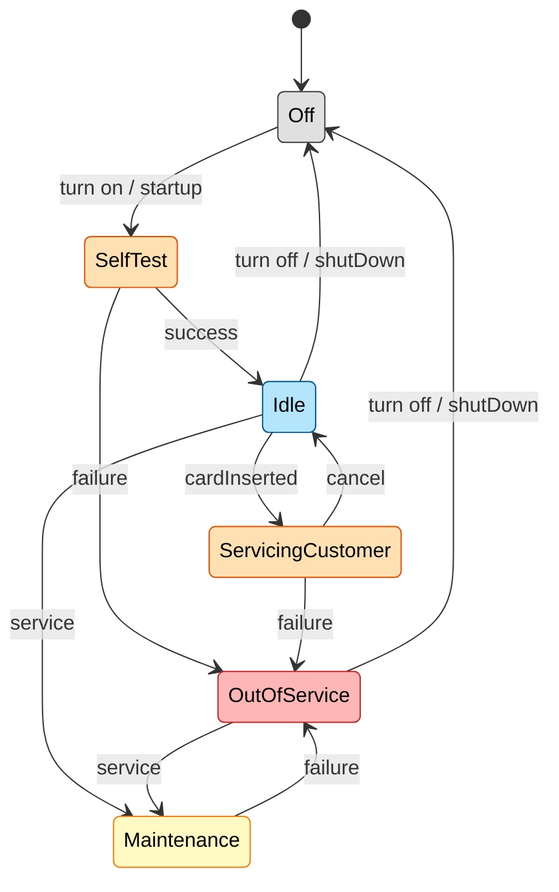
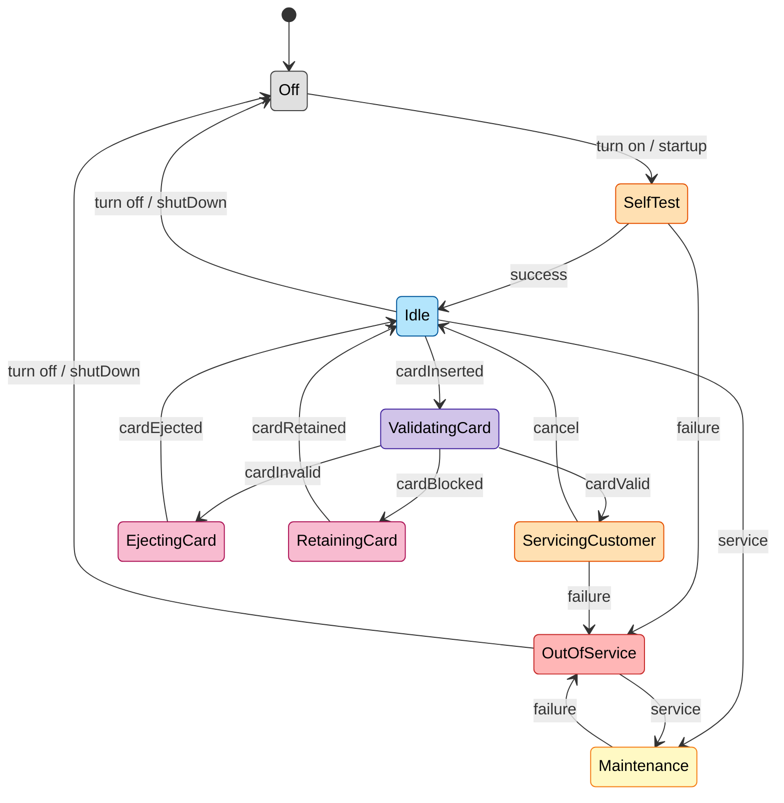

### تمرین ۴:‌ کنترل سلامت کارت در سیستم ATM

#### کنترل سالم بودن کارت در این سیستم تعبیه و تعریف نشده است. لذا مشاهده می‌شود که همه جزئیات در این مدل ذکر نشده است. این بخش از جزئیات را به مدل‌سازی اضافه کنید.

#### پاسخ:

تمرین بعدی:‌ [[رمزکارت و مدل به زبان Z]]
