# Numerical Methods for Root Finding: Comprehensive Analysis

## Table of Contents

1. [Introduction](#introduction)
2. [Test Functions](#test-functions)
3. [Theoretical Background](#theoretical-background)
4. [Method Descriptions with Examples](#method-descriptions-with-examples)
5. [Performance Analysis](#performance-analysis)
6. [Convergence Comparison](#convergence-comparison)
7. [Final Comparison and Recommendations](#final-comparison-and-recommendations)

## Introduction

This report presents a comprehensive analysis of various numerical methods for finding roots of nonlinear equations. We compare different methods in terms of convergence speed, accuracy, stability, and computational efficiency. The methods analyzed include:

- Bisection Method
- Newton's Method
- Secant Method
- Fixed-point Method
- Aitken's Acceleration
- Real-time Aitken's Acceleration
## Test Functions

We tested the methods on the following function:

### Primary Test Function: f(x) = -x + sin(x)

- **Mathematical form**: f(x) = -x + sin(x)
- **Derivative**: f'(x) = cos(x) - 1
- **Interval**: [-4.000000000000000, 2.000000000000000]
- **Initial guess**: -1.000000000000000
- **True root**: 0.000000000000000
- **Tolerance**: ε = 0.000001000000000

This function represents exponential growth problems and has applications in population dynamics, compound interest, and decay processes.

## Theoretical Background

### Convergence Rates

- **Linear Convergence**: If |eₙ₊₁| ≤ c·|eₙ| for some constant c < 1, where eₙ is the error at iteration n. The bisection method exhibits linear convergence.

- **Quadratic Convergence**: If |eₙ₊₁| ≤ c·|eₙ|² for some constant c. Newton's method shows quadratic convergence when the function is well-behaved.

- **Superlinear Convergence**: If |eₙ₊₁| ≤ c·|eₙ|ᵖ for p > 1. The secant method typically has p ≈ 1.62.

### Stopping Criteria

- **Absolute Error**: ∣xₙ₊₁ − xₙ∣ < ε
- **Relative Error**: ∣xₙ₊₁ − xₙ∣/|xₙ₊₁| < ε
- **Function Value**: ∣f(xₙ)∣ < ε

### Aitken's Acceleration

Aitken's acceleration transforms a linearly convergent sequence into a more rapidly convergent one. For a sequence {pₙ}, the Aitken's accelerated sequence {p̂ₙ} is defined as:

p̂ₙ = pₙ - (pₙ₊₁ - pₙ)²/(pₙ₊₂ - 2pₙ₊₁ + pₙ)

## Method Descriptions with Examples

### 1. Bisection Method

#### Mathematical Formula

Given a continuous function f(x) and an interval [a, b] where f(a) ⋅ f(b) < 0:

x = a + b⁄2

The root lies in [a, c] if f(a) ⋅ f(x) < 0, otherwise in [x, b].

#### Algorithm

1. **Input**: Function f, interval [a, b], tolerance \epsilon
2. **Verify**: Check that f(a) ⋅ f(b) < 0
3. **Iterate**:
   - Compute midpoint: x = a + b⁄2
   - If |error| < \epsilon, return x
   - If f(a) ⋅ f(x) < 0, set b = x
   - Otherwise, set a = x
4. **Repeat** until convergence

#### Convergence Rate

Linear convergence with rate ≈ 0.5. Error reduces by half each iteration:
|e_{n+1}| ≤ 1⁄2|e_n|

#### Implementation

```python
def bisection_method(f, a, b, epsilon=1e-6, condition=stopping_condition_2):
    if f(a) * f(b) ≥ 0:
        raise ValueError(f"f({a}) and f({b}) must have opposite signs")

    sequence = []
    for k in range(100):
        x = (a + b) / 2
        sequence.append(x)

        if k > 0 and condition(sequence[k], sequence[k - 1], epsilon):
            return sequence, "Second stopping condition (convergence)"

        if f(a) * f(x) < 0:
            b = x
        else:
            a = x

    return sequence, "First stopping condition (max iterations)"

```

#### Examples with Absolute Error Criterion ∣xₙ₊₁ − xₙ∣ < ε

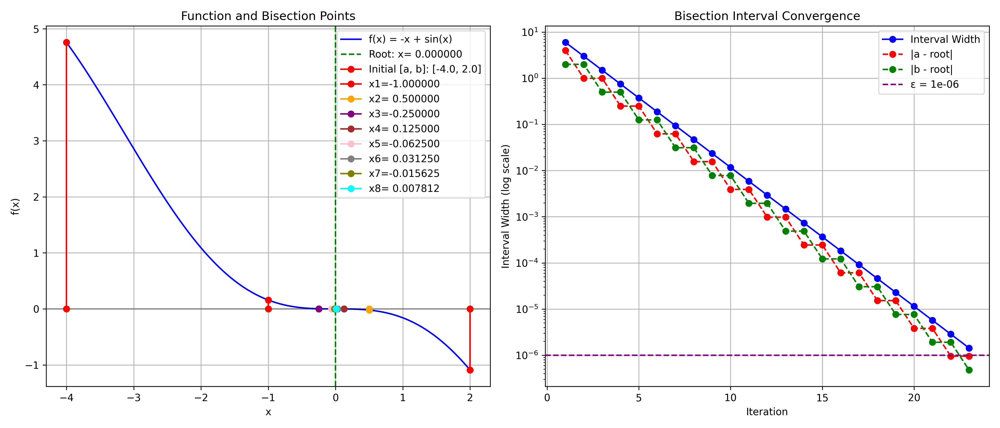

##### Bisection Method Absolute Criterion (ε = 0.000001000000000)

| Iteration | xₙ                  | f(xₙ)               | Error               | Interval [a, b]                    | Interval Length     | Abs. Difference     | Aitken              |
|-----------|---------------------|---------------------|---------------------|-------------------------------------|---------------------|---------------------|---------------------|
| 1 | -1.000000000000000 | 0.158529015192103 | 1.000000000000000 | [-4.000000000000000, 2.000000000000000] | 6.000000000000000 | N/A | N/A |
| 2 | 0.500000000000000 | -0.020574461395797 | 0.500000000000000 | [-1.000000000000000, 2.000000000000000] | 3.000000000000000 | 1.500000000000000 | N/A |
| 3 | -0.250000000000000 | 0.002596040745477 | 0.250000000000000 | [-1.000000000000000, 0.500000000000000] | 1.500000000000000 | 0.750000000000000 | 0.0 |
| 4 | 0.125000000000000 | -0.000325266614772 | 0.125000000000000 | [-0.250000000000000, 0.500000000000000] | 0.750000000000000 | 0.375000000000000 | 0.0 |
| 5 | -0.062500000000000 | 0.000040682157620 | 0.062500000000000 | [-0.250000000000000, 0.125000000000000] | 0.375000000000000 | 0.187500000000000 | 0.0 |
| 6 | 0.031250000000000 | -0.000005086014674 | 0.031250000000000 | [-0.062500000000000, 0.125000000000000] | 0.187500000000000 | 0.093750000000000 | 0.0 |
| 7 | -0.015625000000000 | 0.000000635775117 | 0.015625000000000 | [-0.062500000000000, 0.031250000000000] | 0.093750000000000 | 0.046875000000000 | 0.0 |
| 8 | 0.007812500000000 | -0.000000079472617 | 0.007812500000000 | [-0.015625000000000, 0.031250000000000] | 0.046875000000000 | 0.023437500000000 | 0.0 |
| 9 | -0.003906250000000 | 0.000000009934100 | 0.003906250000000 | [-0.015625000000000, 0.007812500000000] | 0.023437500000000 | 0.011718750000000 | 0.0 |
| 10 | 0.001953125000000 | -0.000000001241763 | 0.001953125000000 | [-0.003906250000000, 0.007812500000000] | 0.011718750000000 | 0.005859375000000 | 0.0 |
| 11 | -0.000976562500000 | 0.000000000155220 | 0.000976562500000 | [-0.003906250000000, 0.001953125000000] | 0.005859375000000 | 0.002929687500000 | 0.0 |
| 12 | 0.000488281250000 | -0.000000000019403 | 0.000488281250000 | [-0.000976562500000, 0.001953125000000] | 0.002929687500000 | 0.001464843750000 | 0.0 |
| 13 | -0.000244140625000 | 0.000000000002425 | 0.000244140625000 | [-0.000976562500000, 0.000488281250000] | 0.001464843750000 | 0.000732421875000 | 0.0 |
| 14 | 0.000122070312500 | -0.000000000000303 | 0.000122070312500 | [-0.000244140625000, 0.000488281250000] | 0.000732421875000 | 0.000366210937500 | 0.0 |
| 15 | -0.000061035156250 | 0.000000000000038 | 0.000061035156250 | [-0.000244140625000, 0.000122070312500] | 0.000366210937500 | 0.000183105468750 | 0.0 |
| 16 | 0.000030517578125 | -0.000000000000005 | 0.000030517578125 | [-0.000061035156250, 0.000122070312500] | 0.000183105468750 | 0.000091552734375 | 0.0 |
| 17 | -0.000015258789062 | 0.000000000000001 | 0.000015258789062 | [-0.000061035156250, 0.000030517578125] | 0.000091552734375 | 0.000045776367188 | 0.0 |
| 18 | 0.000007629394531 | -0.000000000000000 | 0.000007629394531 | [-0.000015258789062, 0.000030517578125] | 0.000045776367188 | 0.000022888183594 | 0.0 |
| 19 | -0.000003814697266 | 0.000000000000000 | 0.000003814697266 | [-0.000015258789062, 0.000007629394531] | 0.000022888183594 | 0.000011444091797 | 0.0 |
| 20 | 0.000001907348633 | -0.000000000000000 | 0.000001907348633 | [-0.000003814697266, 0.000007629394531] | 0.000011444091797 | 0.000005722045898 | 0.0 |
| 21 | -0.000000953674316 | 0.000000000000000 | 0.000000953674316 | [-0.000003814697266, 0.000001907348633] | 0.000005722045898 | 0.000002861022949 | 0.0 |
| 22 | 0.000000476837158 | -0.000000000000000 | 0.000000476837158 | [-0.000000953674316, 0.000001907348633] | 0.000002861022949 | 0.000001430511475 | 0.0 |
| 23 | -0.000000238418579 | 0.000000000000000 | 0.000000238418579 | [-0.000000953674316, 0.000000476837158] | 0.000001430511475 | 0.000000715255737 | 0.0 |

**Result**: Converged to -0.000000238418579 in 23 iterations
**Final Error**: 0.000000238418579
**Convergence Rate**: 1.000000000000000

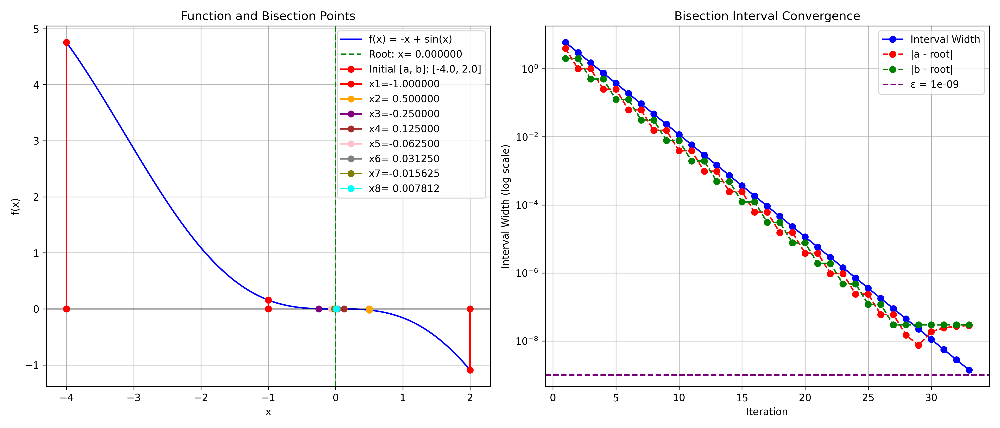

##### Bisection Method Absolute Criterion (ε = 0.000000001000000)

| Iteration | xₙ                  | f(xₙ)               | Error               | Interval [a, b]                    | Interval Length     | Abs. Difference     | Aitken              |
|-----------|---------------------|---------------------|---------------------|-------------------------------------|---------------------|---------------------|---------------------|
| 1 | -1.000000000000000 | 0.158529015192103 | 1.000000000000000 | [-4.000000000000000, 2.000000000000000] | 6.000000000000000 | N/A | N/A |
| 2 | 0.500000000000000 | -0.020574461395797 | 0.500000000000000 | [-1.000000000000000, 2.000000000000000] | 3.000000000000000 | 1.500000000000000 | N/A |
| 3 | -0.250000000000000 | 0.002596040745477 | 0.250000000000000 | [-1.000000000000000, 0.500000000000000] | 1.500000000000000 | 0.750000000000000 | 0.0 |
| 4 | 0.125000000000000 | -0.000325266614772 | 0.125000000000000 | [-0.250000000000000, 0.500000000000000] | 0.750000000000000 | 0.375000000000000 | 0.0 |
| 5 | -0.062500000000000 | 0.000040682157620 | 0.062500000000000 | [-0.250000000000000, 0.125000000000000] | 0.375000000000000 | 0.187500000000000 | 0.0 |
| 6 | 0.031250000000000 | -0.000005086014674 | 0.031250000000000 | [-0.062500000000000, 0.125000000000000] | 0.187500000000000 | 0.093750000000000 | 0.0 |
| 7 | -0.015625000000000 | 0.000000635775117 | 0.015625000000000 | [-0.062500000000000, 0.031250000000000] | 0.093750000000000 | 0.046875000000000 | 0.0 |
| 8 | 0.007812500000000 | -0.000000079472617 | 0.007812500000000 | [-0.015625000000000, 0.031250000000000] | 0.046875000000000 | 0.023437500000000 | 0.0 |
| 9 | -0.003906250000000 | 0.000000009934100 | 0.003906250000000 | [-0.015625000000000, 0.007812500000000] | 0.023437500000000 | 0.011718750000000 | 0.0 |
| 10 | 0.001953125000000 | -0.000000001241763 | 0.001953125000000 | [-0.003906250000000, 0.007812500000000] | 0.011718750000000 | 0.005859375000000 | 0.0 |
| 11 | -0.000976562500000 | 0.000000000155220 | 0.000976562500000 | [-0.003906250000000, 0.001953125000000] | 0.005859375000000 | 0.002929687500000 | 0.0 |
| 12 | 0.000488281250000 | -0.000000000019403 | 0.000488281250000 | [-0.000976562500000, 0.001953125000000] | 0.002929687500000 | 0.001464843750000 | 0.0 |
| 13 | -0.000244140625000 | 0.000000000002425 | 0.000244140625000 | [-0.000976562500000, 0.000488281250000] | 0.001464843750000 | 0.000732421875000 | 0.0 |
| 14 | 0.000122070312500 | -0.000000000000303 | 0.000122070312500 | [-0.000244140625000, 0.000488281250000] | 0.000732421875000 | 0.000366210937500 | 0.0 |
| 15 | -0.000061035156250 | 0.000000000000038 | 0.000061035156250 | [-0.000244140625000, 0.000122070312500] | 0.000366210937500 | 0.000183105468750 | 0.0 |
| 16 | 0.000030517578125 | -0.000000000000005 | 0.000030517578125 | [-0.000061035156250, 0.000122070312500] | 0.000183105468750 | 0.000091552734375 | 0.0 |
| 17 | -0.000015258789062 | 0.000000000000001 | 0.000015258789062 | [-0.000061035156250, 0.000030517578125] | 0.000091552734375 | 0.000045776367188 | 0.0 |
| 18 | 0.000007629394531 | -0.000000000000000 | 0.000007629394531 | [-0.000015258789062, 0.000030517578125] | 0.000045776367188 | 0.000022888183594 | 0.0 |
| 19 | -0.000003814697266 | 0.000000000000000 | 0.000003814697266 | [-0.000015258789062, 0.000007629394531] | 0.000022888183594 | 0.000011444091797 | 0.0 |
| 20 | 0.000001907348633 | -0.000000000000000 | 0.000001907348633 | [-0.000003814697266, 0.000007629394531] | 0.000011444091797 | 0.000005722045898 | 0.0 |
| 21 | -0.000000953674316 | 0.000000000000000 | 0.000000953674316 | [-0.000003814697266, 0.000001907348633] | 0.000005722045898 | 0.000002861022949 | 0.0 |
| 22 | 0.000000476837158 | -0.000000000000000 | 0.000000476837158 | [-0.000000953674316, 0.000001907348633] | 0.000002861022949 | 0.000001430511475 | 0.0 |
| 23 | -0.000000238418579 | 0.000000000000000 | 0.000000238418579 | [-0.000000953674316, 0.000000476837158] | 0.000001430511475 | 0.000000715255737 | 0.0 |
| 24 | 0.000000119209290 | -0.000000000000000 | 0.000000119209290 | [-0.000000238418579, 0.000000476837158] | 0.000000715255737 | 0.000000357627869 | 0.0 |
| 25 | -0.000000059604645 | 0.000000000000000 | 0.000000059604645 | [-0.000000238418579, 0.000000119209290] | 0.000000357627869 | 0.000000178813934 | 0.0 |
| 26 | 0.000000029802322 | -0.000000000000000 | 0.000000029802322 | [-0.000000059604645, 0.000000119209290] | 0.000000178813934 | 0.000000089406967 | 0.0 |
| 27 | -0.000000014901161 | 0.000000000000000 | 0.000000014901161 | [-0.000000059604645, 0.000000029802322] | 0.000000089406967 | 0.000000044703484 | 0.0 |
| 28 | 0.000000007450581 | 0.000000000000000 | 0.000000007450581 | [-0.000000014901161, 0.000000029802322] | 0.000000044703484 | 0.000000022351742 | 0.0 |
| 29 | 0.000000018626451 | 0.000000000000000 | 0.000000018626451 | [0.000000007450581, 0.000000029802322] | 0.000000022351742 | 0.000000011175871 | 2.9802322387695312e-08 |
| 30 | 0.000000024214387 | -0.000000000000000 | 0.000000024214387 | [0.000000018626451, 0.000000029802322] | 0.000000011175871 | 0.000000005587935 | 2.9802322387695312e-08 |
| 31 | 0.000000027008355 | -0.000000000000000 | 0.000000027008355 | [0.000000024214387, 0.000000029802322] | 0.000000005587935 | 0.000000002793968 | 2.9802322387695312e-08 |
| 32 | 0.000000028405339 | -0.000000000000000 | 0.000000028405339 | [0.000000027008355, 0.000000029802322] | 0.000000002793968 | 0.000000001396984 | 2.9802322387695312e-08 |
| 33 | 0.000000029103830 | -0.000000000000000 | 0.000000029103830 | [0.000000028405339, 0.000000029802322] | 0.000000001396984 | 0.000000000698492 | 2.9802322387695312e-08 |

**Result**: Converged to 0.000000029103830 in 33 iterations
**Final Error**: 0.000000029103830
**Convergence Rate**: 0.921535749690580

#### Examples with Relative Error Criterion ∣xₙ₊₁ − xₙ∣/|xₙ₊₁| < ε

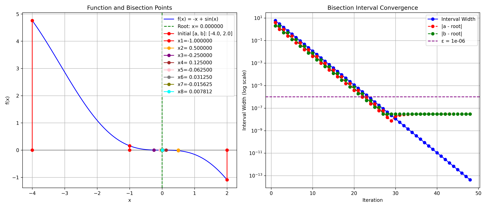

##### Bisection Method with Relative Criterion (ε = 0.000001000000000)

| Iteration | xₙ                  | f(xₙ)               | Error               | Interval [a, b]                    | Interval Length     | Rel. Difference     | Aitken              |
|-----------|---------------------|---------------------|---------------------|-------------------------------------|---------------------|---------------------|---------------------|
| 1 | -1.000000000000000 | 0.158529015192103 | 1.000000000000000 | [-4.000000000000000, 2.000000000000000] | 6.000000000000000 | N/A | N/A |
| 2 | 0.500000000000000 | -0.020574461395797 | 0.500000000000000 | [-1.000000000000000, 2.000000000000000] | 3.000000000000000 | 3.000000000000000 | N/A |
| 3 | -0.250000000000000 | 0.002596040745477 | 0.250000000000000 | [-1.000000000000000, 0.500000000000000] | 1.500000000000000 | 3.000000000000000 | 0.0 |
| 4 | 0.125000000000000 | -0.000325266614772 | 0.125000000000000 | [-0.250000000000000, 0.500000000000000] | 0.750000000000000 | 3.000000000000000 | 0.0 |
| 5 | -0.062500000000000 | 0.000040682157620 | 0.062500000000000 | [-0.250000000000000, 0.125000000000000] | 0.375000000000000 | 3.000000000000000 | 0.0 |
| 6 | 0.031250000000000 | -0.000005086014674 | 0.031250000000000 | [-0.062500000000000, 0.125000000000000] | 0.187500000000000 | 3.000000000000000 | 0.0 |
| 7 | -0.015625000000000 | 0.000000635775117 | 0.015625000000000 | [-0.062500000000000, 0.031250000000000] | 0.093750000000000 | 3.000000000000000 | 0.0 |
| 8 | 0.007812500000000 | -0.000000079472617 | 0.007812500000000 | [-0.015625000000000, 0.031250000000000] | 0.046875000000000 | 3.000000000000000 | 0.0 |
| 9 | -0.003906250000000 | 0.000000009934100 | 0.003906250000000 | [-0.015625000000000, 0.007812500000000] | 0.023437500000000 | 3.000000000000000 | 0.0 |
| 10 | 0.001953125000000 | -0.000000001241763 | 0.001953125000000 | [-0.003906250000000, 0.007812500000000] | 0.011718750000000 | 3.000000000000000 | 0.0 |
| 11 | -0.000976562500000 | 0.000000000155220 | 0.000976562500000 | [-0.003906250000000, 0.001953125000000] | 0.005859375000000 | 3.000000000000000 | 0.0 |
| 12 | 0.000488281250000 | -0.000000000019403 | 0.000488281250000 | [-0.000976562500000, 0.001953125000000] | 0.002929687500000 | 3.000000000000000 | 0.0 |
| 13 | -0.000244140625000 | 0.000000000002425 | 0.000244140625000 | [-0.000976562500000, 0.000488281250000] | 0.001464843750000 | 3.000000000000000 | 0.0 |
| 14 | 0.000122070312500 | -0.000000000000303 | 0.000122070312500 | [-0.000244140625000, 0.000488281250000] | 0.000732421875000 | 3.000000000000000 | 0.0 |
| 15 | -0.000061035156250 | 0.000000000000038 | 0.000061035156250 | [-0.000244140625000, 0.000122070312500] | 0.000366210937500 | 3.000000000000000 | 0.0 |
| 16 | 0.000030517578125 | -0.000000000000005 | 0.000030517578125 | [-0.000061035156250, 0.000122070312500] | 0.000183105468750 | 3.000000000000000 | 0.0 |
| 17 | -0.000015258789062 | 0.000000000000001 | 0.000015258789062 | [-0.000061035156250, 0.000030517578125] | 0.000091552734375 | 3.000000000000000 | 0.0 |
| 18 | 0.000007629394531 | -0.000000000000000 | 0.000007629394531 | [-0.000015258789062, 0.000030517578125] | 0.000045776367188 | 3.000000000000000 | 0.0 |
| 19 | -0.000003814697266 | 0.000000000000000 | 0.000003814697266 | [-0.000015258789062, 0.000007629394531] | 0.000022888183594 | 3.000000000000000 | 0.0 |
| 20 | 0.000001907348633 | -0.000000000000000 | 0.000001907348633 | [-0.000003814697266, 0.000007629394531] | 0.000011444091797 | 3.000000000000000 | 0.0 |
| 21 | -0.000000953674316 | 0.000000000000000 | 0.000000953674316 | [-0.000003814697266, 0.000001907348633] | 0.000005722045898 | 3.000000000000000 | 0.0 |
| 22 | 0.000000476837158 | -0.000000000000000 | 0.000000476837158 | [-0.000000953674316, 0.000001907348633] | 0.000002861022949 | 3.000000000000000 | 0.0 |
| 23 | -0.000000238418579 | 0.000000000000000 | 0.000000238418579 | [-0.000000953674316, 0.000000476837158] | 0.000001430511475 | 3.000000000000000 | 0.0 |
| 24 | 0.000000119209290 | -0.000000000000000 | 0.000000119209290 | [-0.000000238418579, 0.000000476837158] | 0.000000715255737 | 3.000000000000000 | 0.0 |
| 25 | -0.000000059604645 | 0.000000000000000 | 0.000000059604645 | [-0.000000238418579, 0.000000119209290] | 0.000000357627869 | 3.000000000000000 | 0.0 |
| 26 | 0.000000029802322 | -0.000000000000000 | 0.000000029802322 | [-0.000000059604645, 0.000000119209290] | 0.000000178813934 | 3.000000000000000 | 0.0 |
| 27 | -0.000000014901161 | 0.000000000000000 | 0.000000014901161 | [-0.000000059604645, 0.000000029802322] | 0.000000089406967 | 3.000000000000000 | 0.0 |
| 28 | 0.000000007450581 | 0.000000000000000 | 0.000000007450581 | [-0.000000014901161, 0.000000029802322] | 0.000000044703484 | 3.000000000000000 | 0.0 |
| 29 | 0.000000018626451 | 0.000000000000000 | 0.000000018626451 | [0.000000007450581, 0.000000029802322] | 0.000000022351742 | 0.600000000000000 | 2.9802322387695312e-08 |
| 30 | 0.000000024214387 | -0.000000000000000 | 0.000000024214387 | [0.000000018626451, 0.000000029802322] | 0.000000011175871 | 0.230769230769231 | 2.9802322387695312e-08 |
| 31 | 0.000000027008355 | -0.000000000000000 | 0.000000027008355 | [0.000000024214387, 0.000000029802322] | 0.000000005587935 | 0.103448275862069 | 2.9802322387695312e-08 |
| 32 | 0.000000028405339 | -0.000000000000000 | 0.000000028405339 | [0.000000027008355, 0.000000029802322] | 0.000000002793968 | 0.049180327868852 | 2.9802322387695312e-08 |
| 33 | 0.000000029103830 | -0.000000000000000 | 0.000000029103830 | [0.000000028405339, 0.000000029802322] | 0.000000001396984 | 0.024000000000000 | 2.9802322387695312e-08 |
| 34 | 0.000000029453076 | -0.000000000000000 | 0.000000029453076 | [0.000000029103830, 0.000000029802322] | 0.000000000698492 | 0.011857707509881 | 2.9802322387695312e-08 |
| 35 | 0.000000029627699 | -0.000000000000000 | 0.000000029627699 | [0.000000029453076, 0.000000029802322] | 0.000000000349246 | 0.005893909626719 | 2.9802322387695312e-08 |
| 36 | 0.000000029715011 | -0.000000000000000 | 0.000000029715011 | [0.000000029627699, 0.000000029802322] | 0.000000000174623 | 0.002938295788443 | 2.9802322387695312e-08 |
| 37 | 0.000000029758667 | -0.000000000000000 | 0.000000029758667 | [0.000000029715011, 0.000000029802322] | 0.000000000087311 | 0.001466992665037 | 2.9802322387695312e-08 |
| 38 | 0.000000029780495 | -0.000000000000000 | 0.000000029780495 | [0.000000029758667, 0.000000029802322] | 0.000000000043656 | 0.000732958709993 | 2.9802322387695312e-08 |
| 39 | 0.000000029791408 | -0.000000000000000 | 0.000000029791408 | [0.000000029780495, 0.000000029802322] | 0.000000000021828 | 0.000366345097081 | 2.9802322387695312e-08 |
| 40 | 0.000000029796865 | -0.000000000000000 | 0.000000029796865 | [0.000000029791408, 0.000000029802322] | 0.000000000010914 | 0.000183139002503 | 2.9802322387695312e-08 |
| 41 | 0.000000029799594 | -0.000000000000000 | 0.000000029799594 | [0.000000029796865, 0.000000029802322] | 0.000000000005457 | 0.000091561117046 | 2.9802322387695312e-08 |
| 42 | 0.000000029800958 | -0.000000000000000 | 0.000000029800958 | [0.000000029799594, 0.000000029802322] | 0.000000000002728 | 0.000045778462759 | 2.9802322387695312e-08 |
| 43 | 0.000000029801640 | -0.000000000000000 | 0.000000029801640 | [0.000000029800958, 0.000000029802322] | 0.000000000001364 | 0.000022888707475 | 2.9802322387695312e-08 |
| 44 | 0.000000029801981 | -0.000000000000000 | 0.000000029801981 | [0.000000029801640, 0.000000029802322] | 0.000000000000682 | 0.000011444222766 | 2.9802322387695312e-08 |
| 45 | 0.000000029802152 | -0.000000000000000 | 0.000000029802152 | [0.000000029801981, 0.000000029802322] | 0.000000000000341 | 0.000005722078640 | 2.9802322387695312e-08 |
| 46 | 0.000000029802237 | -0.000000000000000 | 0.000000029802237 | [0.000000029802152, 0.000000029802322] | 0.000000000000171 | 0.000002861031135 | 2.9802322387695312e-08 |
| 47 | 0.000000029802280 | -0.000000000000000 | 0.000000029802280 | [0.000000029802237, 0.000000029802322] | 0.000000000000085 | 0.000001430513521 | 2.9802322387695312e-08 |
| 48 | 0.000000029802301 | -0.000000000000000 | 0.000000029802301 | [0.000000029802280, 0.000000029802322] | 0.000000000000043 | 0.000000715256249 | 2.9802322387695312e-08 |

**Result**: Converged to 0.000000029802301 in 48 iterations
**Final Error**: 0.000000029802301
**Convergence Rate**: 0.780628034317804

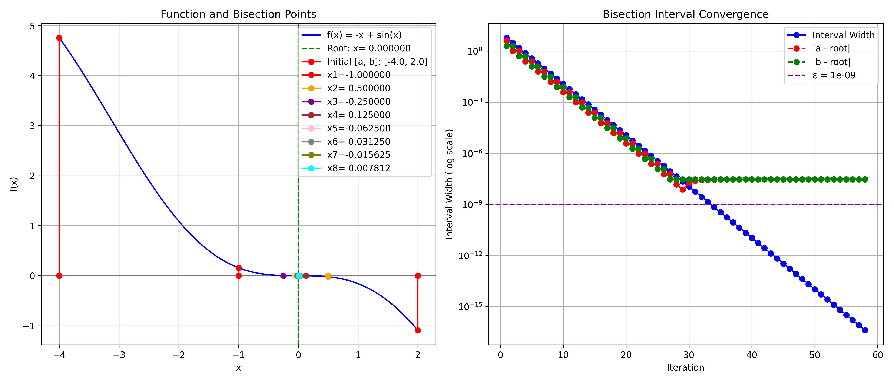

##### Bisection Method with Relative Criterion (ε = 0.000000001000000)

| Iteration | xₙ                  | f(xₙ)               | Error               | Interval [a, b]                    | Interval Length     | Rel. Difference     | Aitken              |
|-----------|---------------------|---------------------|---------------------|-------------------------------------|---------------------|---------------------|---------------------|
| 1 | -1.000000000000000 | 0.158529015192103 | 1.000000000000000 | [-4.000000000000000, 2.000000000000000] | 6.000000000000000 | N/A | N/A |
| 2 | 0.500000000000000 | -0.020574461395797 | 0.500000000000000 | [-1.000000000000000, 2.000000000000000] | 3.000000000000000 | 3.000000000000000 | N/A |
| 3 | -0.250000000000000 | 0.002596040745477 | 0.250000000000000 | [-1.000000000000000, 0.500000000000000] | 1.500000000000000 | 3.000000000000000 | 0.0 |
| 4 | 0.125000000000000 | -0.000325266614772 | 0.125000000000000 | [-0.250000000000000, 0.500000000000000] | 0.750000000000000 | 3.000000000000000 | 0.0 |
| 5 | -0.062500000000000 | 0.000040682157620 | 0.062500000000000 | [-0.250000000000000, 0.125000000000000] | 0.375000000000000 | 3.000000000000000 | 0.0 |
| 6 | 0.031250000000000 | -0.000005086014674 | 0.031250000000000 | [-0.062500000000000, 0.125000000000000] | 0.187500000000000 | 3.000000000000000 | 0.0 |
| 7 | -0.015625000000000 | 0.000000635775117 | 0.015625000000000 | [-0.062500000000000, 0.031250000000000] | 0.093750000000000 | 3.000000000000000 | 0.0 |
| 8 | 0.007812500000000 | -0.000000079472617 | 0.007812500000000 | [-0.015625000000000, 0.031250000000000] | 0.046875000000000 | 3.000000000000000 | 0.0 |
| 9 | -0.003906250000000 | 0.000000009934100 | 0.003906250000000 | [-0.015625000000000, 0.007812500000000] | 0.023437500000000 | 3.000000000000000 | 0.0 |
| 10 | 0.001953125000000 | -0.000000001241763 | 0.001953125000000 | [-0.003906250000000, 0.007812500000000] | 0.011718750000000 | 3.000000000000000 | 0.0 |
| 11 | -0.000976562500000 | 0.000000000155220 | 0.000976562500000 | [-0.003906250000000, 0.001953125000000] | 0.005859375000000 | 3.000000000000000 | 0.0 |
| 12 | 0.000488281250000 | -0.000000000019403 | 0.000488281250000 | [-0.000976562500000, 0.001953125000000] | 0.002929687500000 | 3.000000000000000 | 0.0 |
| 13 | -0.000244140625000 | 0.000000000002425 | 0.000244140625000 | [-0.000976562500000, 0.000488281250000] | 0.001464843750000 | 3.000000000000000 | 0.0 |
| 14 | 0.000122070312500 | -0.000000000000303 | 0.000122070312500 | [-0.000244140625000, 0.000488281250000] | 0.000732421875000 | 3.000000000000000 | 0.0 |
| 15 | -0.000061035156250 | 0.000000000000038 | 0.000061035156250 | [-0.000244140625000, 0.000122070312500] | 0.000366210937500 | 3.000000000000000 | 0.0 |
| 16 | 0.000030517578125 | -0.000000000000005 | 0.000030517578125 | [-0.000061035156250, 0.000122070312500] | 0.000183105468750 | 3.000000000000000 | 0.0 |
| 17 | -0.000015258789062 | 0.000000000000001 | 0.000015258789062 | [-0.000061035156250, 0.000030517578125] | 0.000091552734375 | 3.000000000000000 | 0.0 |
| 18 | 0.000007629394531 | -0.000000000000000 | 0.000007629394531 | [-0.000015258789062, 0.000030517578125] | 0.000045776367188 | 3.000000000000000 | 0.0 |
| 19 | -0.000003814697266 | 0.000000000000000 | 0.000003814697266 | [-0.000015258789062, 0.000007629394531] | 0.000022888183594 | 3.000000000000000 | 0.0 |
| 20 | 0.000001907348633 | -0.000000000000000 | 0.000001907348633 | [-0.000003814697266, 0.000007629394531] | 0.000011444091797 | 3.000000000000000 | 0.0 |
| 21 | -0.000000953674316 | 0.000000000000000 | 0.000000953674316 | [-0.000003814697266, 0.000001907348633] | 0.000005722045898 | 3.000000000000000 | 0.0 |
| 22 | 0.000000476837158 | -0.000000000000000 | 0.000000476837158 | [-0.000000953674316, 0.000001907348633] | 0.000002861022949 | 3.000000000000000 | 0.0 |
| 23 | -0.000000238418579 | 0.000000000000000 | 0.000000238418579 | [-0.000000953674316, 0.000000476837158] | 0.000001430511475 | 3.000000000000000 | 0.0 |
| 24 | 0.000000119209290 | -0.000000000000000 | 0.000000119209290 | [-0.000000238418579, 0.000000476837158] | 0.000000715255737 | 3.000000000000000 | 0.0 |
| 25 | -0.000000059604645 | 0.000000000000000 | 0.000000059604645 | [-0.000000238418579, 0.000000119209290] | 0.000000357627869 | 3.000000000000000 | 0.0 |
| 26 | 0.000000029802322 | -0.000000000000000 | 0.000000029802322 | [-0.000000059604645, 0.000000119209290] | 0.000000178813934 | 3.000000000000000 | 0.0 |
| 27 | -0.000000014901161 | 0.000000000000000 | 0.000000014901161 | [-0.000000059604645, 0.000000029802322] | 0.000000089406967 | 3.000000000000000 | 0.0 |
| 28 | 0.000000007450581 | 0.000000000000000 | 0.000000007450581 | [-0.000000014901161, 0.000000029802322] | 0.000000044703484 | 3.000000000000000 | 0.0 |
| 29 | 0.000000018626451 | 0.000000000000000 | 0.000000018626451 | [0.000000007450581, 0.000000029802322] | 0.000000022351742 | 0.600000000000000 | 2.9802322387695312e-08 |
| 30 | 0.000000024214387 | -0.000000000000000 | 0.000000024214387 | [0.000000018626451, 0.000000029802322] | 0.000000011175871 | 0.230769230769231 | 2.9802322387695312e-08 |
| 31 | 0.000000027008355 | -0.000000000000000 | 0.000000027008355 | [0.000000024214387, 0.000000029802322] | 0.000000005587935 | 0.103448275862069 | 2.9802322387695312e-08 |
| 32 | 0.000000028405339 | -0.000000000000000 | 0.000000028405339 | [0.000000027008355, 0.000000029802322] | 0.000000002793968 | 0.049180327868852 | 2.9802322387695312e-08 |
| 33 | 0.000000029103830 | -0.000000000000000 | 0.000000029103830 | [0.000000028405339, 0.000000029802322] | 0.000000001396984 | 0.024000000000000 | 2.9802322387695312e-08 |
| 34 | 0.000000029453076 | -0.000000000000000 | 0.000000029453076 | [0.000000029103830, 0.000000029802322] | 0.000000000698492 | 0.011857707509881 | 2.9802322387695312e-08 |
| 35 | 0.000000029627699 | -0.000000000000000 | 0.000000029627699 | [0.000000029453076, 0.000000029802322] | 0.000000000349246 | 0.005893909626719 | 2.9802322387695312e-08 |
| 36 | 0.000000029715011 | -0.000000000000000 | 0.000000029715011 | [0.000000029627699, 0.000000029802322] | 0.000000000174623 | 0.002938295788443 | 2.9802322387695312e-08 |
| 37 | 0.000000029758667 | -0.000000000000000 | 0.000000029758667 | [0.000000029715011, 0.000000029802322] | 0.000000000087311 | 0.001466992665037 | 2.9802322387695312e-08 |
| 38 | 0.000000029780495 | -0.000000000000000 | 0.000000029780495 | [0.000000029758667, 0.000000029802322] | 0.000000000043656 | 0.000732958709993 | 2.9802322387695312e-08 |
| 39 | 0.000000029791408 | -0.000000000000000 | 0.000000029791408 | [0.000000029780495, 0.000000029802322] | 0.000000000021828 | 0.000366345097081 | 2.9802322387695312e-08 |
| 40 | 0.000000029796865 | -0.000000000000000 | 0.000000029796865 | [0.000000029791408, 0.000000029802322] | 0.000000000010914 | 0.000183139002503 | 2.9802322387695312e-08 |
| 41 | 0.000000029799594 | -0.000000000000000 | 0.000000029799594 | [0.000000029796865, 0.000000029802322] | 0.000000000005457 | 0.000091561117046 | 2.9802322387695312e-08 |
| 42 | 0.000000029800958 | -0.000000000000000 | 0.000000029800958 | [0.000000029799594, 0.000000029802322] | 0.000000000002728 | 0.000045778462759 | 2.9802322387695312e-08 |
| 43 | 0.000000029801640 | -0.000000000000000 | 0.000000029801640 | [0.000000029800958, 0.000000029802322] | 0.000000000001364 | 0.000022888707475 | 2.9802322387695312e-08 |
| 44 | 0.000000029801981 | -0.000000000000000 | 0.000000029801981 | [0.000000029801640, 0.000000029802322] | 0.000000000000682 | 0.000011444222766 | 2.9802322387695312e-08 |
| 45 | 0.000000029802152 | -0.000000000000000 | 0.000000029802152 | [0.000000029801981, 0.000000029802322] | 0.000000000000341 | 0.000005722078640 | 2.9802322387695312e-08 |
| 46 | 0.000000029802237 | -0.000000000000000 | 0.000000029802237 | [0.000000029802152, 0.000000029802322] | 0.000000000000171 | 0.000002861031135 | 2.9802322387695312e-08 |
| 47 | 0.000000029802280 | -0.000000000000000 | 0.000000029802280 | [0.000000029802237, 0.000000029802322] | 0.000000000000085 | 0.000001430513521 | 2.9802322387695312e-08 |
| 48 | 0.000000029802301 | -0.000000000000000 | 0.000000029802301 | [0.000000029802280, 0.000000029802322] | 0.000000000000043 | 0.000000715256249 | 2.9802322387695312e-08 |
| 49 | 0.000000029802312 | -0.000000000000000 | 0.000000029802312 | [0.000000029802301, 0.000000029802322] | 0.000000000000021 | 0.000000357627997 | 2.9802322387695312e-08 |
| 50 | 0.000000029802317 | -0.000000000000000 | 0.000000029802317 | [0.000000029802312, 0.000000029802322] | 0.000000000000011 | 0.000000178813966 | 2.9802322387695312e-08 |
| 51 | 0.000000029802320 | -0.000000000000000 | 0.000000029802320 | [0.000000029802317, 0.000000029802322] | 0.000000000000005 | 0.000000089406975 | 2.9802322387695312e-08 |
| 52 | 0.000000029802321 | -0.000000000000000 | 0.000000029802321 | [0.000000029802320, 0.000000029802322] | 0.000000000000003 | 0.000000044703486 | 2.9802322387695312e-08 |
| 53 | 0.000000029802322 | -0.000000000000000 | 0.000000029802322 | [0.000000029802321, 0.000000029802322] | 0.000000000000001 | 0.000000022351742 | 2.9802322387695312e-08 |
| 54 | 0.000000029802322 | -0.000000000000000 | 0.000000029802322 | [0.000000029802322, 0.000000029802322] | 0.000000000000001 | 0.000000011175871 | 2.9802322387695312e-08 |
| 55 | 0.000000029802322 | -0.000000000000000 | 0.000000029802322 | [0.000000029802322, 0.000000029802322] | 0.000000000000000 | 0.000000005587935 | 2.9802322387695312e-08 |
| 56 | 0.000000029802322 | -0.000000000000000 | 0.000000029802322 | [0.000000029802322, 0.000000029802322] | 0.000000000000000 | 0.000000002793968 | 2.9802322387695312e-08 |
| 57 | 0.000000029802322 | -0.000000000000000 | 0.000000029802322 | [0.000000029802322, 0.000000029802322] | 0.000000000000000 | 0.000000001396984 | 2.9802322387695312e-08 |
| 58 | 0.000000029802322 | -0.000000000000000 | 0.000000029802322 | [0.000000029802322, 0.000000029802322] | 0.000000000000000 | 0.000000000698492 | 2.9802322387695312e-08 |

**Result**: Converged to 0.000000029802322 in 58 iterations
**Final Error**: 0.000000029802322
**Convergence Rate**: 0.729604745594283

#### Comparison of Stopping Criteria for Bisection Method

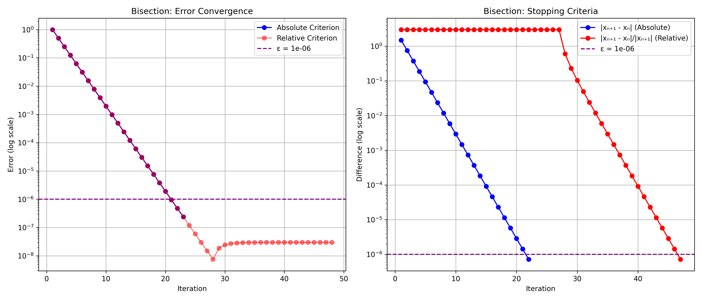

| Criterion | Iterations | Final Value         | Error               |
|-----------|------------|---------------------|---------------------|
| Absolute | 23 | -0.000000238418579 | 0.000000238418579 |
| Relative | 48 | 0.000000029802301 | 0.000000029802301 |

### 2. Newton's Method

#### Mathematical Formula

Starting with an initial guess x₍0₎, the Newton-Raphson iteration is:

x_{n+1} = x_n - f(x_n)⁄f'(x_n)

This formula comes from the linear approximation of f(x) at x_n:
f(x) ≈ f(x_n) + f'(x_n)(x - x_n)

Setting f(x) = 0 and solving for x gives the Newton iteration.

#### Algorithm

1. **Input**: Function f, derivative f', initial guess x₍0₎, tolerance \epsilon
2. **Initialize**: Set n = 0
3. **Iterate**:
   - Compute x_{n+1} = x_n - f(x_n)⁄f'(x_n)
   - If |error| < \epsilon, return x_{n+1}
   - Set n = n + 1
4. **Repeat** until convergence or maximum iterations

#### Convergence Rate

Quadratic convergence when f'(r) ≠ 0 at the root r:
|e_{n+1}| ≤ C|e_n|^2

where C = |f''(r)|⁄2|f'(r)|

#### Implementation

```python
def newton_method(f, df, x0, epsilon=1e-6, condition=stopping_condition_2):
    sequence = [x0]
    x = x0

    for k in range(100):
        try:
            x_new = x - f(x) / df(x)
            sequence.append(x_new)

            if condition(sequence[k], sequence[k - 1], epsilon):
                return sequence, "Second stopping condition (convergence)"

            x = x_new

        except ZeroDivisionError:
            return sequence, "Error: Zero derivative"

    return sequence, "First stopping condition (max iterations)"

```

#### Examples with Absolute Error Criterion ∣xₙ₊₁ − xₙ∣ < ε

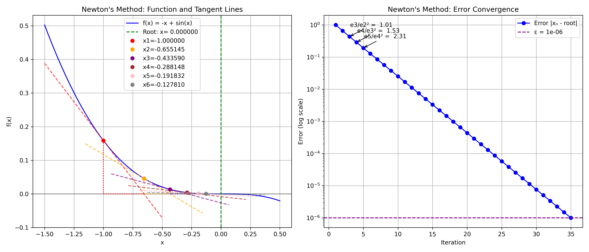

##### Newton's Method (ε = 0.000001000000000)

| Iteration | xₙ                  | f(xₙ)               | f'(xₙ)              | Error               | Abs. Error          | Aitken              |
|-----------|---------------------|---------------------|---------------------|---------------------|---------------------|---------------------|
| 1 | -1.000000000000000 | 0.158529015192103 | 0.367879441171442 | 1.000000000000000 | N/A | N/A |
| 2 | -0.655145072042430 | 0.045870786040896 | 0.519366711531902 | 0.655145072042430 | 0.344854927957570 | N/A |
| 3 | -0.433590368363493 | 0.013458737959401 | 0.648177715209517 | 0.433590368363493 | 0.221554703678938 | -0.03548495525948214 |
| 4 | -0.288148400892501 | 0.003970948460417 | 0.749650335205116 | 0.288148400892501 | 0.145441967470992 | -0.01022689976501201 |
| 5 | -0.191832312150639 | 0.001174396923293 | 0.825445274029662 | 0.191832312150639 | 0.096316088741863 | -0.0029952024537142075 |
| 6 | -0.127809667560708 | 0.000347684349205 | 0.880020859722503 | 0.127809667560708 | 0.064022644589930 | -0.0008830071213855595 |
| 7 | -0.085183233602864 | 0.000102980156755 | 0.918343997504690 | 0.085183233602864 | 0.042626433957844 | -0.00026105260518638485 |
| 8 | -0.056781952786616 | 0.000030507717045 | 0.944800057927927 | 0.056781952786616 | 0.028401280816248 | -7.727312698979638e-05 |
| 9 | -0.037852600781113 | 0.000009038675804 | 0.962854854485419 | 0.037852600781113 | 0.018929352005503 | -2.2885787712978445e-05 |
| 10 | -0.025234464535015 | 0.000002678040885 | 0.975081263249376 | 0.025234464535015 | 0.012618136246098 | -6.7796649750664906e-06 |
| 11 | -0.016822797810871 | 0.000000793482367 | 0.983317915284625 | 0.016822797810871 | 0.008411666724144 | -2.00861727823326e-06 |
| 12 | -0.011215145640463 | 0.000000235104408 | 0.988847509657230 | 0.011215145640463 | 0.005607652170409 | -5.951230984818645e-07 |
| 13 | -0.007476748086524 | 0.000000069660371 | 0.992551133263900 | 0.007476748086524 | 0.003738397553939 | -1.763299729042045e-07 |
| 14 | -0.004984494080302 | 0.000000020640084 | 0.995027907895901 | 0.004984494080302 | 0.002492254006222 | -5.2245406173198616e-08 |
| 15 | -0.003322994677536 | 0.000000006115577 | 0.996682520358774 | 0.003322994677536 | 0.001661499402766 | -1.5480183197802422e-08 |
| 16 | -0.002215329377337 | 0.000000001812022 | 0.997787122653769 | 0.002215329377337 | 0.001107665300200 | -4.586786164426093e-09 |
| 17 | -0.001476886130694 | 0.000000000536895 | 0.998524203928930 | 0.001476886130694 | 0.000738443246643 | -1.3583505388201078e-09 |
| 18 | -0.000984590717982 | 0.000000000159080 | 0.999015893832418 | 0.000984590717982 | 0.000492295412712 | -4.028536133154903e-10 |
| 19 | -0.000656393801177 | 0.000000000047135 | 0.999343821578107 | 0.000656393801177 | 0.000328196916805 | -1.1759021252381874e-10 |
| 20 | -0.000437595864559 | 0.000000000013966 | 0.999562499866547 | 0.000437595864559 | 0.000218797936618 | -3.883414336630642e-11 |
| 21 | -0.000291730575180 | 0.000000000004138 | 0.999708311974047 | 0.000291730575180 | 0.000145865289380 | -6.614067258291223e-12 |
| 22 | -0.000194487049464 | 0.000000000001226 | 0.999805531861916 | 0.000194487049464 | 0.000097243525716 | -1.257052242246287e-12 |
| 23 | -0.000129658032417 | 0.000000000000363 | 0.999870350372823 | 0.000129658032417 | 0.000064829017048 | 1.1010064930074004e-12 |
| 24 | -0.000086438689368 | 0.000000000000108 | 0.999913565046348 | 0.000086438689368 | 0.000043219343049 | -1.316930305040806e-11 |
| 25 | -0.000057625794780 | 0.000000000000032 | 0.999942375865554 | 0.000057625794780 | 0.000028812894588 | -1.027120231857255e-11 |
| 26 | -0.000038417196692 | 0.000000000000009 | 0.999961583541239 | 0.000038417196692 | 0.000019208598088 | 9.66410565667649e-12 |
| 27 | -0.000025611468248 | 0.000000000000003 | 0.999974388859723 | 0.000025611468248 | 0.000012805728444 | -3.305025948963569e-11 |
| 28 | -0.000017074312016 | 0.000000000000001 | 0.999982925833749 | 0.000017074312016 | 0.000008537156232 | 2.4060312871557448e-11 |
| 29 | -0.000011382877972 | 0.000000000000000 | 0.999988617186813 | 0.000011382877972 | 0.000005691434044 | -3.054466288189214e-11 |
| 30 | -0.000007588596588 | 0.000000000000000 | 0.999992411432206 | 0.000007588596588 | 0.000003794281384 | -8.168840308166495e-11 |
| 31 | -0.000005059065812 | 0.000000000000000 | 0.999994940946985 | 0.000005059065812 | 0.000002529530775 | 5.4854615178995324e-11 |
| 32 | -0.000003372690698 | 0.000000000000000 | 0.999996627314989 | 0.000003372690698 | 0.000001686375114 | 1.8711499361799772e-10 |
| 33 | -0.000002248438823 | 0.000000000000000 | 0.999997751563705 | 0.000002248438823 | 0.000001124251875 | 7.572365246220789e-11 |
| 34 | -0.000001499003613 | 0.000000000000000 | 0.999998500997511 | 0.000001499003613 | 0.000000749435210 | -5.293261918971231e-10 |
| 35 | -0.000000999361199 | 0.000000000000000 | 0.999999000639300 | 0.000000999361199 | 0.000000499642414 | 3.72811670103622e-11 |

**Result**: Converged to -0.000000999361199 in 35 iterations
**Final Error**: 0.000000999361199
**Convergence Rate**: 0.998733150781984


##### Newton's Method (ε = 0.000000001000000)

| Iteration | xₙ                  | f(xₙ)               | f'(xₙ)              | Error               | Abs. Error          | Aitken              |
|-----------|---------------------|---------------------|---------------------|---------------------|---------------------|---------------------|
| 1 | -1.000000000000000 | 0.158529015192103 | 0.367879441171442 | 1.000000000000000 | N/A | N/A |
| 2 | -0.655145072042430 | 0.045870786040896 | 0.519366711531902 | 0.655145072042430 | 0.344854927957570 | N/A |
| 3 | -0.433590368363493 | 0.013458737959401 | 0.648177715209517 | 0.433590368363493 | 0.221554703678938 | -0.03548495525948214 |
| 4 | -0.288148400892501 | 0.003970948460417 | 0.749650335205116 | 0.288148400892501 | 0.145441967470992 | -0.01022689976501201 |
| 5 | -0.191832312150639 | 0.001174396923293 | 0.825445274029662 | 0.191832312150639 | 0.096316088741863 | -0.0029952024537142075 |
| 6 | -0.127809667560708 | 0.000347684349205 | 0.880020859722503 | 0.127809667560708 | 0.064022644589930 | -0.0008830071213855595 |
| 7 | -0.085183233602864 | 0.000102980156755 | 0.918343997504690 | 0.085183233602864 | 0.042626433957844 | -0.00026105260518638485 |
| 8 | -0.056781952786616 | 0.000030507717045 | 0.944800057927927 | 0.056781952786616 | 0.028401280816248 | -7.727312698979638e-05 |
| 9 | -0.037852600781113 | 0.000009038675804 | 0.962854854485419 | 0.037852600781113 | 0.018929352005503 | -2.2885787712978445e-05 |
| 10 | -0.025234464535015 | 0.000002678040885 | 0.975081263249376 | 0.025234464535015 | 0.012618136246098 | -6.7796649750664906e-06 |
| 11 | -0.016822797810871 | 0.000000793482367 | 0.983317915284625 | 0.016822797810871 | 0.008411666724144 | -2.00861727823326e-06 |
| 12 | -0.011215145640463 | 0.000000235104408 | 0.988847509657230 | 0.011215145640463 | 0.005607652170409 | -5.951230984818645e-07 |
| 13 | -0.007476748086524 | 0.000000069660371 | 0.992551133263900 | 0.007476748086524 | 0.003738397553939 | -1.763299729042045e-07 |
| 14 | -0.004984494080302 | 0.000000020640084 | 0.995027907895901 | 0.004984494080302 | 0.002492254006222 | -5.2245406173198616e-08 |
| 15 | -0.003322994677536 | 0.000000006115577 | 0.996682520358774 | 0.003322994677536 | 0.001661499402766 | -1.5480183197802422e-08 |
| 16 | -0.002215329377337 | 0.000000001812022 | 0.997787122653769 | 0.002215329377337 | 0.001107665300200 | -4.586786164426093e-09 |
| 17 | -0.001476886130694 | 0.000000000536895 | 0.998524203928930 | 0.001476886130694 | 0.000738443246643 | -1.3583505388201078e-09 |
| 18 | -0.000984590717982 | 0.000000000159080 | 0.999015893832418 | 0.000984590717982 | 0.000492295412712 | -4.028536133154903e-10 |
| 19 | -0.000656393801177 | 0.000000000047135 | 0.999343821578107 | 0.000656393801177 | 0.000328196916805 | -1.1759021252381874e-10 |
| 20 | -0.000437595864559 | 0.000000000013966 | 0.999562499866547 | 0.000437595864559 | 0.000218797936618 | -3.883414336630642e-11 |
| 21 | -0.000291730575180 | 0.000000000004138 | 0.999708311974047 | 0.000291730575180 | 0.000145865289380 | -6.614067258291223e-12 |
| 22 | -0.000194487049464 | 0.000000000001226 | 0.999805531861916 | 0.000194487049464 | 0.000097243525716 | -1.257052242246287e-12 |
| 23 | -0.000129658032417 | 0.000000000000363 | 0.999870350372823 | 0.000129658032417 | 0.000064829017048 | 1.1010064930074004e-12 |
| 24 | -0.000086438689368 | 0.000000000000108 | 0.999913565046348 | 0.000086438689368 | 0.000043219343049 | -1.316930305040806e-11 |
| 25 | -0.000057625794780 | 0.000000000000032 | 0.999942375865554 | 0.000057625794780 | 0.000028812894588 | -1.027120231857255e-11 |
| 26 | -0.000038417196692 | 0.000000000000009 | 0.999961583541239 | 0.000038417196692 | 0.000019208598088 | 9.66410565667649e-12 |
| 27 | -0.000025611468248 | 0.000000000000003 | 0.999974388859723 | 0.000025611468248 | 0.000012805728444 | -3.305025948963569e-11 |
| 28 | -0.000017074312016 | 0.000000000000001 | 0.999982925833749 | 0.000017074312016 | 0.000008537156232 | 2.4060312871557448e-11 |
| 29 | -0.000011382877972 | 0.000000000000000 | 0.999988617186813 | 0.000011382877972 | 0.000005691434044 | -3.054466288189214e-11 |
| 30 | -0.000007588596588 | 0.000000000000000 | 0.999992411432206 | 0.000007588596588 | 0.000003794281384 | -8.168840308166495e-11 |
| 31 | -0.000005059065812 | 0.000000000000000 | 0.999994940946985 | 0.000005059065812 | 0.000002529530775 | 5.4854615178995324e-11 |
| 32 | -0.000003372690698 | 0.000000000000000 | 0.999996627314989 | 0.000003372690698 | 0.000001686375114 | 1.8711499361799772e-10 |
| 33 | -0.000002248438823 | 0.000000000000000 | 0.999997751563705 | 0.000002248438823 | 0.000001124251875 | 7.572365246220789e-11 |
| 34 | -0.000001499003613 | 0.000000000000000 | 0.999998500997511 | 0.000001499003613 | 0.000000749435210 | -5.293261918971231e-10 |
| 35 | -0.000000999361199 | 0.000000000000000 | 0.999999000639300 | 0.000000999361199 | 0.000000499642414 | 3.72811670103622e-11 |
| 36 | -0.000000666062839 | 0.000000000000000 | 0.999999333937383 | 0.000000666062839 | 0.000000333298360 | 1.7566294957940445e-09 |
| 37 | -0.000000444111609 | 0.000000000000000 | 0.999999555888490 | 0.000000444111609 | 0.000000221951230 | -1.690254069199765e-09 |
| 38 | -0.000000295905465 | 0.000000000000000 | 0.999999704094579 | 0.000000295905465 | 0.000000148206144 | 1.9457170202741195e-09 |
| 39 | -0.000000196665244 | 0.000000000000000 | 0.999999803334775 | 0.000000196665244 | 0.000000099240221 | 4.4669064223657126e-09 |
| 40 | -0.000000130894602 | 0.000000000000000 | 0.999999869105407 | 0.000000130894602 | 0.000000065770643 | -1.649548744063142e-09 |
| 41 | -0.000000087545769 | 0.000000000000000 | 0.999999912454235 | 0.000000087545769 | 0.000000043348833 | -3.738026336674704e-09 |
| 42 | -0.000000060297932 | 0.000000000000000 | 0.999999939702070 | 0.000000060297932 | 0.000000027247838 | -1.418620649310674e-08 |
| 43 | -0.000000037946190 | 0.000000000000000 | 0.999999962053811 | 0.000000037946190 | 0.000000022351742 | 6.409437045796498e-08 |
| 44 | -0.000000028012082 | 0.000000000000000 | 0.999999971987918 | 0.000000028012082 | 0.000000009934107 | -2.0064796458591694e-08 |
| 45 | -0.000000020561502 | 0.000000000000000 | 0.999999979438498 | 0.000000020561502 | 0.000000007450581 | 1.7902399590515837e-09 |
| 46 | -0.000000020561502 | 0.000000000000000 | 0.999999979438498 | 0.000000020561502 | 0.000000000000000 | -2.056150183171992e-08 |
| 47 | -0.000000020561502 | 0.000000000000000 | 0.999999979438498 | 0.000000020561502 | 0.000000000000000 | -2.056150183171992e-08 |

**Result**: Converged to -0.000000020561502 in 47 iterations
**Final Error**: 0.000000020561502
**Convergence Rate**: 0.972580462468180

#### Examples with Relative Error Criterion ∣xₙ₊₁ − xₙ∣/|xₙ₊₁| < ε

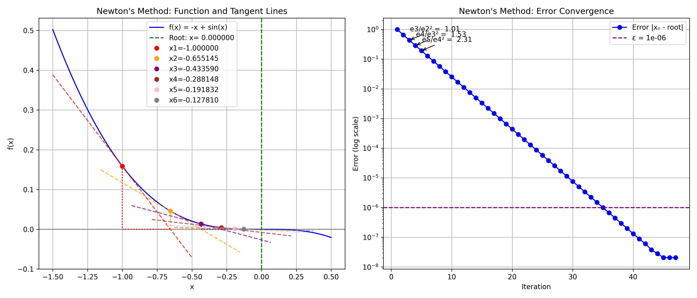

##### Newton's Method with Relative Criterion (ε = 0.000001000000000)

| Iteration | xₙ                  | f(xₙ)               | f'(xₙ)              | Error               | Rel. Difference     | Aitken              |
|-----------|---------------------|---------------------|---------------------|---------------------|---------------------|---------------------|
| 1 | -1.000000000000000 | 0.158529015192103 | -0.459697694131860 | 1.000000000000000 | N/A | N/A |
| 2 | -0.655145072042430 | 0.045870786040896 | -0.207040452218828 | 0.655145072042430 | 0.526379488564992 | N/A |
| 3 | -0.433590368363493 | 0.013458737959401 | -0.092536825466730 | 0.433590368363493 | 0.510976995441931 | -0.03548495525948214 |
| 4 | -0.288148400892501 | 0.003970948460417 | -0.041228298535459 | 0.288148400892501 | 0.504746745151125 | -0.01022689976501201 |
| 5 | -0.191832312150639 | 0.001174396923293 | -0.018343461611363 | 0.191832312150639 | 0.502084803451825 | -0.0029952024537142075 |
| 6 | -0.127809667560708 | 0.000347684349205 | -0.008156543180432 | 0.127809667560708 | 0.500921767592583 | -0.0008830071213855595 |
| 7 | -0.085183233602864 | 0.000102980156755 | -0.003625898332586 | 0.085183233602864 | 0.500408732504503 | -0.00026105260518638485 |
| 8 | -0.056781952786616 | 0.000030507717045 | -0.001611661985921 | 0.056781952786616 | 0.500181473556893 | -7.727312698979638e-05 |
| 9 | -0.037852600781113 | 0.000009038675804 | -0.000716324156558 | 0.037852600781113 | 0.500080618369240 | -2.2885787712978445e-05 |
| 10 | -0.025234464535015 | 0.000002678040885 | -0.000318372205273 | 0.025234464535015 | 0.500035823173082 | -6.7796649750664906e-06 |
| 11 | -0.016822797810871 | 0.000000793482367 | -0.000141499925929 | 0.016822797810871 | 0.500015919986154 | -2.00861727823326e-06 |
| 12 | -0.011215145640463 | 0.000000235104408 | -0.000062889086685 | 0.011215145640463 | 0.500007075269445 | -5.951230984818645e-07 |
| 13 | -0.007476748086524 | 0.000000069660371 | -0.000027950750766 | 0.007476748086524 | 0.500003144505745 | -1.763299729042045e-07 |
| 14 | -0.004984494080302 | 0.000000020640084 | -0.000012422564898 | 0.004984494080302 | 0.500001397548202 | -5.2245406173198616e-08 |
| 15 | -0.003322994677536 | 0.000000006115577 | -0.000005521141733 | 0.003322994677536 | 0.500000621125684 | -1.5480183197802422e-08 |
| 16 | -0.002215329377337 | 0.000000001812022 | -0.000002453841122 | 0.002215329377337 | 0.500000276045329 | -4.586786164426093e-09 |
| 17 | -0.001476886130694 | 0.000000000536895 | -0.000001090596123 | 0.001476886130694 | 0.500000122755206 | -1.3583505388201078e-09 |
| 18 | -0.000984590717982 | 0.000000000159080 | -0.000000484709402 | 0.000984590717982 | 0.500000054562091 | -4.028536133154903e-10 |
| 19 | -0.000656393801177 | 0.000000000047135 | -0.000000215426403 | 0.000656393801177 | 0.500000024704444 | -1.1759021252381874e-10 |
| 20 | -0.000437595864559 | 0.000000000013966 | -0.000000095745069 | 0.000437595864559 | 0.500000009913724 | -3.883414336630642e-11 |
| 21 | -0.000291730575180 | 0.000000000004138 | -0.000000042553364 | 0.000291730575180 | 0.500000006135085 | -6.614067258291223e-12 |
| 22 | -0.000194487049464 | 0.000000000001226 | -0.000000018912606 | 0.000194487049464 | 0.500000005057847 | -1.257052242246287e-12 |
| 23 | -0.000129658032417 | 0.000000000000363 | -0.000000008405603 | 0.000129658032417 | 0.500000006473117 | 1.1010064930074004e-12 |
| 24 | -0.000086438689368 | 0.000000000000108 | -0.000000003735824 | 0.000086438689368 | 0.499999981080737 | -1.316930305040806e-11 |
| 25 | -0.000057625794780 | 0.000000000000032 | -0.000000001660366 | 0.000057625794780 | 0.499999951374126 | -1.027120231857255e-11 |
| 26 | -0.000038417196692 | 0.000000000000009 | -0.000000000737940 | 0.000038417196692 | 0.499999993300242 | 9.66410565667649e-12 |
| 27 | -0.000025611468248 | 0.000000000000003 | -0.000000000327974 | 0.000025611468248 | 0.499999778225512 | -3.305025948963569e-11 |
| 28 | -0.000017074312016 | 0.000000000000001 | -0.000000000145766 | 0.000017074312016 | 0.500000013083974 | 2.4060312871557448e-11 |
| 29 | -0.000011382877972 | 0.000000000000000 | -0.000000000064785 | 0.000011382877972 | 0.499999565852311 | -3.054466288189214e-11 |
| 30 | -0.000007588596588 | 0.000000000000000 | -0.000000000028793 | 0.000007588596588 | 0.499997771742014 | -8.168840308166495e-11 |
| 31 | -0.000005059065812 | 0.000000000000000 | -0.000000000012797 | 0.000005059065812 | 0.499999578859028 | 5.4854615178995324e-11 |
| 32 | -0.000003372690698 | 0.000000000000000 | -0.000000000005688 | 0.000003372690698 | 0.500008825191508 | 1.8711499361799772e-10 |
| 33 | -0.000002248438823 | 0.000000000000000 | -0.000000000002528 | 0.000002248438823 | 0.500014438326708 | 7.572365246220789e-11 |
| 34 | -0.000001499003613 | 0.000000000000000 | -0.000000000001124 | 0.000001499003613 | 0.499955573140650 | -5.293261918971231e-10 |
| 35 | -0.000000999361199 | 0.000000000000000 | -0.000000000000499 | 0.000000999361199 | 0.499961789616429 | 3.72811670103622e-11 |
| 36 | -0.000000666062839 | 0.000000000000000 | -0.000000000000222 | 0.000000666062839 | 0.500400774698967 | 1.7566294957940445e-09 |
| 37 | -0.000000444111609 | 0.000000000000000 | -0.000000000000099 | 0.000000444111609 | 0.499764530712295 | -1.690254069199765e-09 |
| 38 | -0.000000295905465 | 0.000000000000000 | -0.000000000000044 | 0.000000295905465 | 0.500856392463748 | 1.9457170202741195e-09 |
| 39 | -0.000000196665244 | 0.000000000000000 | -0.000000000000019 | 0.000000196665244 | 0.504614941300665 | 4.4669064223657126e-09 |
| 40 | -0.000000130894602 | 0.000000000000000 | -0.000000000000009 | 0.000000130894602 | 0.502470243825440 | -1.649548744063142e-09 |
| 41 | -0.000000087545769 | 0.000000000000000 | -0.000000000000004 | 0.000000087545769 | 0.495156224152292 | -3.738026336674704e-09 |
| 42 | -0.000000060297932 | 0.000000000000000 | -0.000000000000002 | 0.000000060297932 | 0.451886770433786 | -1.418620649310674e-08 |
| 43 | -0.000000037946190 | 0.000000000000000 | -0.000000000000001 | 0.000000037946190 | 0.589037841608172 | 6.409437045796498e-08 |
| 44 | -0.000000028012082 | 0.000000000000000 | -0.000000000000000 | 0.000000028012082 | 0.354636521146567 | -2.0064796458591694e-08 |
| 45 | -0.000000020561502 | 0.000000000000000 | -0.000000000000000 | 0.000000020561502 | 0.362355856002207 | 1.7902399590515837e-09 |
| 46 | -0.000000020561502 | 0.000000000000000 | -0.000000000000000 | 0.000000020561502 | 0.000000000000000 | -2.056150183171992e-08 |
| 47 | -0.000000020561502 | 0.000000000000000 | -0.000000000000000 | 0.000000020561502 | 0.000000000000000 | -2.056150183171992e-08 |

**Result**: Converged to -0.000000020561502 in 47 iterations
**Final Error**: 0.000000020561502
**Convergence Rate**: 0.972580462468180

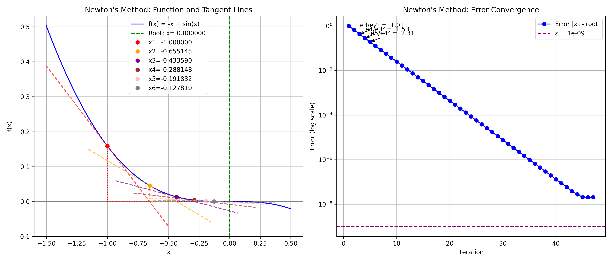

##### Newton's Method with Relative Criterion (ε = 0.000000001000000)

| Iteration | xₙ                  | f(xₙ)               | f'(xₙ)              | Error               | Rel. Difference     | Aitken              |
|-----------|---------------------|---------------------|---------------------|---------------------|---------------------|---------------------|
| 1 | -1.000000000000000 | 0.158529015192103 | -0.459697694131860 | 1.000000000000000 | N/A | N/A |
| 2 | -0.655145072042430 | 0.045870786040896 | -0.207040452218828 | 0.655145072042430 | 0.526379488564992 | N/A |
| 3 | -0.433590368363493 | 0.013458737959401 | -0.092536825466730 | 0.433590368363493 | 0.510976995441931 | -0.03548495525948214 |
| 4 | -0.288148400892501 | 0.003970948460417 | -0.041228298535459 | 0.288148400892501 | 0.504746745151125 | -0.01022689976501201 |
| 5 | -0.191832312150639 | 0.001174396923293 | -0.018343461611363 | 0.191832312150639 | 0.502084803451825 | -0.0029952024537142075 |
| 6 | -0.127809667560708 | 0.000347684349205 | -0.008156543180432 | 0.127809667560708 | 0.500921767592583 | -0.0008830071213855595 |
| 7 | -0.085183233602864 | 0.000102980156755 | -0.003625898332586 | 0.085183233602864 | 0.500408732504503 | -0.00026105260518638485 |
| 8 | -0.056781952786616 | 0.000030507717045 | -0.001611661985921 | 0.056781952786616 | 0.500181473556893 | -7.727312698979638e-05 |
| 9 | -0.037852600781113 | 0.000009038675804 | -0.000716324156558 | 0.037852600781113 | 0.500080618369240 | -2.2885787712978445e-05 |
| 10 | -0.025234464535015 | 0.000002678040885 | -0.000318372205273 | 0.025234464535015 | 0.500035823173082 | -6.7796649750664906e-06 |
| 11 | -0.016822797810871 | 0.000000793482367 | -0.000141499925929 | 0.016822797810871 | 0.500015919986154 | -2.00861727823326e-06 |
| 12 | -0.011215145640463 | 0.000000235104408 | -0.000062889086685 | 0.011215145640463 | 0.500007075269445 | -5.951230984818645e-07 |
| 13 | -0.007476748086524 | 0.000000069660371 | -0.000027950750766 | 0.007476748086524 | 0.500003144505745 | -1.763299729042045e-07 |
| 14 | -0.004984494080302 | 0.000000020640084 | -0.000012422564898 | 0.004984494080302 | 0.500001397548202 | -5.2245406173198616e-08 |
| 15 | -0.003322994677536 | 0.000000006115577 | -0.000005521141733 | 0.003322994677536 | 0.500000621125684 | -1.5480183197802422e-08 |
| 16 | -0.002215329377337 | 0.000000001812022 | -0.000002453841122 | 0.002215329377337 | 0.500000276045329 | -4.586786164426093e-09 |
| 17 | -0.001476886130694 | 0.000000000536895 | -0.000001090596123 | 0.001476886130694 | 0.500000122755206 | -1.3583505388201078e-09 |
| 18 | -0.000984590717982 | 0.000000000159080 | -0.000000484709402 | 0.000984590717982 | 0.500000054562091 | -4.028536133154903e-10 |
| 19 | -0.000656393801177 | 0.000000000047135 | -0.000000215426403 | 0.000656393801177 | 0.500000024704444 | -1.1759021252381874e-10 |
| 20 | -0.000437595864559 | 0.000000000013966 | -0.000000095745069 | 0.000437595864559 | 0.500000009913724 | -3.883414336630642e-11 |
| 21 | -0.000291730575180 | 0.000000000004138 | -0.000000042553364 | 0.000291730575180 | 0.500000006135085 | -6.614067258291223e-12 |
| 22 | -0.000194487049464 | 0.000000000001226 | -0.000000018912606 | 0.000194487049464 | 0.500000005057847 | -1.257052242246287e-12 |
| 23 | -0.000129658032417 | 0.000000000000363 | -0.000000008405603 | 0.000129658032417 | 0.500000006473117 | 1.1010064930074004e-12 |
| 24 | -0.000086438689368 | 0.000000000000108 | -0.000000003735824 | 0.000086438689368 | 0.499999981080737 | -1.316930305040806e-11 |
| 25 | -0.000057625794780 | 0.000000000000032 | -0.000000001660366 | 0.000057625794780 | 0.499999951374126 | -1.027120231857255e-11 |
| 26 | -0.000038417196692 | 0.000000000000009 | -0.000000000737940 | 0.000038417196692 | 0.499999993300242 | 9.66410565667649e-12 |
| 27 | -0.000025611468248 | 0.000000000000003 | -0.000000000327974 | 0.000025611468248 | 0.499999778225512 | -3.305025948963569e-11 |
| 28 | -0.000017074312016 | 0.000000000000001 | -0.000000000145766 | 0.000017074312016 | 0.500000013083974 | 2.4060312871557448e-11 |
| 29 | -0.000011382877972 | 0.000000000000000 | -0.000000000064785 | 0.000011382877972 | 0.499999565852311 | -3.054466288189214e-11 |
| 30 | -0.000007588596588 | 0.000000000000000 | -0.000000000028793 | 0.000007588596588 | 0.499997771742014 | -8.168840308166495e-11 |
| 31 | -0.000005059065812 | 0.000000000000000 | -0.000000000012797 | 0.000005059065812 | 0.499999578859028 | 5.4854615178995324e-11 |
| 32 | -0.000003372690698 | 0.000000000000000 | -0.000000000005688 | 0.000003372690698 | 0.500008825191508 | 1.8711499361799772e-10 |
| 33 | -0.000002248438823 | 0.000000000000000 | -0.000000000002528 | 0.000002248438823 | 0.500014438326708 | 7.572365246220789e-11 |
| 34 | -0.000001499003613 | 0.000000000000000 | -0.000000000001124 | 0.000001499003613 | 0.499955573140650 | -5.293261918971231e-10 |
| 35 | -0.000000999361199 | 0.000000000000000 | -0.000000000000499 | 0.000000999361199 | 0.499961789616429 | 3.72811670103622e-11 |
| 36 | -0.000000666062839 | 0.000000000000000 | -0.000000000000222 | 0.000000666062839 | 0.500400774698967 | 1.7566294957940445e-09 |
| 37 | -0.000000444111609 | 0.000000000000000 | -0.000000000000099 | 0.000000444111609 | 0.499764530712295 | -1.690254069199765e-09 |
| 38 | -0.000000295905465 | 0.000000000000000 | -0.000000000000044 | 0.000000295905465 | 0.500856392463748 | 1.9457170202741195e-09 |
| 39 | -0.000000196665244 | 0.000000000000000 | -0.000000000000019 | 0.000000196665244 | 0.504614941300665 | 4.4669064223657126e-09 |
| 40 | -0.000000130894602 | 0.000000000000000 | -0.000000000000009 | 0.000000130894602 | 0.502470243825440 | -1.649548744063142e-09 |
| 41 | -0.000000087545769 | 0.000000000000000 | -0.000000000000004 | 0.000000087545769 | 0.495156224152292 | -3.738026336674704e-09 |
| 42 | -0.000000060297932 | 0.000000000000000 | -0.000000000000002 | 0.000000060297932 | 0.451886770433786 | -1.418620649310674e-08 |
| 43 | -0.000000037946190 | 0.000000000000000 | -0.000000000000001 | 0.000000037946190 | 0.589037841608172 | 6.409437045796498e-08 |
| 44 | -0.000000028012082 | 0.000000000000000 | -0.000000000000000 | 0.000000028012082 | 0.354636521146567 | -2.0064796458591694e-08 |
| 45 | -0.000000020561502 | 0.000000000000000 | -0.000000000000000 | 0.000000020561502 | 0.362355856002207 | 1.7902399590515837e-09 |
| 46 | -0.000000020561502 | 0.000000000000000 | -0.000000000000000 | 0.000000020561502 | 0.000000000000000 | -2.056150183171992e-08 |
| 47 | -0.000000020561502 | 0.000000000000000 | -0.000000000000000 | 0.000000020561502 | 0.000000000000000 | -2.056150183171992e-08 |

**Result**: Converged to -0.000000020561502 in 47 iterations
**Final Error**: 0.000000020561502
**Convergence Rate**: 0.972580462468180

#### Comparison of Stopping Criteria for Newton's Method

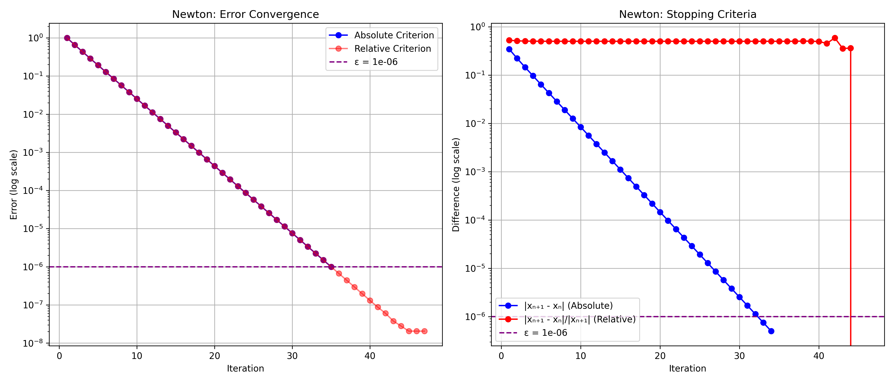

| Criterion | Iterations | Final Value         | Error               |
|-----------|------------|---------------------|---------------------|
| Absolute | 35 | -0.000000999361199 | 0.000000999361199 |
| Relative | 47 | -0.000000020561502 | 0.000000020561502 |

### 3. Secant Method

#### Mathematical Formula

The secant method approximates the derivative using two previous points:

x_{n+1} = x_n - f(x_n) ⋅ \frac{x_n - x_{n-1}}{f(x_n) - f(x_{n-1})}

This can be rewritten as:
x_{n+1} = \frac{x_{n-1}f(x_n) - x_n f(x_{n-1})}{f(x_n) - f(x_{n-1})}

#### Algorithm

1. **Input**: Function f, two initial points x₍0₎, x₍1₎, tolerance \epsilon
2. **Initialize**: Set n = 1
3. **Iterate**:
   - Compute x_{n+1} = x_n - f(x_n) ⋅ \frac{x_n - x_{n-1}}{f(x_n) - f(x_{n-1})}
   - If |error| < \epsilon, return x_{n+1}
   - Set n = n + 1
4. **Repeat** until convergence or maximum iterations

#### Convergence Rate

Superlinear convergence with rate ϕ = \frac{1 + \sqrt{5}}{2} ≈ 1.618 (golden ratio):
|e_{n+1}| ≤ C|e_n|^ϕ

#### Implementation

```python
def secant_method(f, x0, x1, epsilon=1e-6, condition=stopping_condition_2):
    sequence = []
    for k in range(100):
        try:
            f0, f1 = f(x0), f(x1)
            if abs(f1 - f0) < 1e-19:
                return sequence, "Error: Division by zero"

            x_new = x1 - f1 * (x1 - x0) / (f1 - f0)
            sequence.append(x_new)

            if k > 0 and condition(sequence[k], sequence[k - 1], epsilon):
                return sequence, "Second stopping condition (convergence)"

            x0, x1 = x1, x_new

        except (ZeroDivisionError, OverflowError):
            return sequence, "Error: Non-convergence"

    return sequence, "First stopping condition (max iterations)"

```

#### Examples with Absolute Error Criterion ∣xₙ₊₁ − xₙ∣ < ε

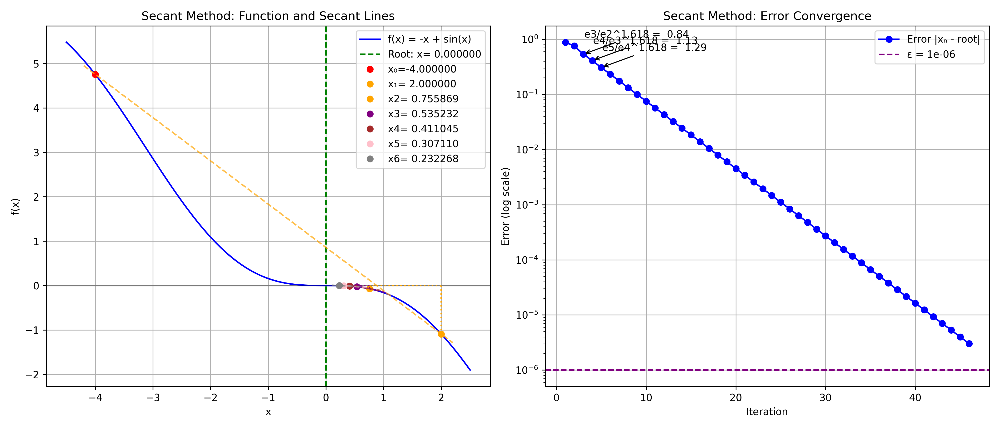

##### f(x) = -x + sin(x) (ε = 1e-06, absolute criterion)

| Iteration | xₙ                  | f(xₙ)               | Error               | Abs. Error          | Aitken              |
|-----------|---------------------|---------------------|---------------------|---------------------|---------------------|
| 1 | 0.880853396037415 | -0.109571055601439 | 0.880853396037415 | N/A | N/A |
| 2 | 0.755869056453362 | -0.069947737576414 | 0.755869056453362 | 0.124984339584053 | N/A |
| 3 | 0.535232011850850 | -0.025191393629282 | 0.535232011850850 | 0.220637044602512 | 1.0441638339204546 |
| 4 | 0.411045044158651 | -0.011477502254070 | 0.411045044158651 | 0.124186967692199 | 0.25114467457238054 |
| 5 | 0.307109832582624 | -0.004804869848338 | 0.307109832582624 | 0.103935211576027 | -0.22630209196288353 |
| 6 | 0.232267531386273 | -0.002082776728245 | 0.232267531386273 | 0.074842301196351 | 0.0397336812054333 |
| 7 | 0.175002847063257 | -0.000891905891620 | 0.175002847063257 | 0.057264684323016 | -0.011555097295479877 |
| 8 | 0.132114308895519 | -0.000383989457242 | 0.132114308895519 | 0.042888538167738 | 0.004164391977755005 |
| 9 | 0.099690182842007 | -0.000165040344263 | 0.099690182842007 | 0.032424126053512 | -0.0007764213836455591 |
| 10 | 0.075249394507561 | -0.000070996153383 | 0.075249394507561 | 0.024440788334446 | 0.000424533599753002 |
| 11 | 0.056798473284811 | -0.000030534350250 | 0.056798473284811 | 0.018450921222750 | -3.692683673880981e-05 |
| 12 | 0.042874553750515 | -0.000013134322369 | 0.042874553750515 | 0.013923919534296 | 4.807641740471602e-05 |
| 13 | 0.032364154051628 | -0.000005649614098 | 0.032364154051628 | 0.010510399698888 | 2.10339514745278e-06 |
| 14 | 0.024430684882384 | -0.000002430203909 | 0.024430684882384 | 0.007933469169243 | 6.303885194243464e-06 |
| 15 | 0.018442026508575 | -0.000001045363399 | 0.018442026508575 | 0.005988658373809 | 1.14310624511893e-06 |
| 16 | 0.013921416210440 | -0.000000449670911 | 0.013921416210440 | 0.004520610298136 | 9.473877578755618e-07 |
| 17 | 0.010508939140595 | -0.000000193429622 | 0.010508939140595 | 0.003412477069844 | 2.751506425410777e-07 |
| 18 | 0.007932952464203 | -0.000000083205482 | 0.007932952464203 | 0.002575986676393 | 1.568112000683436e-07 |
| 19 | 0.005988403729141 | -0.000000035791606 | 0.005988403729141 | 0.001944548735061 | 5.6283535932594164e-08 |
| 20 | 0.004520510172204 | -0.000000015396098 | 0.004520510172204 | 0.001467893556937 | 2.7455586621913386e-08 |
| 21 | 0.003412431267441 | -0.000000006622779 | 0.003412431267441 | 0.001108078904763 | 1.0867759483133843e-08 |
| 22 | 0.002575967768085 | -0.000000002848852 | 0.002575967768085 | 0.000836463499355 | 4.9477759502328245e-09 |
| 23 | 0.001944540371002 | -0.000000001225461 | 0.001944540371002 | 0.000631427397083 | 2.0513202499475303e-09 |
| 24 | 0.001467890025999 | -0.000000000527144 | 0.001467890025999 | 0.000476650345003 | 9.020053757732849e-10 |
| 25 | 0.001108077366371 | -0.000000000226756 | 0.001108077366371 | 0.000359812659628 | 3.823735917739962e-10 |
| 26 | 0.000836462843175 | -0.000000000097541 | 0.000836462843175 | 0.000271614523196 | 1.6725044027672553e-10 |
| 27 | 0.000631427113204 | -0.000000000041958 | 0.000631427113204 | 0.000205035729971 | 6.971829428874254e-11 |
| 28 | 0.000476650223161 | -0.000000000018049 | 0.000476650223161 | 0.000154776890043 | 3.1359945022735314e-11 |
| 29 | 0.000359812607159 | -0.000000000007764 | 0.000359812607159 | 0.000116837616002 | 1.5645609699292684e-11 |
| 30 | 0.000271614500378 | -0.000000000003340 | 0.000271614500378 | 0.000088198106782 | -1.8143985120767925e-12 |
| 31 | 0.000205035720014 | -0.000000000001437 | 0.000205035720014 | 0.000066578780363 | 7.57558263082131e-12 |
| 32 | 0.000154776886639 | -0.000000000000618 | 0.000154776886639 | 0.000050258833375 | 1.548241824458549e-11 |
| 33 | 0.000116837613792 | -0.000000000000266 | 0.000116837613792 | 0.000037939272847 | -2.995988927865373e-11 |
| 34 | 0.000088198106987 | -0.000000000000114 | 0.000088198106987 | 0.000028639506805 | 4.4116751538817583e-11 |
| 35 | 0.000066578778371 | -0.000000000000049 | 0.000066578778371 | 0.000021619328616 | -6.865512161330269e-11 |
| 36 | 0.000050258835890 | -0.000000000000021 | 0.000050258835890 | 0.000016319942481 | 8.595027807696814e-11 |
| 37 | 0.000037939269141 | -0.000000000000009 | 0.000037939269141 | 0.000012319566750 | -9.833792096326354e-11 |
| 38 | 0.000028639503874 | -0.000000000000004 | 0.000028639503874 | 0.000009299765266 | -5.870381620859313e-12 |
| 39 | 0.000021619325247 | -0.000000000000002 | 0.000021619325247 | 0.000007020178627 | 9.520820305644433e-11 |
| 40 | 0.000016319944514 | -0.000000000000001 | 0.000016319944514 | 0.000005299380733 | -6.393023887645054e-11 |
| 41 | 0.000012319566791 | -0.000000000000000 | 0.000012319566791 | 0.000004000377723 | 1.0194181865772162e-10 |
| 42 | 0.000009299764576 | -0.000000000000000 | 0.000009299764576 | 0.000003019802215 | -8.570469733684412e-11 |
| 43 | 0.000007020170122 | -0.000000000000000 | 0.000007020170122 | 0.000002279594454 | -2.248936536722654e-10 |
| 44 | 0.000005299364728 | -0.000000000000000 | 0.000005299364728 | 0.000001720805394 | 9.991324635890699e-11 |
| 45 | 0.000004000410166 | -0.000000000000000 | 0.000004000410166 | 0.000001298954563 | 6.955009242679867e-10 |
| 46 | 0.000003019771868 | -0.000000000000000 | 0.000003019771868 | 0.000000980638297 | -1.2847786374311934e-09 |

**Result**: Converged to 0.000003019771868 in 46 iterations
**Final Error**: 0.000003019771868
**Convergence Rate**: 1.024767494227340

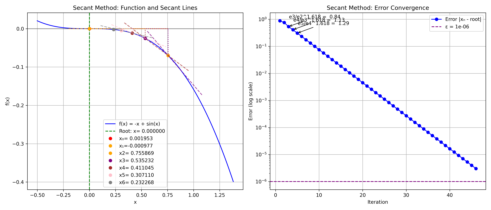

##### Secant method from bisection [a, b] (ε = 1e-06, absolute)

| Iteration | xₙ                  | f(xₙ)               | Error               | Abs. Error          | Aitken              |
|-----------|---------------------|---------------------|---------------------|---------------------|---------------------|
| 1 | 0.880853396037415 | -0.109571055601439 | 0.880853396037415 | N/A | N/A |
| 2 | 0.755869056453362 | -0.069947737576414 | 0.755869056453362 | 0.124984339584053 | N/A |
| 3 | 0.535232011850850 | -0.025191393629282 | 0.535232011850850 | 0.220637044602512 | 1.0441638339204546 |
| 4 | 0.411045044158651 | -0.011477502254070 | 0.411045044158651 | 0.124186967692199 | 0.25114467457238054 |
| 5 | 0.307109832582624 | -0.004804869848338 | 0.307109832582624 | 0.103935211576027 | -0.22630209196288353 |
| 6 | 0.232267531386273 | -0.002082776728245 | 0.232267531386273 | 0.074842301196351 | 0.0397336812054333 |
| 7 | 0.175002847063257 | -0.000891905891620 | 0.175002847063257 | 0.057264684323016 | -0.011555097295479877 |
| 8 | 0.132114308895519 | -0.000383989457242 | 0.132114308895519 | 0.042888538167738 | 0.004164391977755005 |
| 9 | 0.099690182842007 | -0.000165040344263 | 0.099690182842007 | 0.032424126053512 | -0.0007764213836455591 |
| 10 | 0.075249394507561 | -0.000070996153383 | 0.075249394507561 | 0.024440788334446 | 0.000424533599753002 |
| 11 | 0.056798473284811 | -0.000030534350250 | 0.056798473284811 | 0.018450921222750 | -3.692683673880981e-05 |
| 12 | 0.042874553750515 | -0.000013134322369 | 0.042874553750515 | 0.013923919534296 | 4.807641740471602e-05 |
| 13 | 0.032364154051628 | -0.000005649614098 | 0.032364154051628 | 0.010510399698888 | 2.10339514745278e-06 |
| 14 | 0.024430684882384 | -0.000002430203909 | 0.024430684882384 | 0.007933469169243 | 6.303885194243464e-06 |
| 15 | 0.018442026508575 | -0.000001045363399 | 0.018442026508575 | 0.005988658373809 | 1.14310624511893e-06 |
| 16 | 0.013921416210440 | -0.000000449670911 | 0.013921416210440 | 0.004520610298136 | 9.473877578755618e-07 |
| 17 | 0.010508939140595 | -0.000000193429622 | 0.010508939140595 | 0.003412477069844 | 2.751506425410777e-07 |
| 18 | 0.007932952464203 | -0.000000083205482 | 0.007932952464203 | 0.002575986676393 | 1.568112000683436e-07 |
| 19 | 0.005988403729141 | -0.000000035791606 | 0.005988403729141 | 0.001944548735061 | 5.6283535932594164e-08 |
| 20 | 0.004520510172204 | -0.000000015396098 | 0.004520510172204 | 0.001467893556937 | 2.7455586621913386e-08 |
| 21 | 0.003412431267441 | -0.000000006622779 | 0.003412431267441 | 0.001108078904763 | 1.0867759483133843e-08 |
| 22 | 0.002575967768085 | -0.000000002848852 | 0.002575967768085 | 0.000836463499355 | 4.9477759502328245e-09 |
| 23 | 0.001944540371002 | -0.000000001225461 | 0.001944540371002 | 0.000631427397083 | 2.0513202499475303e-09 |
| 24 | 0.001467890025999 | -0.000000000527144 | 0.001467890025999 | 0.000476650345003 | 9.020053757732849e-10 |
| 25 | 0.001108077366371 | -0.000000000226756 | 0.001108077366371 | 0.000359812659628 | 3.823735917739962e-10 |
| 26 | 0.000836462843175 | -0.000000000097541 | 0.000836462843175 | 0.000271614523196 | 1.6725044027672553e-10 |
| 27 | 0.000631427113204 | -0.000000000041958 | 0.000631427113204 | 0.000205035729971 | 6.971829428874254e-11 |
| 28 | 0.000476650223161 | -0.000000000018049 | 0.000476650223161 | 0.000154776890043 | 3.1359945022735314e-11 |
| 29 | 0.000359812607159 | -0.000000000007764 | 0.000359812607159 | 0.000116837616002 | 1.5645609699292684e-11 |
| 30 | 0.000271614500378 | -0.000000000003340 | 0.000271614500378 | 0.000088198106782 | -1.8143985120767925e-12 |
| 31 | 0.000205035720014 | -0.000000000001437 | 0.000205035720014 | 0.000066578780363 | 7.57558263082131e-12 |
| 32 | 0.000154776886639 | -0.000000000000618 | 0.000154776886639 | 0.000050258833375 | 1.548241824458549e-11 |
| 33 | 0.000116837613792 | -0.000000000000266 | 0.000116837613792 | 0.000037939272847 | -2.995988927865373e-11 |
| 34 | 0.000088198106987 | -0.000000000000114 | 0.000088198106987 | 0.000028639506805 | 4.4116751538817583e-11 |
| 35 | 0.000066578778371 | -0.000000000000049 | 0.000066578778371 | 0.000021619328616 | -6.865512161330269e-11 |
| 36 | 0.000050258835890 | -0.000000000000021 | 0.000050258835890 | 0.000016319942481 | 8.595027807696814e-11 |
| 37 | 0.000037939269141 | -0.000000000000009 | 0.000037939269141 | 0.000012319566750 | -9.833792096326354e-11 |
| 38 | 0.000028639503874 | -0.000000000000004 | 0.000028639503874 | 0.000009299765266 | -5.870381620859313e-12 |
| 39 | 0.000021619325247 | -0.000000000000002 | 0.000021619325247 | 0.000007020178627 | 9.520820305644433e-11 |
| 40 | 0.000016319944514 | -0.000000000000001 | 0.000016319944514 | 0.000005299380733 | -6.393023887645054e-11 |
| 41 | 0.000012319566791 | -0.000000000000000 | 0.000012319566791 | 0.000004000377723 | 1.0194181865772162e-10 |
| 42 | 0.000009299764576 | -0.000000000000000 | 0.000009299764576 | 0.000003019802215 | -8.570469733684412e-11 |
| 43 | 0.000007020170122 | -0.000000000000000 | 0.000007020170122 | 0.000002279594454 | -2.248936536722654e-10 |
| 44 | 0.000005299364728 | -0.000000000000000 | 0.000005299364728 | 0.000001720805394 | 9.991324635890699e-11 |
| 45 | 0.000004000410166 | -0.000000000000000 | 0.000004000410166 | 0.000001298954563 | 6.955009242679867e-10 |
| 46 | 0.000003019771868 | -0.000000000000000 | 0.000003019771868 | 0.000000980638297 | -1.2847786374311934e-09 |

**Result**: Converged to 0.000003019771868 in 46 iterations
**Final Error**: 0.000003019771868
**Convergence Rate**: 1.024767494227340

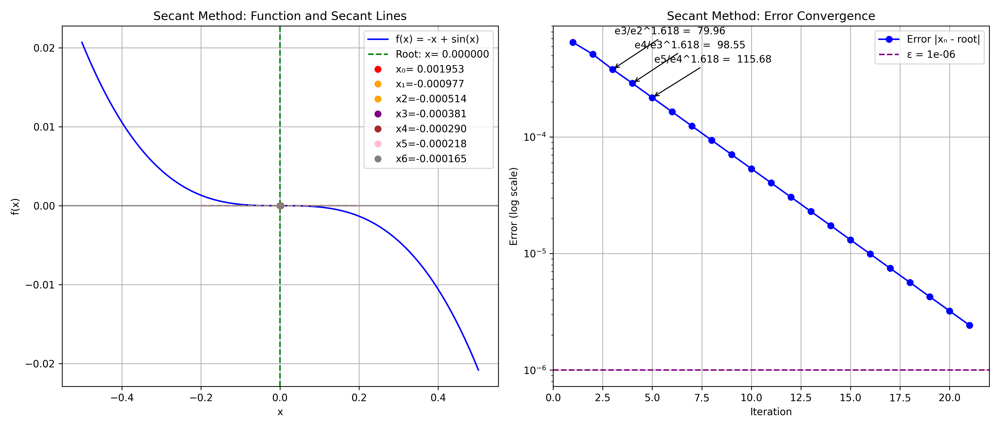

##### Secant method from bisection [x9, x10] (ε = 1e-06, absolute)

| Iteration | xₙ                  | f(xₙ)               | Error               | Abs. Error          | Aitken              |
|-----------|---------------------|---------------------|---------------------|---------------------|---------------------|
| 1 | -0.000651041625285 | 0.000000000045991 | 0.000651041625285 | N/A | N/A |
| 2 | -0.000513980236306 | 0.000000000022630 | 0.000513980236306 | 0.000137061388979 | N/A |
| 3 | -0.000381206922138 | 0.000000000009233 | 0.000381206922138 | 0.000132773314168 | 0.003729904411476457 |
| 4 | -0.000289707070278 | 0.000000000004053 | 0.000289707070278 | 0.000091499851860 | -8.685946742957362e-05 |
| 5 | -0.000218126023123 | 0.000000000001730 | 0.000218126023123 | 0.000071581047155 | 3.9110612688457555e-05 |
| 6 | -0.000164822922088 | 0.000000000000746 | 0.000164822922088 | 0.000053303101036 | -9.377635101596451e-06 |
| 7 | -0.000124373331351 | 0.000000000000321 | 0.000124373331351 | 0.000040449590737 | 2.920252485521076e-06 |
| 8 | -0.000093900534240 | 0.000000000000138 | 0.000093900534240 | 0.000030472797110 | -8.254042451874338e-07 |
| 9 | -0.000070879381072 | 0.000000000000059 | 0.000070879381072 | 0.000023021153168 | 2.4230661105947415e-07 |
| 10 | -0.000053506433241 | 0.000000000000026 | 0.000053506433241 | 0.000017372947831 | -7.011173619180953e-08 |
| 11 | -0.000040390474090 | 0.000000000000011 | 0.000040390474090 | 0.000013115959152 | 2.0341495173410414e-08 |
| 12 | -0.000030489960046 | 0.000000000000005 | 0.000030489960046 | 0.000009900514044 | -5.78910349155183e-09 |
| 13 | -0.000023016165079 | 0.000000000000002 | 0.000023016165079 | 0.000007473794968 | 1.5841825391641265e-09 |
| 14 | -0.000017374389823 | 0.000000000000001 | 0.000017374389823 | 0.000005641775256 | -3.256502498657197e-10 |
| 15 | -0.000013115557335 | 0.000000000000000 | 0.000013115557335 | 0.000004258832488 | -2.971915344196594e-10 |
| 16 | -0.000009900626487 | 0.000000000000000 | 0.000009900626487 | 0.000003214930847 | 4.790834880873541e-10 |
| 17 | -0.000007473751869 | 0.000000000000000 | 0.000007473751869 | 0.000002426874618 | -2.068300991765618e-11 |
| 18 | -0.000005641775552 | 0.000000000000000 | 0.000005641775552 | 0.000001831976317 | -2.4452458956347267e-10 |
| 19 | -0.000004258869827 | 0.000000000000000 | 0.000004258869827 | 0.000001382905725 | -2.3370239617856957e-10 |
| 20 | -0.000003214856366 | 0.000000000000000 | 0.000003214856366 | 0.000001044013461 | 1.3991277667744668e-09 |
| 21 | -0.000002426844359 | 0.000000000000000 | 0.000002426844359 | 0.000000788012007 | -1.2217108176335614e-09 |

**Result**: Converged to -0.000002426844359 in 21 iterations
**Final Error**: 0.000002426844359
**Convergence Rate**: 1.010920720490428

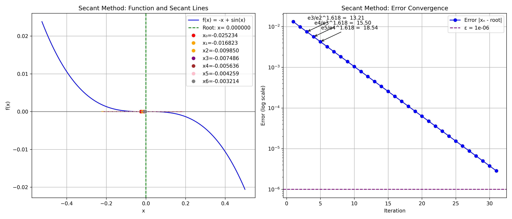

##### Secant method from Newton [x9, x10] (ε = 1e-06, absolute)

| Iteration | xₙ                  | f(xₙ)               | Error               | Abs. Error          | Aitken              |
|-----------|---------------------|---------------------|---------------------|---------------------|---------------------|
| 1 | -0.013281114623035 | 0.000000390434777 | 0.013281114623035 | N/A | N/A |
| 2 | -0.009850263480445 | 0.000000159290613 | 0.009850263480445 | 0.003430851142590 | N/A |
| 3 | -0.007485927839687 | 0.000000069917267 | 0.007485927839687 | 0.002364335640758 | -0.002244482204295956 |
| 4 | -0.005636294905831 | 0.000000029842087 | 0.005636294905831 | 0.001849632933856 | 0.001010536253465099 |
| 5 | -0.004258960960671 | 0.000000012875359 | 0.004258960960671 | 0.001377333945160 | -0.00024233411646379203 |
| 6 | -0.003213758343618 | 0.000000005532076 | 0.003213758343618 | 0.001045202617053 | 7.544811853965171e-05 |
| 7 | -0.002426352826420 | 0.000000002380732 | 0.002426352826420 | 0.000787405517198 | -2.1331789083514976e-05 |
| 8 | -0.001831495198718 | 0.000000001023920 | 0.001831495198718 | 0.000594857627701 | 6.258505872719887e-06 |
| 9 | -0.001382585034601 | 0.000000000440478 | 0.001382585034601 | 0.000448910164117 | -1.811909126414775e-06 |
| 10 | -0.001043673744903 | 0.000000000189471 | 0.001043673744903 | 0.000338911289698 | 5.26597068313886e-07 |
| 11 | -0.000787848544235 | 0.000000000081504 | 0.000787848544235 | 0.000255825200667 | -1.5310616655723162e-07 |
| 12 | -0.000594728523847 | 0.000000000035059 | 0.000594728523847 | 0.000193120020388 | 4.43818137822391e-08 |
| 13 | -0.000448947493490 | 0.000000000015081 | 0.000448947493490 | 0.000145781030357 | -1.2930289321894106e-08 |
| 14 | -0.000338900372772 | 0.000000000006487 | 0.000338900372772 | 0.000110047120718 | 3.735422872386783e-09 |
| 15 | -0.000255828340384 | 0.000000000002791 | 0.000255828340384 | 0.000083072032388 | -1.0941290650725265e-09 |
| 16 | -0.000193119096011 | 0.000000000001200 | 0.000193119096011 | 0.000062709244373 | 3.003543913690683e-10 |
| 17 | -0.000145781293305 | 0.000000000000516 | 0.000145781293305 | 0.000047337802706 | -7.0334905488776e-11 |
| 18 | -0.000110047040830 | 0.000000000000222 | 0.000110047040830 | 0.000035734252475 | 3.7397516290324506e-11 |
| 19 | -0.000083072055869 | 0.000000000000096 | 0.000083072055869 | 0.000026974984961 | -6.240246541071651e-11 |
| 20 | -0.000062709235624 | 0.000000000000041 | 0.000062709235624 | 0.000020362820245 | 9.877377850364428e-11 |
| 21 | -0.000047337802999 | 0.000000000000018 | 0.000047337802999 | 0.000015371432625 | -7.670381483562607e-11 |
| 22 | -0.000035734251691 | 0.000000000000008 | 0.000035734251691 | 0.000011603551307 | -4.3593727938476615e-12 |
| 23 | -0.000026974990633 | 0.000000000000003 | 0.000026974990633 | 0.000008759261059 | -1.7058948410765204e-11 |
| 24 | -0.000020362810782 | 0.000000000000001 | 0.000020362810782 | 0.000006612179851 | 1.4625712097725502e-10 |
| 25 | -0.000015371435617 | 0.000000000000001 | 0.000015371435617 | 0.000004991375164 | -1.658814252814998e-10 |
| 26 | -0.000011603545888 | 0.000000000000000 | 0.000011603545888 | 0.000003767889729 | 1.8277846247025933e-10 |
| 27 | -0.000008759262677 | 0.000000000000000 | 0.000008759262677 | 0.000002844283211 | -1.787865783358148e-10 |
| 28 | -0.000006612184113 | 0.000000000000000 | 0.000006612184113 | 0.000002147078565 | -1.4216905163193206e-10 |
| 29 | -0.000004991382420 | 0.000000000000000 | 0.000004991382420 | 0.000001620801693 | 2.831307553520317e-10 |
| 30 | -0.000003767855652 | 0.000000000000000 | 0.000003767855652 | 0.000001223526767 | 3.6039112889726536e-10 |
| 31 | -0.000002844331612 | 0.000000000000000 | 0.000002844331612 | 0.000000923524041 | -1.3686022553185235e-09 |

**Result**: Converged to -0.000002844331612 in 31 iterations
**Final Error**: 0.000002844331612
**Convergence Rate**: 0.998042784004808

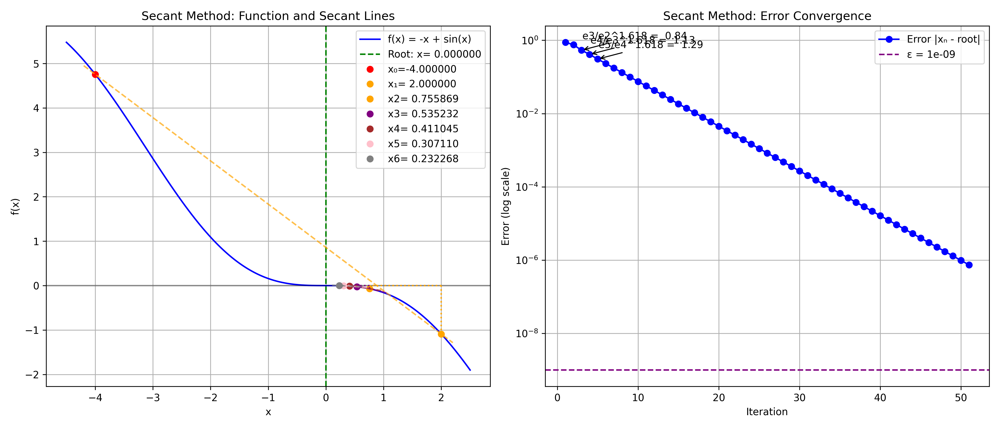

##### f(x) = -x + sin(x) (ε = 1e-09, absolute criterion)

| Iteration | xₙ                  | f(xₙ)               | Error               | Abs. Error          | Aitken              |
|-----------|---------------------|---------------------|---------------------|---------------------|---------------------|
| 1 | 0.880853396037415 | -0.109571055601439 | 0.880853396037415 | N/A | N/A |
| 2 | 0.755869056453362 | -0.069947737576414 | 0.755869056453362 | 0.124984339584053 | N/A |
| 3 | 0.535232011850850 | -0.025191393629282 | 0.535232011850850 | 0.220637044602512 | 1.0441638339204546 |
| 4 | 0.411045044158651 | -0.011477502254070 | 0.411045044158651 | 0.124186967692199 | 0.25114467457238054 |
| 5 | 0.307109832582624 | -0.004804869848338 | 0.307109832582624 | 0.103935211576027 | -0.22630209196288353 |
| 6 | 0.232267531386273 | -0.002082776728245 | 0.232267531386273 | 0.074842301196351 | 0.0397336812054333 |
| 7 | 0.175002847063257 | -0.000891905891620 | 0.175002847063257 | 0.057264684323016 | -0.011555097295479877 |
| 8 | 0.132114308895519 | -0.000383989457242 | 0.132114308895519 | 0.042888538167738 | 0.004164391977755005 |
| 9 | 0.099690182842007 | -0.000165040344263 | 0.099690182842007 | 0.032424126053512 | -0.0007764213836455591 |
| 10 | 0.075249394507561 | -0.000070996153383 | 0.075249394507561 | 0.024440788334446 | 0.000424533599753002 |
| 11 | 0.056798473284811 | -0.000030534350250 | 0.056798473284811 | 0.018450921222750 | -3.692683673880981e-05 |
| 12 | 0.042874553750515 | -0.000013134322369 | 0.042874553750515 | 0.013923919534296 | 4.807641740471602e-05 |
| 13 | 0.032364154051628 | -0.000005649614098 | 0.032364154051628 | 0.010510399698888 | 2.10339514745278e-06 |
| 14 | 0.024430684882384 | -0.000002430203909 | 0.024430684882384 | 0.007933469169243 | 6.303885194243464e-06 |
| 15 | 0.018442026508575 | -0.000001045363399 | 0.018442026508575 | 0.005988658373809 | 1.14310624511893e-06 |
| 16 | 0.013921416210440 | -0.000000449670911 | 0.013921416210440 | 0.004520610298136 | 9.473877578755618e-07 |
| 17 | 0.010508939140595 | -0.000000193429622 | 0.010508939140595 | 0.003412477069844 | 2.751506425410777e-07 |
| 18 | 0.007932952464203 | -0.000000083205482 | 0.007932952464203 | 0.002575986676393 | 1.568112000683436e-07 |
| 19 | 0.005988403729141 | -0.000000035791606 | 0.005988403729141 | 0.001944548735061 | 5.6283535932594164e-08 |
| 20 | 0.004520510172204 | -0.000000015396098 | 0.004520510172204 | 0.001467893556937 | 2.7455586621913386e-08 |
| 21 | 0.003412431267441 | -0.000000006622779 | 0.003412431267441 | 0.001108078904763 | 1.0867759483133843e-08 |
| 22 | 0.002575967768085 | -0.000000002848852 | 0.002575967768085 | 0.000836463499355 | 4.9477759502328245e-09 |
| 23 | 0.001944540371002 | -0.000000001225461 | 0.001944540371002 | 0.000631427397083 | 2.0513202499475303e-09 |
| 24 | 0.001467890025999 | -0.000000000527144 | 0.001467890025999 | 0.000476650345003 | 9.020053757732849e-10 |
| 25 | 0.001108077366371 | -0.000000000226756 | 0.001108077366371 | 0.000359812659628 | 3.823735917739962e-10 |
| 26 | 0.000836462843175 | -0.000000000097541 | 0.000836462843175 | 0.000271614523196 | 1.6725044027672553e-10 |
| 27 | 0.000631427113204 | -0.000000000041958 | 0.000631427113204 | 0.000205035729971 | 6.971829428874254e-11 |
| 28 | 0.000476650223161 | -0.000000000018049 | 0.000476650223161 | 0.000154776890043 | 3.1359945022735314e-11 |
| 29 | 0.000359812607159 | -0.000000000007764 | 0.000359812607159 | 0.000116837616002 | 1.5645609699292684e-11 |
| 30 | 0.000271614500378 | -0.000000000003340 | 0.000271614500378 | 0.000088198106782 | -1.8143985120767925e-12 |
| 31 | 0.000205035720014 | -0.000000000001437 | 0.000205035720014 | 0.000066578780363 | 7.57558263082131e-12 |
| 32 | 0.000154776886639 | -0.000000000000618 | 0.000154776886639 | 0.000050258833375 | 1.548241824458549e-11 |
| 33 | 0.000116837613792 | -0.000000000000266 | 0.000116837613792 | 0.000037939272847 | -2.995988927865373e-11 |
| 34 | 0.000088198106987 | -0.000000000000114 | 0.000088198106987 | 0.000028639506805 | 4.4116751538817583e-11 |
| 35 | 0.000066578778371 | -0.000000000000049 | 0.000066578778371 | 0.000021619328616 | -6.865512161330269e-11 |
| 36 | 0.000050258835890 | -0.000000000000021 | 0.000050258835890 | 0.000016319942481 | 8.595027807696814e-11 |
| 37 | 0.000037939269141 | -0.000000000000009 | 0.000037939269141 | 0.000012319566750 | -9.833792096326354e-11 |
| 38 | 0.000028639503874 | -0.000000000000004 | 0.000028639503874 | 0.000009299765266 | -5.870381620859313e-12 |
| 39 | 0.000021619325247 | -0.000000000000002 | 0.000021619325247 | 0.000007020178627 | 9.520820305644433e-11 |
| 40 | 0.000016319944514 | -0.000000000000001 | 0.000016319944514 | 0.000005299380733 | -6.393023887645054e-11 |
| 41 | 0.000012319566791 | -0.000000000000000 | 0.000012319566791 | 0.000004000377723 | 1.0194181865772162e-10 |
| 42 | 0.000009299764576 | -0.000000000000000 | 0.000009299764576 | 0.000003019802215 | -8.570469733684412e-11 |
| 43 | 0.000007020170122 | -0.000000000000000 | 0.000007020170122 | 0.000002279594454 | -2.248936536722654e-10 |
| 44 | 0.000005299364728 | -0.000000000000000 | 0.000005299364728 | 0.000001720805394 | 9.991324635890699e-11 |
| 45 | 0.000004000410166 | -0.000000000000000 | 0.000004000410166 | 0.000001298954563 | 6.955009242679867e-10 |
| 46 | 0.000003019771868 | -0.000000000000000 | 0.000003019771868 | 0.000000980638297 | -1.2847786374311934e-09 |
| 47 | 0.000002279563104 | -0.000000000000000 | 0.000002279563104 | 0.000000740208764 | 6.874290031669297e-10 |
| 48 | 0.000001720720471 | -0.000000000000000 | 0.000001720720471 | 0.000000558842633 | -1.2387849573375607e-09 |
| 49 | 0.000001299011973 | -0.000000000000000 | 0.000001299011973 | 0.000000421708498 | 2.1936629816093743e-09 |
| 50 | 0.000000980654355 | -0.000000000000000 | 0.000000980654355 | 0.000000318357619 | -8.104685059670005e-13 |
| 51 | 0.000000740347790 | -0.000000000000000 | 0.000000740347790 | 0.000000240306565 | 4.82764752700353e-10 |

**Result**: Converged to 0.000000740347790 in 51 iterations
**Final Error**: 0.000000740347790
**Convergence Rate**: 1.022231808776884

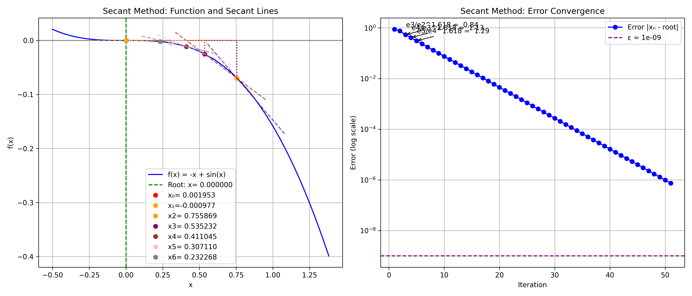

##### Secant method from bisection [a, b] (ε = 1e-09, absolute)

| Iteration | xₙ                  | f(xₙ)               | Error               | Abs. Error          | Aitken              |
|-----------|---------------------|---------------------|---------------------|---------------------|---------------------|
| 1 | 0.880853396037415 | -0.109571055601439 | 0.880853396037415 | N/A | N/A |
| 2 | 0.755869056453362 | -0.069947737576414 | 0.755869056453362 | 0.124984339584053 | N/A |
| 3 | 0.535232011850850 | -0.025191393629282 | 0.535232011850850 | 0.220637044602512 | 1.0441638339204546 |
| 4 | 0.411045044158651 | -0.011477502254070 | 0.411045044158651 | 0.124186967692199 | 0.25114467457238054 |
| 5 | 0.307109832582624 | -0.004804869848338 | 0.307109832582624 | 0.103935211576027 | -0.22630209196288353 |
| 6 | 0.232267531386273 | -0.002082776728245 | 0.232267531386273 | 0.074842301196351 | 0.0397336812054333 |
| 7 | 0.175002847063257 | -0.000891905891620 | 0.175002847063257 | 0.057264684323016 | -0.011555097295479877 |
| 8 | 0.132114308895519 | -0.000383989457242 | 0.132114308895519 | 0.042888538167738 | 0.004164391977755005 |
| 9 | 0.099690182842007 | -0.000165040344263 | 0.099690182842007 | 0.032424126053512 | -0.0007764213836455591 |
| 10 | 0.075249394507561 | -0.000070996153383 | 0.075249394507561 | 0.024440788334446 | 0.000424533599753002 |
| 11 | 0.056798473284811 | -0.000030534350250 | 0.056798473284811 | 0.018450921222750 | -3.692683673880981e-05 |
| 12 | 0.042874553750515 | -0.000013134322369 | 0.042874553750515 | 0.013923919534296 | 4.807641740471602e-05 |
| 13 | 0.032364154051628 | -0.000005649614098 | 0.032364154051628 | 0.010510399698888 | 2.10339514745278e-06 |
| 14 | 0.024430684882384 | -0.000002430203909 | 0.024430684882384 | 0.007933469169243 | 6.303885194243464e-06 |
| 15 | 0.018442026508575 | -0.000001045363399 | 0.018442026508575 | 0.005988658373809 | 1.14310624511893e-06 |
| 16 | 0.013921416210440 | -0.000000449670911 | 0.013921416210440 | 0.004520610298136 | 9.473877578755618e-07 |
| 17 | 0.010508939140595 | -0.000000193429622 | 0.010508939140595 | 0.003412477069844 | 2.751506425410777e-07 |
| 18 | 0.007932952464203 | -0.000000083205482 | 0.007932952464203 | 0.002575986676393 | 1.568112000683436e-07 |
| 19 | 0.005988403729141 | -0.000000035791606 | 0.005988403729141 | 0.001944548735061 | 5.6283535932594164e-08 |
| 20 | 0.004520510172204 | -0.000000015396098 | 0.004520510172204 | 0.001467893556937 | 2.7455586621913386e-08 |
| 21 | 0.003412431267441 | -0.000000006622779 | 0.003412431267441 | 0.001108078904763 | 1.0867759483133843e-08 |
| 22 | 0.002575967768085 | -0.000000002848852 | 0.002575967768085 | 0.000836463499355 | 4.9477759502328245e-09 |
| 23 | 0.001944540371002 | -0.000000001225461 | 0.001944540371002 | 0.000631427397083 | 2.0513202499475303e-09 |
| 24 | 0.001467890025999 | -0.000000000527144 | 0.001467890025999 | 0.000476650345003 | 9.020053757732849e-10 |
| 25 | 0.001108077366371 | -0.000000000226756 | 0.001108077366371 | 0.000359812659628 | 3.823735917739962e-10 |
| 26 | 0.000836462843175 | -0.000000000097541 | 0.000836462843175 | 0.000271614523196 | 1.6725044027672553e-10 |
| 27 | 0.000631427113204 | -0.000000000041958 | 0.000631427113204 | 0.000205035729971 | 6.971829428874254e-11 |
| 28 | 0.000476650223161 | -0.000000000018049 | 0.000476650223161 | 0.000154776890043 | 3.1359945022735314e-11 |
| 29 | 0.000359812607159 | -0.000000000007764 | 0.000359812607159 | 0.000116837616002 | 1.5645609699292684e-11 |
| 30 | 0.000271614500378 | -0.000000000003340 | 0.000271614500378 | 0.000088198106782 | -1.8143985120767925e-12 |
| 31 | 0.000205035720014 | -0.000000000001437 | 0.000205035720014 | 0.000066578780363 | 7.57558263082131e-12 |
| 32 | 0.000154776886639 | -0.000000000000618 | 0.000154776886639 | 0.000050258833375 | 1.548241824458549e-11 |
| 33 | 0.000116837613792 | -0.000000000000266 | 0.000116837613792 | 0.000037939272847 | -2.995988927865373e-11 |
| 34 | 0.000088198106987 | -0.000000000000114 | 0.000088198106987 | 0.000028639506805 | 4.4116751538817583e-11 |
| 35 | 0.000066578778371 | -0.000000000000049 | 0.000066578778371 | 0.000021619328616 | -6.865512161330269e-11 |
| 36 | 0.000050258835890 | -0.000000000000021 | 0.000050258835890 | 0.000016319942481 | 8.595027807696814e-11 |
| 37 | 0.000037939269141 | -0.000000000000009 | 0.000037939269141 | 0.000012319566750 | -9.833792096326354e-11 |
| 38 | 0.000028639503874 | -0.000000000000004 | 0.000028639503874 | 0.000009299765266 | -5.870381620859313e-12 |
| 39 | 0.000021619325247 | -0.000000000000002 | 0.000021619325247 | 0.000007020178627 | 9.520820305644433e-11 |
| 40 | 0.000016319944514 | -0.000000000000001 | 0.000016319944514 | 0.000005299380733 | -6.393023887645054e-11 |
| 41 | 0.000012319566791 | -0.000000000000000 | 0.000012319566791 | 0.000004000377723 | 1.0194181865772162e-10 |
| 42 | 0.000009299764576 | -0.000000000000000 | 0.000009299764576 | 0.000003019802215 | -8.570469733684412e-11 |
| 43 | 0.000007020170122 | -0.000000000000000 | 0.000007020170122 | 0.000002279594454 | -2.248936536722654e-10 |
| 44 | 0.000005299364728 | -0.000000000000000 | 0.000005299364728 | 0.000001720805394 | 9.991324635890699e-11 |
| 45 | 0.000004000410166 | -0.000000000000000 | 0.000004000410166 | 0.000001298954563 | 6.955009242679867e-10 |
| 46 | 0.000003019771868 | -0.000000000000000 | 0.000003019771868 | 0.000000980638297 | -1.2847786374311934e-09 |
| 47 | 0.000002279563104 | -0.000000000000000 | 0.000002279563104 | 0.000000740208764 | 6.874290031669297e-10 |
| 48 | 0.000001720720471 | -0.000000000000000 | 0.000001720720471 | 0.000000558842633 | -1.2387849573375607e-09 |
| 49 | 0.000001299011973 | -0.000000000000000 | 0.000001299011973 | 0.000000421708498 | 2.1936629816093743e-09 |
| 50 | 0.000000980654355 | -0.000000000000000 | 0.000000980654355 | 0.000000318357619 | -8.104685059670005e-13 |
| 51 | 0.000000740347790 | -0.000000000000000 | 0.000000740347790 | 0.000000240306565 | 4.82764752700353e-10 |

**Result**: Converged to 0.000000740347790 in 51 iterations
**Final Error**: 0.000000740347790
**Convergence Rate**: 1.022231808776884

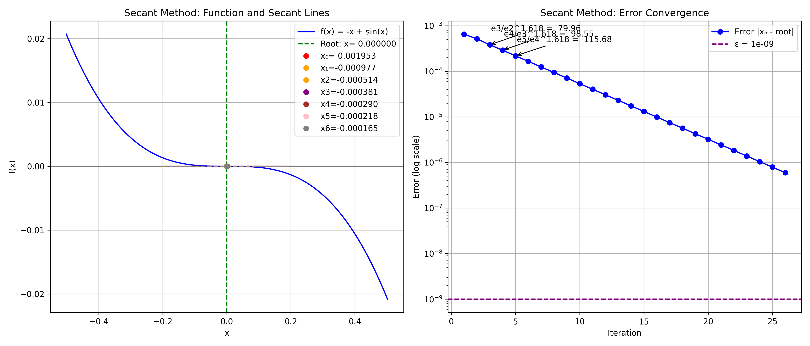

##### Secant method from bisection [x9, x10] (ε = 1e-09, absolute)

| Iteration | xₙ                  | f(xₙ)               | Error               | Abs. Error          | Aitken              |
|-----------|---------------------|---------------------|---------------------|---------------------|---------------------|
| 1 | -0.000651041625285 | 0.000000000045991 | 0.000651041625285 | N/A | N/A |
| 2 | -0.000513980236306 | 0.000000000022630 | 0.000513980236306 | 0.000137061388979 | N/A |
| 3 | -0.000381206922138 | 0.000000000009233 | 0.000381206922138 | 0.000132773314168 | 0.003729904411476457 |
| 4 | -0.000289707070278 | 0.000000000004053 | 0.000289707070278 | 0.000091499851860 | -8.685946742957362e-05 |
| 5 | -0.000218126023123 | 0.000000000001730 | 0.000218126023123 | 0.000071581047155 | 3.9110612688457555e-05 |
| 6 | -0.000164822922088 | 0.000000000000746 | 0.000164822922088 | 0.000053303101036 | -9.377635101596451e-06 |
| 7 | -0.000124373331351 | 0.000000000000321 | 0.000124373331351 | 0.000040449590737 | 2.920252485521076e-06 |
| 8 | -0.000093900534240 | 0.000000000000138 | 0.000093900534240 | 0.000030472797110 | -8.254042451874338e-07 |
| 9 | -0.000070879381072 | 0.000000000000059 | 0.000070879381072 | 0.000023021153168 | 2.4230661105947415e-07 |
| 10 | -0.000053506433241 | 0.000000000000026 | 0.000053506433241 | 0.000017372947831 | -7.011173619180953e-08 |
| 11 | -0.000040390474090 | 0.000000000000011 | 0.000040390474090 | 0.000013115959152 | 2.0341495173410414e-08 |
| 12 | -0.000030489960046 | 0.000000000000005 | 0.000030489960046 | 0.000009900514044 | -5.78910349155183e-09 |
| 13 | -0.000023016165079 | 0.000000000000002 | 0.000023016165079 | 0.000007473794968 | 1.5841825391641265e-09 |
| 14 | -0.000017374389823 | 0.000000000000001 | 0.000017374389823 | 0.000005641775256 | -3.256502498657197e-10 |
| 15 | -0.000013115557335 | 0.000000000000000 | 0.000013115557335 | 0.000004258832488 | -2.971915344196594e-10 |
| 16 | -0.000009900626487 | 0.000000000000000 | 0.000009900626487 | 0.000003214930847 | 4.790834880873541e-10 |
| 17 | -0.000007473751869 | 0.000000000000000 | 0.000007473751869 | 0.000002426874618 | -2.068300991765618e-11 |
| 18 | -0.000005641775552 | 0.000000000000000 | 0.000005641775552 | 0.000001831976317 | -2.4452458956347267e-10 |
| 19 | -0.000004258869827 | 0.000000000000000 | 0.000004258869827 | 0.000001382905725 | -2.3370239617856957e-10 |
| 20 | -0.000003214856366 | 0.000000000000000 | 0.000003214856366 | 0.000001044013461 | 1.3991277667744668e-09 |
| 21 | -0.000002426844359 | 0.000000000000000 | 0.000002426844359 | 0.000000788012007 | -1.2217108176335614e-09 |
| 22 | -0.000001831948702 | 0.000000000000000 | 0.000001831948702 | 0.000000594895657 | 6.296508207374718e-10 |
| 23 | -0.000001382923575 | 0.000000000000000 | 0.000001382923575 | 0.000000449025126 | -7.145508409312385e-10 |
| 24 | -0.000001043833872 | 0.000000000000000 | 0.000001043833872 | 0.000000339089704 | 2.0694811127785075e-09 |
| 25 | -0.000000788159664 | 0.000000000000000 | 0.000000788159664 | 0.000000255674208 | -4.500704469656615e-09 |
| 26 | -0.000000594710386 | 0.000000000000000 | 0.000000594710386 | 0.000000193449278 | 6.698458525641322e-09 |

**Result**: Converged to -0.000000594710386 in 26 iterations
**Final Error**: 0.000000594710386
**Convergence Rate**: 1.008710171576937

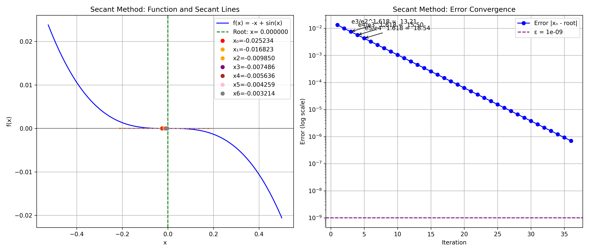

##### Secant method from Newton [x9, x10] (ε = 1e-09, absolute)

| Iteration | xₙ                  | f(xₙ)               | Error               | Abs. Error          | Aitken              |
|-----------|---------------------|---------------------|---------------------|---------------------|---------------------|
| 1 | -0.013281114623035 | 0.000000390434777 | 0.013281114623035 | N/A | N/A |
| 2 | -0.009850263480445 | 0.000000159290613 | 0.009850263480445 | 0.003430851142590 | N/A |
| 3 | -0.007485927839687 | 0.000000069917267 | 0.007485927839687 | 0.002364335640758 | -0.002244482204295956 |
| 4 | -0.005636294905831 | 0.000000029842087 | 0.005636294905831 | 0.001849632933856 | 0.001010536253465099 |
| 5 | -0.004258960960671 | 0.000000012875359 | 0.004258960960671 | 0.001377333945160 | -0.00024233411646379203 |
| 6 | -0.003213758343618 | 0.000000005532076 | 0.003213758343618 | 0.001045202617053 | 7.544811853965171e-05 |
| 7 | -0.002426352826420 | 0.000000002380732 | 0.002426352826420 | 0.000787405517198 | -2.1331789083514976e-05 |
| 8 | -0.001831495198718 | 0.000000001023920 | 0.001831495198718 | 0.000594857627701 | 6.258505872719887e-06 |
| 9 | -0.001382585034601 | 0.000000000440478 | 0.001382585034601 | 0.000448910164117 | -1.811909126414775e-06 |
| 10 | -0.001043673744903 | 0.000000000189471 | 0.001043673744903 | 0.000338911289698 | 5.26597068313886e-07 |
| 11 | -0.000787848544235 | 0.000000000081504 | 0.000787848544235 | 0.000255825200667 | -1.5310616655723162e-07 |
| 12 | -0.000594728523847 | 0.000000000035059 | 0.000594728523847 | 0.000193120020388 | 4.43818137822391e-08 |
| 13 | -0.000448947493490 | 0.000000000015081 | 0.000448947493490 | 0.000145781030357 | -1.2930289321894106e-08 |
| 14 | -0.000338900372772 | 0.000000000006487 | 0.000338900372772 | 0.000110047120718 | 3.735422872386783e-09 |
| 15 | -0.000255828340384 | 0.000000000002791 | 0.000255828340384 | 0.000083072032388 | -1.0941290650725265e-09 |
| 16 | -0.000193119096011 | 0.000000000001200 | 0.000193119096011 | 0.000062709244373 | 3.003543913690683e-10 |
| 17 | -0.000145781293305 | 0.000000000000516 | 0.000145781293305 | 0.000047337802706 | -7.0334905488776e-11 |
| 18 | -0.000110047040830 | 0.000000000000222 | 0.000110047040830 | 0.000035734252475 | 3.7397516290324506e-11 |
| 19 | -0.000083072055869 | 0.000000000000096 | 0.000083072055869 | 0.000026974984961 | -6.240246541071651e-11 |
| 20 | -0.000062709235624 | 0.000000000000041 | 0.000062709235624 | 0.000020362820245 | 9.877377850364428e-11 |
| 21 | -0.000047337802999 | 0.000000000000018 | 0.000047337802999 | 0.000015371432625 | -7.670381483562607e-11 |
| 22 | -0.000035734251691 | 0.000000000000008 | 0.000035734251691 | 0.000011603551307 | -4.3593727938476615e-12 |
| 23 | -0.000026974990633 | 0.000000000000003 | 0.000026974990633 | 0.000008759261059 | -1.7058948410765204e-11 |
| 24 | -0.000020362810782 | 0.000000000000001 | 0.000020362810782 | 0.000006612179851 | 1.4625712097725502e-10 |
| 25 | -0.000015371435617 | 0.000000000000001 | 0.000015371435617 | 0.000004991375164 | -1.658814252814998e-10 |
| 26 | -0.000011603545888 | 0.000000000000000 | 0.000011603545888 | 0.000003767889729 | 1.8277846247025933e-10 |
| 27 | -0.000008759262677 | 0.000000000000000 | 0.000008759262677 | 0.000002844283211 | -1.787865783358148e-10 |
| 28 | -0.000006612184113 | 0.000000000000000 | 0.000006612184113 | 0.000002147078565 | -1.4216905163193206e-10 |
| 29 | -0.000004991382420 | 0.000000000000000 | 0.000004991382420 | 0.000001620801693 | 2.831307553520317e-10 |
| 30 | -0.000003767855652 | 0.000000000000000 | 0.000003767855652 | 0.000001223526767 | 3.6039112889726536e-10 |
| 31 | -0.000002844331612 | 0.000000000000000 | 0.000002844331612 | 0.000000923524041 | -1.3686022553185235e-09 |
| 32 | -0.000002147030151 | 0.000000000000000 | 0.000002147030151 | 0.000000697301460 | 2.3102240296870133e-09 |
| 33 | -0.000001620777645 | 0.000000000000000 | 0.000001620777645 | 0.000000526252507 | -1.6990398371928895e-09 |
| 34 | -0.000001223509758 | 0.000000000000000 | 0.000001223509758 | 0.000000397267887 | 6.072854376048566e-11 |
| 35 | -0.000000923425791 | 0.000000000000000 | 0.000000923425791 | 0.000000300083967 | 3.171811729061745e-09 |
| 36 | -0.000000697405101 | 0.000000000000000 | 0.000000697405101 | 0.000000226020690 | -7.652305369735853e-09 |

**Result**: Converged to -0.000000697405101 in 36 iterations
**Final Error**: 0.000000697405101
**Convergence Rate**: 0.998283178990858

#### Examples with Relative Error Criterion ∣xₙ₊₁ − xₙ∣/|xₙ₊₁| < ε

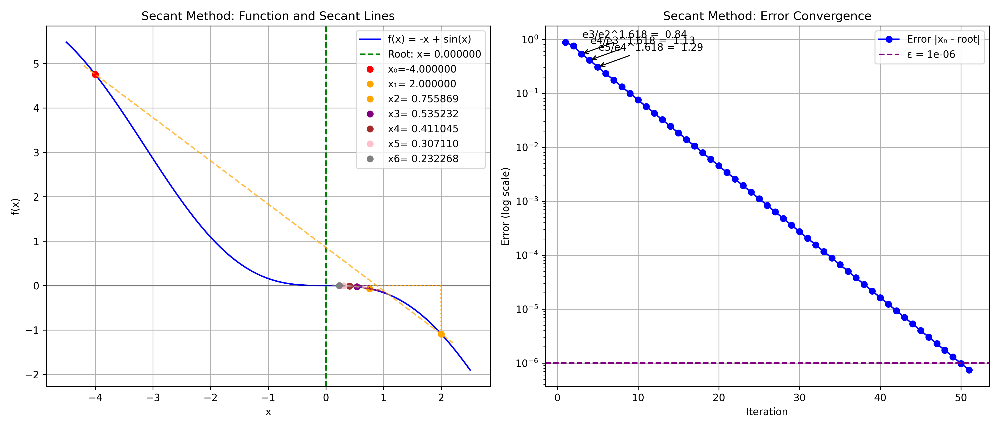

##### f(x) = -x + sin(x) (ε = 1e-06, relative criterion) 

| Iteration | xₙ                  | f(xₙ)               | Error               | Rel. Difference     | Aitken              |
|-----------|---------------------|---------------------|---------------------|---------------------|---------------------|
| 1 | 0.880853396037415 | -0.109571055601439 | -0.363506833240448 | 0.880853396037415 | N/A | N/A |
| 2 | 0.755869056453362 | -0.069947737576414 | -0.272324286299104 | 0.755869056453362 | 0.165351840397457 | N/A |
| 3 | 0.535232011850850 | -0.025191393629282 | -0.139849683041295 | 0.535232011850850 | 0.412226921628887 | 1.0441638339204546 |
| 4 | 0.411045044158651 | -0.011477502254070 | -0.083296242259076 | 0.411045044158651 | 0.302124960407664 | 0.25114467457238054 |
| 5 | 0.307109832582624 | -0.004804869848338 | -0.046788738260913 | 0.307109832582624 | 0.338430100729727 | -0.22630209196288353 |
| 6 | 0.232267531386273 | -0.002082776728245 | -0.026853053890101 | 0.232267531386273 | 0.322224551790167 | 0.0397336812054333 |
| 7 | 0.175002847063257 | -0.000891905891620 | -0.015273956795939 | 0.175002847063257 | 0.327221444016377 | -0.011555097295479877 |
| 8 | 0.132114308895519 | -0.000383989457242 | -0.008714408991693 | 0.132114308895519 | 0.324632044222065 | 0.004164391977755005 |
| 9 | 0.099690182842007 | -0.000165040344263 | -0.004964952370619 | 0.099690182842007 | 0.325248937549839 | -0.0007764213836455591 |
| 10 | 0.075249394507561 | -0.000070996153383 | -0.002829899956431 | 0.075249394507561 | 0.324797142812757 | 0.000424533599753002 |
| 11 | 0.056798473284811 | -0.000030534350250 | -0.001612599684310 | 0.056798473284811 | 0.324848893917090 | -3.692683673880981e-05 |
| 12 | 0.042874553750515 | -0.000013134322369 | -0.000918972893287 | 0.042874553750515 | 0.324759520887807 | 4.807641740471602e-05 |
| 13 | 0.032364154051628 | -0.000005649614098 | -0.000523673521695 | 0.032364154051628 | 0.324754346494625 | 2.10339514745278e-06 |
| 14 | 0.024430684882384 | -0.000002430203909 | -0.000298414338877 | 0.024430684882384 | 0.324733801260048 | 6.303885194243464e-06 |
| 15 | 0.018442026508575 | -0.000001045363399 | -0.000170049351189 | 0.018442026508575 | 0.324728867026860 | 1.14310624511893e-06 |
| 16 | 0.013921416210440 | -0.000000449670911 | -0.000096901349633 | 0.013921416210440 | 0.324723449812927 | 9.473877578755618e-07 |
| 17 | 0.010508939140595 | -0.000000193429622 | -0.000055218392744 | 0.010508939140595 | 0.324721365704958 | 2.751506425410777e-07 |
| 18 | 0.007932952464203 | -0.000000083205482 | -0.000031465702383 | 0.007932952464203 | 0.324719792286258 | 1.568112000683436e-07 |
| 19 | 0.005988403729141 | -0.000000035791606 | -0.000017930436028 | 0.005988403729141 | 0.324719044175115 | 5.6283535932594164e-08 |
| 20 | 0.004520510172204 | -0.000000015396098 | -0.000010217488709 | 0.004520510172204 | 0.324718560741862 | 2.7455586621913386e-08 |
| 21 | 0.003412431267441 | -0.000000006622779 | -0.000005822337928 | 0.003412431267441 | 0.324718307247970 | 1.0867759483133843e-08 |
| 22 | 0.002575967768085 | -0.000000002848852 | -0.000003317803136 | 0.002575967768085 | 0.324718154364657 | 4.9477759502328245e-09 |
| 23 | 0.001944540371002 | -0.000000001225461 | -0.000001890618031 | 0.001944540371002 | 0.324718070398086 | 2.0513202499475303e-09 |
| 24 | 0.001467890025999 | -0.000000000527144 | -0.000001077350371 | 0.001467890025999 | 0.324718021487235 | 9.020053757732849e-10 |
| 25 | 0.001108077366371 | -0.000000000226756 | -0.000000613917662 | 0.001108077366371 | 0.324717994020488 | 3.823735917739962e-10 |
| 26 | 0.000836462843175 | -0.000000000097541 | -0.000000349835024 | 0.000836462843175 | 0.324717978105368 | 1.6725044027672553e-10 |
| 27 | 0.000631427113204 | -0.000000000041958 | -0.000000199350093 | 0.000631427113204 | 0.324717969316907 | 6.971829428874254e-11 |
| 28 | 0.000476650223161 | -0.000000000018049 | -0.000000113597715 | 0.000476650223161 | 0.324717964080122 | 3.1359945022735314e-11 |
| 29 | 0.000359812607159 | -0.000000000007764 | -0.000000064732555 | 0.000359812607159 | 0.324717960619093 | 1.5645609699292684e-11 |
| 30 | 0.000271614500378 | -0.000000000003340 | -0.000000036887218 | 0.000271614500378 | 0.324717961150796 | -1.8143985120767925e-12 |
| 31 | 0.000205035720014 | -0.000000000001437 | -0.000000021019823 | 0.000205035720014 | 0.324717958209926 | 7.57558263082131e-12 |
| 32 | 0.000154776886639 | -0.000000000000618 | -0.000000011977942 | 0.000154776886639 | 0.324717950247931 | 1.548241824458549e-11 |
| 33 | 0.000116837613792 | -0.000000000000266 | -0.000000006825514 | 0.000116837613792 | 0.324717970658102 | -2.995988927865373e-11 |
| 34 | 0.000088198106987 | -0.000000000000114 | -0.000000003889453 | 0.000088198106987 | 0.324717930844304 | 4.4116751538817583e-11 |
| 35 | 0.000066578778371 | -0.000000000000049 | -0.000000002216367 | 0.000066578778371 | 0.324718012922158 | -6.865512161330269e-11 |
| 36 | 0.000050258835890 | -0.000000000000021 | -0.000000001262975 | 0.000050258835890 | 0.324717876801323 | 8.595027807696814e-11 |
| 37 | 0.000037939269141 | -0.000000000000009 | -0.000000000719694 | 0.000037939269141 | 0.324718083111391 | -9.833792096326354e-11 |
| 38 | 0.000028639503874 | -0.000000000000004 | -0.000000000410111 | 0.000028639503874 | 0.324718099426511 | -5.870381620859313e-12 |
| 39 | 0.000021619325247 | -0.000000000000002 | -0.000000000233698 | 0.000021619325247 | 0.324717748898406 | 9.520820305644433e-11 |
| 40 | 0.000016319944514 | -0.000000000000001 | -0.000000000133170 | 0.000016319944514 | 0.324718060697881 | -6.393023887645054e-11 |
| 41 | 0.000012319566791 | -0.000000000000000 | -0.000000000075886 | 0.000012319566791 | 0.324717402057399 | 1.0194181865772162e-10 |
| 42 | 0.000009299764576 | -0.000000000000000 | -0.000000000043243 | 0.000009299764576 | 0.324718135588068 | -8.570469733684412e-11 |
| 43 | 0.000007020170122 | -0.000000000000000 | -0.000000000024641 | 0.000007020170122 | 0.324720685418165 | -2.248936536722654e-10 |
| 44 | 0.000005299364728 | -0.000000000000000 | -0.000000000014042 | 0.000005299364728 | 0.324719184698693 | 9.991324635890699e-11 |
| 45 | 0.000004000410166 | -0.000000000000000 | -0.000000000008002 | 0.000004000410166 | 0.324705344947338 | 6.955009242679867e-10 |
| 46 | 0.000003019771868 | -0.000000000000000 | -0.000000000004559 | 0.000003019771868 | 0.324739198829694 | -1.2847786374311934e-09 |
| 47 | 0.000002279563104 | -0.000000000000000 | -0.000000000002598 | 0.000002279563104 | 0.324715188954072 | 6.874290031669297e-10 |
| 48 | 0.000001720720471 | -0.000000000000000 | -0.000000000001480 | 0.000001720720471 | 0.324772467260349 | -1.2387849573375607e-09 |
| 49 | 0.000001299011973 | -0.000000000000000 | -0.000000000000844 | 0.000001299011973 | 0.324637883704603 | 2.1936629816093743e-09 |
| 50 | 0.000000980654355 | -0.000000000000000 | -0.000000000000481 | 0.000000980654355 | 0.324637949458456 | -8.104685059670005e-13 |
| 51 | 0.000000740347790 | -0.000000000000000 | -0.000000000000274 | 0.000000740347790 | 0.324586050029281 | 4.82764752700353e-10 |

**Result**: Converged to 0.000000740347790 in 51 iterations
**Final Error**: 0.000000740347790
**Convergence Rate**: 1.022231808776884


##### f(x) = -x + sin(x) (ε = 1e-09, relative criterion) 

| Iteration | xₙ                  | f(xₙ)               | Error               | Rel. Difference     | Aitken              |
|-----------|---------------------|---------------------|---------------------|---------------------|---------------------|
| 1 | 0.880853396037415 | -0.109571055601439 | -0.363506833240448 | 0.880853396037415 | N/A | N/A |
| 2 | 0.755869056453362 | -0.069947737576414 | -0.272324286299104 | 0.755869056453362 | 0.165351840397457 | N/A |
| 3 | 0.535232011850850 | -0.025191393629282 | -0.139849683041295 | 0.535232011850850 | 0.412226921628887 | 1.0441638339204546 |
| 4 | 0.411045044158651 | -0.011477502254070 | -0.083296242259076 | 0.411045044158651 | 0.302124960407664 | 0.25114467457238054 |
| 5 | 0.307109832582624 | -0.004804869848338 | -0.046788738260913 | 0.307109832582624 | 0.338430100729727 | -0.22630209196288353 |
| 6 | 0.232267531386273 | -0.002082776728245 | -0.026853053890101 | 0.232267531386273 | 0.322224551790167 | 0.0397336812054333 |
| 7 | 0.175002847063257 | -0.000891905891620 | -0.015273956795939 | 0.175002847063257 | 0.327221444016377 | -0.011555097295479877 |
| 8 | 0.132114308895519 | -0.000383989457242 | -0.008714408991693 | 0.132114308895519 | 0.324632044222065 | 0.004164391977755005 |
| 9 | 0.099690182842007 | -0.000165040344263 | -0.004964952370619 | 0.099690182842007 | 0.325248937549839 | -0.0007764213836455591 |
| 10 | 0.075249394507561 | -0.000070996153383 | -0.002829899956431 | 0.075249394507561 | 0.324797142812757 | 0.000424533599753002 |
| 11 | 0.056798473284811 | -0.000030534350250 | -0.001612599684310 | 0.056798473284811 | 0.324848893917090 | -3.692683673880981e-05 |
| 12 | 0.042874553750515 | -0.000013134322369 | -0.000918972893287 | 0.042874553750515 | 0.324759520887807 | 4.807641740471602e-05 |
| 13 | 0.032364154051628 | -0.000005649614098 | -0.000523673521695 | 0.032364154051628 | 0.324754346494625 | 2.10339514745278e-06 |
| 14 | 0.024430684882384 | -0.000002430203909 | -0.000298414338877 | 0.024430684882384 | 0.324733801260048 | 6.303885194243464e-06 |
| 15 | 0.018442026508575 | -0.000001045363399 | -0.000170049351189 | 0.018442026508575 | 0.324728867026860 | 1.14310624511893e-06 |
| 16 | 0.013921416210440 | -0.000000449670911 | -0.000096901349633 | 0.013921416210440 | 0.324723449812927 | 9.473877578755618e-07 |
| 17 | 0.010508939140595 | -0.000000193429622 | -0.000055218392744 | 0.010508939140595 | 0.324721365704958 | 2.751506425410777e-07 |
| 18 | 0.007932952464203 | -0.000000083205482 | -0.000031465702383 | 0.007932952464203 | 0.324719792286258 | 1.568112000683436e-07 |
| 19 | 0.005988403729141 | -0.000000035791606 | -0.000017930436028 | 0.005988403729141 | 0.324719044175115 | 5.6283535932594164e-08 |
| 20 | 0.004520510172204 | -0.000000015396098 | -0.000010217488709 | 0.004520510172204 | 0.324718560741862 | 2.7455586621913386e-08 |
| 21 | 0.003412431267441 | -0.000000006622779 | -0.000005822337928 | 0.003412431267441 | 0.324718307247970 | 1.0867759483133843e-08 |
| 22 | 0.002575967768085 | -0.000000002848852 | -0.000003317803136 | 0.002575967768085 | 0.324718154364657 | 4.9477759502328245e-09 |
| 23 | 0.001944540371002 | -0.000000001225461 | -0.000001890618031 | 0.001944540371002 | 0.324718070398086 | 2.0513202499475303e-09 |
| 24 | 0.001467890025999 | -0.000000000527144 | -0.000001077350371 | 0.001467890025999 | 0.324718021487235 | 9.020053757732849e-10 |
| 25 | 0.001108077366371 | -0.000000000226756 | -0.000000613917662 | 0.001108077366371 | 0.324717994020488 | 3.823735917739962e-10 |
| 26 | 0.000836462843175 | -0.000000000097541 | -0.000000349835024 | 0.000836462843175 | 0.324717978105368 | 1.6725044027672553e-10 |
| 27 | 0.000631427113204 | -0.000000000041958 | -0.000000199350093 | 0.000631427113204 | 0.324717969316907 | 6.971829428874254e-11 |
| 28 | 0.000476650223161 | -0.000000000018049 | -0.000000113597715 | 0.000476650223161 | 0.324717964080122 | 3.1359945022735314e-11 |
| 29 | 0.000359812607159 | -0.000000000007764 | -0.000000064732555 | 0.000359812607159 | 0.324717960619093 | 1.5645609699292684e-11 |
| 30 | 0.000271614500378 | -0.000000000003340 | -0.000000036887218 | 0.000271614500378 | 0.324717961150796 | -1.8143985120767925e-12 |
| 31 | 0.000205035720014 | -0.000000000001437 | -0.000000021019823 | 0.000205035720014 | 0.324717958209926 | 7.57558263082131e-12 |
| 32 | 0.000154776886639 | -0.000000000000618 | -0.000000011977942 | 0.000154776886639 | 0.324717950247931 | 1.548241824458549e-11 |
| 33 | 0.000116837613792 | -0.000000000000266 | -0.000000006825514 | 0.000116837613792 | 0.324717970658102 | -2.995988927865373e-11 |
| 34 | 0.000088198106987 | -0.000000000000114 | -0.000000003889453 | 0.000088198106987 | 0.324717930844304 | 4.4116751538817583e-11 |
| 35 | 0.000066578778371 | -0.000000000000049 | -0.000000002216367 | 0.000066578778371 | 0.324718012922158 | -6.865512161330269e-11 |
| 36 | 0.000050258835890 | -0.000000000000021 | -0.000000001262975 | 0.000050258835890 | 0.324717876801323 | 8.595027807696814e-11 |
| 37 | 0.000037939269141 | -0.000000000000009 | -0.000000000719694 | 0.000037939269141 | 0.324718083111391 | -9.833792096326354e-11 |
| 38 | 0.000028639503874 | -0.000000000000004 | -0.000000000410111 | 0.000028639503874 | 0.324718099426511 | -5.870381620859313e-12 |
| 39 | 0.000021619325247 | -0.000000000000002 | -0.000000000233698 | 0.000021619325247 | 0.324717748898406 | 9.520820305644433e-11 |
| 40 | 0.000016319944514 | -0.000000000000001 | -0.000000000133170 | 0.000016319944514 | 0.324718060697881 | -6.393023887645054e-11 |
| 41 | 0.000012319566791 | -0.000000000000000 | -0.000000000075886 | 0.000012319566791 | 0.324717402057399 | 1.0194181865772162e-10 |
| 42 | 0.000009299764576 | -0.000000000000000 | -0.000000000043243 | 0.000009299764576 | 0.324718135588068 | -8.570469733684412e-11 |
| 43 | 0.000007020170122 | -0.000000000000000 | -0.000000000024641 | 0.000007020170122 | 0.324720685418165 | -2.248936536722654e-10 |
| 44 | 0.000005299364728 | -0.000000000000000 | -0.000000000014042 | 0.000005299364728 | 0.324719184698693 | 9.991324635890699e-11 |
| 45 | 0.000004000410166 | -0.000000000000000 | -0.000000000008002 | 0.000004000410166 | 0.324705344947338 | 6.955009242679867e-10 |
| 46 | 0.000003019771868 | -0.000000000000000 | -0.000000000004559 | 0.000003019771868 | 0.324739198829694 | -1.2847786374311934e-09 |
| 47 | 0.000002279563104 | -0.000000000000000 | -0.000000000002598 | 0.000002279563104 | 0.324715188954072 | 6.874290031669297e-10 |
| 48 | 0.000001720720471 | -0.000000000000000 | -0.000000000001480 | 0.000001720720471 | 0.324772467260349 | -1.2387849573375607e-09 |
| 49 | 0.000001299011973 | -0.000000000000000 | -0.000000000000844 | 0.000001299011973 | 0.324637883704603 | 2.1936629816093743e-09 |
| 50 | 0.000000980654355 | -0.000000000000000 | -0.000000000000481 | 0.000000980654355 | 0.324637949458456 | -8.104685059670005e-13 |
| 51 | 0.000000740347790 | -0.000000000000000 | -0.000000000000274 | 0.000000740347790 | 0.324586050029281 | 4.82764752700353e-10 |

**Result**: Converged to 0.000000740347790 in 51 iterations
**Final Error**: 0.000000740347790
**Convergence Rate**: 1.022231808776884

#### Comparison of Stopping Criteria for Secant Method

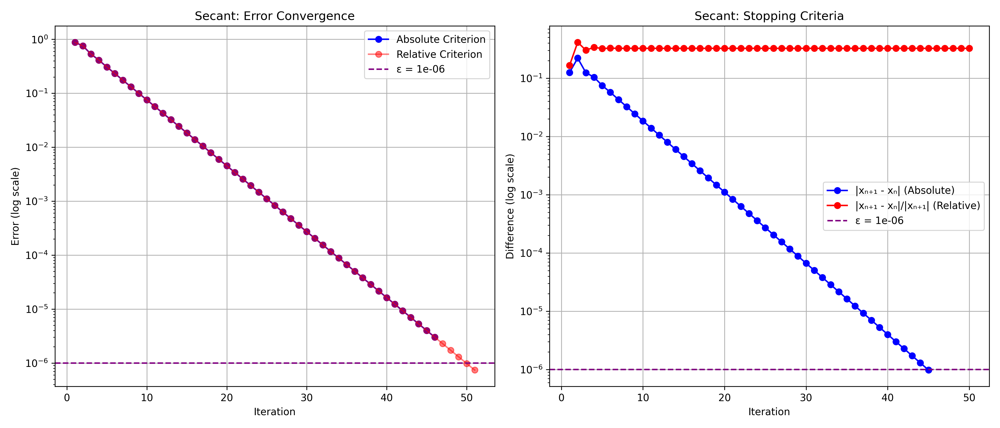

| Criterion | Iterations | Final Value         | Error               |
|-----------|------------|---------------------|---------------------|
| Absolute | 46 | 0.000003019771868 | 0.000003019771868 |
| Relative | 51 | 0.000000740347790 | 0.000000740347790 |

### 4. Fixed-point Method

#### Mathematical Formula

Transform the equation f(x) = 0 into the equivalent form x = g(x), then iterate:

x_{n+1} = g(x_n)

#### Algorithm

1. **Input**: Function f, initial guess x₍0₎, tolerance \epsilon
2. **Transform**: Define g(x) such that f(x) = 0 \Leftrightarrow x = g(x)
3. **Initialize**: Set n = 0
4. **Iterate**:
   - Compute x_{n+1} = g(x_n)
   - If |error| < \epsilon, return x_{n+1}
   - Set n = n + 1
5. **Repeat** until convergence or maximum iterations

#### Convergence Condition

Convergence requires |g'(r)| < 1 at the fixed point r:
|e_{n+1}| ≤ |g'(\xi)||e_n|

where \xi lies between x_n and r.

#### Implementation

```python
def fixed_point_method(f, x0, g, epsilon=1e-6, condition=stopping_condition_2):
    sequence = [x0]
    x = x0

    for k in range(100):
        try:
            x_new = g(x)
            sequence.append(x_new)

            if condition(sequence[k], sequence[k - 1], epsilon):
                return sequence, "Second stopping condition (convergence)"

            if abs(x_new) > 1e10 or math.isnan(x_new) or math.isinf(x_new):
                return sequence, "Error: Divergence"

            x = x_new

        except Exception:
            return sequence, "Error: Non-convergence"

    return sequence, "First stopping condition (max iterations)"

```

#### Best g(x) Function

The best g(x) function is: **_lambdifygenerated**

| g(x)                     | Convergence | Error               |
|--------------------------|-------------|---------------------|
| _lambdifygenerated | Yes | 0.002127300741326 |
| x - 0.01 * f(x) | No | 0.203067083349982 |
| x + 0.01 * f(x) | No | 0.127857412599212 |
| x - 0.05 * f(x) | No | 1.064408908469861 |
| x + 0.05 * f(x) | No | 0.066559342992084 |
| x - 0.1 * f(x) | No | 18.741191816527120 |
| x + 0.1 * f(x) | No | 0.038098764392434 |
| x - 0.5 * f(x) | No | ∞ |
| x + 0.5 * f(x) | Yes | 0.005657426139027 |
| x - 1.0 * f(x) | No | ∞ |
| x + 1.0 * f(x) | Yes | 0.002127300741326 |

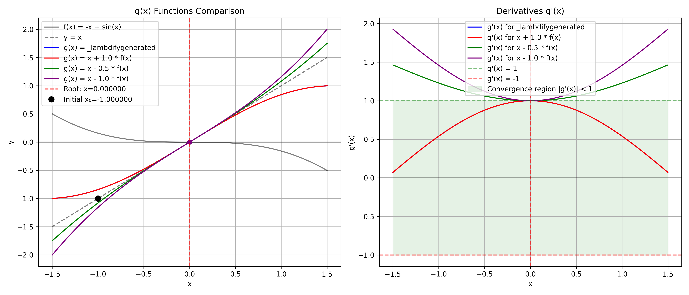

**Explanation**:

- The plot shows different g(x) functions and their derivatives
- For convergence, we need |g'(x)| < 1 at the root (shaded green area in right plot)
- The best g(x) has its derivative closest to 0 at the root, giving fastest convergence
- Functions with g'(x) outside [-1,1] at the root will diverge

#### Examples with Absolute Error Criterion ∣xₙ₊₁ − xₙ∣ < ε

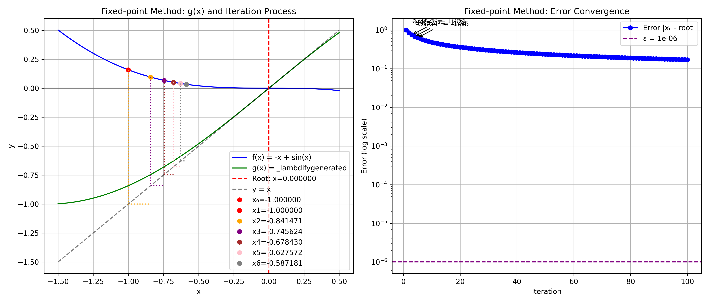

##### Fixed-point Method (ε = 0.000001000000000)

| Iteration | xₙ                  | g(xₙ)               | f(xₙ)               | Error               | Aitken              |
|-----------|---------------------|---------------------|---------------------|---------------------|---------------------|
| 1 | -1.000000000000000 | -0.841470984807897 | 0.158529015192103 | 1.000000000000000 | N/A |
| 2 | -0.841470984807897 | -0.745624141665558 | 0.095846843142339 | 0.841470984807897 | N/A |
| 3 | -0.745624141665558 | -0.678430477360740 | 0.067193664304818 | 0.745624141665558 | -0.5990654465862197 |
| 4 | -0.678430477360740 | -0.627571832049159 | 0.050858645311581 | 0.678430477360740 | -0.5208567383940799 |
| 5 | -0.627571832049159 | -0.587180996573431 | 0.040390835475728 | 0.627571832049159 | -0.46922479835423725 |
| 6 | -0.587180996573431 | -0.554016390755630 | 0.033164605817801 | 0.587180996573431 | -0.43132990489238066 |
| 7 | -0.554016390755630 | -0.526107075502842 | 0.027909315252788 | 0.554016390755630 | -0.4018082364183797 |
| 8 | -0.526107075502842 | -0.502170676268555 | 0.023936399234286 | 0.526107075502842 | -0.377888843181844 |
| 9 | -0.502170676268555 | -0.481329355262346 | 0.020841321006209 | 0.502170676268555 | -0.35795639999517004 |
| 10 | -0.481329355262346 | -0.462957898537812 | 0.018371456724534 | 0.481329355262346 | -0.34099020087733434 |
| 11 | -0.462957898537812 | -0.446596593386982 | 0.016361305150830 | 0.462957898537812 | -0.3263064943753933 |
| 12 | -0.446596593386982 | -0.431898433265822 | 0.014698160121159 | 0.446596593386982 | -0.31342638386629484 |
| 13 | -0.431898433265822 | -0.418595660998211 | 0.013302772267612 | 0.431898433265822 | -0.3020024187312004 |
| 14 | -0.418595660998211 | -0.406477764984069 | 0.012117896014142 | 0.418595660998211 | -0.29177518627926735 |
| 15 | -0.406477764984069 | -0.395376546988835 | 0.011101217995234 | 0.406477764984069 | -0.2825463389136228 |
| 16 | -0.395376546988835 | -0.385155713096526 | 0.010220833892308 | 0.395376546988835 | -0.27416113887947624 |
| 17 | -0.385155713096526 | -0.375703446847715 | 0.009452266248811 | 0.385155713096526 | -0.2664967719514377 |
| 18 | -0.375703446847715 | -0.366927001062791 | 0.008776445784924 | 0.375703446847715 | -0.2594542942918249 |
| 19 | -0.366927001062791 | -0.358748688107810 | 0.008178312954982 | 0.366927001062791 | -0.2529529432595793 |
| 20 | -0.358748688107810 | -0.351102858963179 | 0.007645829144631 | 0.358748688107810 | -0.24692603026090693 |
| 21 | -0.351102858963179 | -0.343933594328648 | 0.007169264634530 | 0.351102858963179 | -0.24131791870289127 |
| 22 | -0.343933594328648 | -0.337192916936002 | 0.006740677392646 | 0.343933594328648 | -0.23608176249780433 |
| 23 | -0.337192916936002 | -0.330839391070358 | 0.006353525865644 | 0.337192916936002 | -0.2311777879928787 |
| 24 | -0.330839391070358 | -0.324837013640270 | 0.006002377430088 | 0.330839391070358 | -0.22657197092611697 |
| 25 | -0.324837013640270 | -0.319154327474343 | 0.005682686165927 | 0.324837013640270 | -0.22223500501643623 |
| 26 | -0.319154327474343 | -0.313763705915325 | 0.005390621559018 | 0.319154327474343 | -0.21814148889967144 |
| 27 | -0.313763705915325 | -0.308640770822766 | 0.005122935092560 | 0.313763705915325 | -0.21426927863729123 |
| 28 | -0.308640770822766 | -0.303763915468900 | 0.004876855353866 | 0.308640770822766 | -0.21059896725384694 |
| 29 | -0.303763915468900 | -0.299113910636710 | 0.004650004832190 | 0.303763915468900 | -0.20711346277922033 |
| 30 | -0.299113910636710 | -0.294673577256255 | 0.004440333380455 | 0.299113910636710 | -0.20379764343278953 |
| 31 | -0.294673577256255 | -0.290427512659243 | 0.004246064597011 | 0.294673577256255 | -0.20063807377466808 |
| 32 | -0.290427512659243 | -0.286361860348455 | 0.004065652310788 | 0.290427512659243 | -0.1976227694452417 |
| 33 | -0.286361860348455 | -0.282464115317791 | 0.003897745030665 | 0.286361860348455 | -0.19474100093691268 |
| 34 | -0.282464115317791 | -0.278722958597813 | 0.003741156719978 | 0.282464115317791 | -0.1919831289487819 |
| 35 | -0.278722958597813 | -0.275128115968017 | 0.003594842629796 | 0.278722958597813 | -0.18934046547267494 |
| 36 | -0.275128115968017 | -0.271670236763068 | 0.003457879204948 | 0.275128115968017 | -0.18680515597902086 |
| 37 | -0.271670236763068 | -0.268340789473641 | 0.003329447289428 | 0.271670236763068 | -0.18437007900672409 |
| 38 | -0.268340789473641 | -0.265131971453282 | 0.003208818020358 | 0.268340789473641 | -0.1820287601922439 |
| 39 | -0.265131971453282 | -0.262036630528281 | 0.003095340925001 | 0.265131971453282 | -0.17977529834087488 |
| 40 | -0.262036630528281 | -0.259048196695839 | 0.002988433832443 | 0.262036630528281 | -0.17760430159131085 |
| 41 | -0.259048196695839 | -0.256160622408316 | 0.002887574287522 | 0.259048196695839 | -0.17551083208183677 |
| 42 | -0.256160622408316 | -0.253368330194057 | 0.002792292214260 | 0.256160622408316 | -0.17349035780852687 |
| 43 | -0.253368330194057 | -0.250666166570835 | 0.002702163623222 | 0.253368330194057 | -0.17153871059385484 |
| 44 | -0.250666166570835 | -0.248049361375991 | 0.002616805194844 | 0.250666166570835 | -0.16965204926840205 |
| 45 | -0.248049361375991 | -0.245513491775248 | 0.002535869600743 | 0.248049361375991 | -0.16782682731638976 |
| 46 | -0.245513491775248 | -0.243054450326041 | 0.002459041449207 | 0.245513491775248 | -0.16605976435898095 |
| 47 | -0.243054450326041 | -0.240668416565461 | 0.002386033760580 | 0.243054450326041 | -0.16434782094617395 |
| 48 | -0.240668416565461 | -0.238351831671369 | 0.002316584894092 | 0.240668416565461 | -0.1626881762139675 |
| 49 | -0.238351831671369 | -0.236101375810769 | 0.002250455860600 | 0.238351831671369 | -0.16107820802741696 |
| 50 | -0.236101375810769 | -0.233913947844445 | 0.002187427966324 | 0.236101375810769 | -0.15951547528996657 |
| 51 | -0.233913947844445 | -0.231786647103119 | 0.002127300741326 | 0.233913947844445 | -0.15799770214375458 |
| 52 | -0.231786647103119 | -0.229716756989405 | 0.002069890113714 | 0.231786647103119 | -0.1565227638263093 |
| 53 | -0.229716756989405 | -0.227701730192909 | 0.002015026796497 | 0.229716756989405 | -0.15508867398273535 |
| 54 | -0.227701730192909 | -0.225739175333946 | 0.001962554858963 | 0.227701730192909 | -0.1536935732581144 |
| 55 | -0.225739175333946 | -0.223826844875308 | 0.001912330458638 | 0.225739175333946 | -0.15233571902080706 |
| 56 | -0.223826844875308 | -0.221962624161997 | 0.001864220713311 | 0.223826844875308 | -0.15101347608634447 |
| 57 | -0.221962624161997 | -0.220144521466446 | 0.001818102695551 | 0.221962624161997 | -0.14972530832737102 |
| 58 | -0.220144521466446 | -0.218370658931835 | 0.001773862534611 | 0.220144521466446 | -0.14846977107342074 |
| 59 | -0.218370658931835 | -0.216639264319163 | 0.001731394612672 | 0.218370658931835 | -0.14724550421155785 |
| 60 | -0.216639264319163 | -0.214948663474997 | 0.001690600844166 | 0.216639264319163 | -0.14605122591468755 |
| 61 | -0.214948663474997 | -0.213297273446584 | 0.001651390028413 | 0.214948663474997 | -0.1448857269294621 |
| 62 | -0.213297273446584 | -0.211683596179494 | 0.001613677267090 | 0.213297273446584 | -0.14374786536626583 |
| 63 | -0.211683596179494 | -0.210106212740356 | 0.001577383439139 | 0.211683596179494 | -0.14263656194109248 |
| 64 | -0.210106212740356 | -0.208563778013676 | 0.001542434726679 | 0.210106212740356 | -0.14155079562071735 |
| 65 | -0.208563778013676 | -0.207055015827396 | 0.001508762186280 | 0.208563778013676 | -0.14048959963468283 |
| 66 | -0.207055015827396 | -0.205578714466746 | 0.001476301360650 | 0.207055015827396 | -0.1394520578155356 |
| 67 | -0.205578714466746 | -0.204133722540338 | 0.001444991926409 | 0.205578714466746 | -0.13843730123665854 |
| 68 | -0.204133722540338 | -0.202718945166210 | 0.001414777374127 | 0.204133722540338 | -0.13744450512102152 |
| 69 | -0.202718945166210 | -0.201333340448950 | 0.001385604717260 | 0.202718945166210 | -0.13647288599173413 |
| 70 | -0.201333340448950 | -0.199975916221949 | 0.001357424227001 | 0.201333340448950 | -0.1355216990469916 |
| 71 | -0.199975916221949 | -0.198645727031511 | 0.001330189190438 | 0.199975916221949 | -0.1345902357338496 |
| 72 | -0.198645727031511 | -0.197341871341849 | 0.001303855689662 | 0.198645727031511 | -0.1336778215080676 |
| 73 | -0.197341871341849 | -0.196063488942078 | 0.001278382399770 | 0.197341871341849 | -0.13278381375952913 |
| 74 | -0.196063488942078 | -0.194809758538159 | 0.001253730403920 | 0.196063488942078 | -0.13190759989151188 |
| 75 | -0.194809758538159 | -0.193579895514375 | 0.001229863023783 | 0.194809758538159 | -0.13104859553848658 |
| 76 | -0.193579895514375 | -0.192373149850419 | 0.001206745663957 | 0.193579895514375 | -0.1302062429126415 |
| 77 | -0.192373149850419 | -0.191188804181423 | 0.001184345668996 | 0.192373149850419 | -0.12938000926707927 |
| 78 | -0.191188804181423 | -0.190026171989499 | 0.001162632191924 | 0.191188804181423 | -0.12856938546633123 |
| 79 | -0.190026171989499 | -0.188884595916346 | 0.001141576073154 | 0.190026171989499 | -0.12777388465533168 |
| 80 | -0.188884595916346 | -0.187763446187463 | 0.001121149728883 | 0.188884595916346 | -0.12699304101948344 |
| 81 | -0.187763446187463 | -0.186662119139339 | 0.001101327048124 | 0.187763446187463 | -0.12622640862797402 |
| 82 | -0.186662119139339 | -0.185580035841746 | 0.001082083297592 | 0.186662119139339 | -0.12547356035402718 |
| 83 | -0.185580035841746 | -0.184516640807959 | 0.001063395033788 | 0.185580035841746 | -0.12473408686571415 |
| 84 | -0.184516640807959 | -0.183471400786333 | 0.001045240021625 | 0.184516640807959 | -0.12400759568251564 |
| 85 | -0.183471400786333 | -0.182443803627253 | 0.001027597159080 | 0.183471400786333 | -0.1232937102924922 |
| 86 | -0.182443803627253 | -0.181433357219929 | 0.001010446407324 | 0.182443803627253 | -0.12259206932605973 |
| 87 | -0.181433357219929 | -0.180439588494031 | 0.000993768725898 | 0.181433357219929 | -0.12190232577894379 |
| 88 | -0.180439588494031 | -0.179462042481508 | 0.000977546012523 | 0.180439588494031 | -0.12122414628729555 |
| 89 | -0.179462042481508 | -0.178500281434370 | 0.000961761047138 | 0.179462042481508 | -0.12055721044249895 |
| 90 | -0.178500281434370 | -0.177553883994511 | 0.000946397439859 | 0.178500281434370 | -0.11990121015269303 |
| 91 | -0.177553883994511 | -0.176622444411982 | 0.000931439582528 | 0.177553883994511 | -0.11925584903784911 |
| 92 | -0.176622444411982 | -0.175705571808417 | 0.000916872603565 | 0.176622444411982 | -0.11862084186328592 |
| 93 | -0.175705571808417 | -0.174802889482536 | 0.000902682325881 | 0.175705571808417 | -0.1179959140066 |
| 94 | -0.174802889482536 | -0.173914034254936 | 0.000888855227600 | 0.174802889482536 | -0.1173808009526415 |
| 95 | -0.173914034254936 | -0.173038655849547 | 0.000875378405389 | 0.173914034254936 | -0.11677524782168361 |
| 96 | -0.173038655849547 | -0.172176416309364 | 0.000862239540183 | 0.173038655849547 | -0.11617900892148028 |
| 97 | -0.172176416309364 | -0.171326989444225 | 0.000849426865139 | 0.172176416309364 | -0.11559184732433266 |
| 98 | -0.171326989444225 | -0.170490060308578 | 0.000836929135647 | 0.171326989444225 | -0.11501353447011817 |
| 99 | -0.170490060308578 | -0.169665324707324 | 0.000824735601254 | 0.170490060308578 | -0.11444384978827728 |
| 100 | -0.169665324707324 | -0.168852488727981 | 0.000812835979343 | 0.169665324707324 | -0.1138825803432098 |

**Result**: Converged
**Final Value**: -0.168852488727981 in 101 iterations
**Final Error**: 0.168852488727981
**Convergence Rate**: 0.965604838324565


##### Fixed-point Method (ε = 0.000000001000000)

| Iteration | xₙ                  | g(xₙ)               | f(xₙ)               | Error               | Aitken              |
|-----------|---------------------|---------------------|---------------------|---------------------|---------------------|
| 1 | -1.000000000000000 | -0.841470984807897 | 0.158529015192103 | 1.000000000000000 | N/A |
| 2 | -0.841470984807897 | -0.745624141665558 | 0.095846843142339 | 0.841470984807897 | N/A |
| 3 | -0.745624141665558 | -0.678430477360740 | 0.067193664304818 | 0.745624141665558 | -0.5990654465862197 |
| 4 | -0.678430477360740 | -0.627571832049159 | 0.050858645311581 | 0.678430477360740 | -0.5208567383940799 |
| 5 | -0.627571832049159 | -0.587180996573431 | 0.040390835475728 | 0.627571832049159 | -0.46922479835423725 |
| 6 | -0.587180996573431 | -0.554016390755630 | 0.033164605817801 | 0.587180996573431 | -0.43132990489238066 |
| 7 | -0.554016390755630 | -0.526107075502842 | 0.027909315252788 | 0.554016390755630 | -0.4018082364183797 |
| 8 | -0.526107075502842 | -0.502170676268555 | 0.023936399234286 | 0.526107075502842 | -0.377888843181844 |
| 9 | -0.502170676268555 | -0.481329355262346 | 0.020841321006209 | 0.502170676268555 | -0.35795639999517004 |
| 10 | -0.481329355262346 | -0.462957898537812 | 0.018371456724534 | 0.481329355262346 | -0.34099020087733434 |
| 11 | -0.462957898537812 | -0.446596593386982 | 0.016361305150830 | 0.462957898537812 | -0.3263064943753933 |
| 12 | -0.446596593386982 | -0.431898433265822 | 0.014698160121159 | 0.446596593386982 | -0.31342638386629484 |
| 13 | -0.431898433265822 | -0.418595660998211 | 0.013302772267612 | 0.431898433265822 | -0.3020024187312004 |
| 14 | -0.418595660998211 | -0.406477764984069 | 0.012117896014142 | 0.418595660998211 | -0.29177518627926735 |
| 15 | -0.406477764984069 | -0.395376546988835 | 0.011101217995234 | 0.406477764984069 | -0.2825463389136228 |
| 16 | -0.395376546988835 | -0.385155713096526 | 0.010220833892308 | 0.395376546988835 | -0.27416113887947624 |
| 17 | -0.385155713096526 | -0.375703446847715 | 0.009452266248811 | 0.385155713096526 | -0.2664967719514377 |
| 18 | -0.375703446847715 | -0.366927001062791 | 0.008776445784924 | 0.375703446847715 | -0.2594542942918249 |
| 19 | -0.366927001062791 | -0.358748688107810 | 0.008178312954982 | 0.366927001062791 | -0.2529529432595793 |
| 20 | -0.358748688107810 | -0.351102858963179 | 0.007645829144631 | 0.358748688107810 | -0.24692603026090693 |
| 21 | -0.351102858963179 | -0.343933594328648 | 0.007169264634530 | 0.351102858963179 | -0.24131791870289127 |
| 22 | -0.343933594328648 | -0.337192916936002 | 0.006740677392646 | 0.343933594328648 | -0.23608176249780433 |
| 23 | -0.337192916936002 | -0.330839391070358 | 0.006353525865644 | 0.337192916936002 | -0.2311777879928787 |
| 24 | -0.330839391070358 | -0.324837013640270 | 0.006002377430088 | 0.330839391070358 | -0.22657197092611697 |
| 25 | -0.324837013640270 | -0.319154327474343 | 0.005682686165927 | 0.324837013640270 | -0.22223500501643623 |
| 26 | -0.319154327474343 | -0.313763705915325 | 0.005390621559018 | 0.319154327474343 | -0.21814148889967144 |
| 27 | -0.313763705915325 | -0.308640770822766 | 0.005122935092560 | 0.313763705915325 | -0.21426927863729123 |
| 28 | -0.308640770822766 | -0.303763915468900 | 0.004876855353866 | 0.308640770822766 | -0.21059896725384694 |
| 29 | -0.303763915468900 | -0.299113910636710 | 0.004650004832190 | 0.303763915468900 | -0.20711346277922033 |
| 30 | -0.299113910636710 | -0.294673577256255 | 0.004440333380455 | 0.299113910636710 | -0.20379764343278953 |
| 31 | -0.294673577256255 | -0.290427512659243 | 0.004246064597011 | 0.294673577256255 | -0.20063807377466808 |
| 32 | -0.290427512659243 | -0.286361860348455 | 0.004065652310788 | 0.290427512659243 | -0.1976227694452417 |
| 33 | -0.286361860348455 | -0.282464115317791 | 0.003897745030665 | 0.286361860348455 | -0.19474100093691268 |
| 34 | -0.282464115317791 | -0.278722958597813 | 0.003741156719978 | 0.282464115317791 | -0.1919831289487819 |
| 35 | -0.278722958597813 | -0.275128115968017 | 0.003594842629796 | 0.278722958597813 | -0.18934046547267494 |
| 36 | -0.275128115968017 | -0.271670236763068 | 0.003457879204948 | 0.275128115968017 | -0.18680515597902086 |
| 37 | -0.271670236763068 | -0.268340789473641 | 0.003329447289428 | 0.271670236763068 | -0.18437007900672409 |
| 38 | -0.268340789473641 | -0.265131971453282 | 0.003208818020358 | 0.268340789473641 | -0.1820287601922439 |
| 39 | -0.265131971453282 | -0.262036630528281 | 0.003095340925001 | 0.265131971453282 | -0.17977529834087488 |
| 40 | -0.262036630528281 | -0.259048196695839 | 0.002988433832443 | 0.262036630528281 | -0.17760430159131085 |
| 41 | -0.259048196695839 | -0.256160622408316 | 0.002887574287522 | 0.259048196695839 | -0.17551083208183677 |
| 42 | -0.256160622408316 | -0.253368330194057 | 0.002792292214260 | 0.256160622408316 | -0.17349035780852687 |
| 43 | -0.253368330194057 | -0.250666166570835 | 0.002702163623222 | 0.253368330194057 | -0.17153871059385484 |
| 44 | -0.250666166570835 | -0.248049361375991 | 0.002616805194844 | 0.250666166570835 | -0.16965204926840205 |
| 45 | -0.248049361375991 | -0.245513491775248 | 0.002535869600743 | 0.248049361375991 | -0.16782682731638976 |
| 46 | -0.245513491775248 | -0.243054450326041 | 0.002459041449207 | 0.245513491775248 | -0.16605976435898095 |
| 47 | -0.243054450326041 | -0.240668416565461 | 0.002386033760580 | 0.243054450326041 | -0.16434782094617395 |
| 48 | -0.240668416565461 | -0.238351831671369 | 0.002316584894092 | 0.240668416565461 | -0.1626881762139675 |
| 49 | -0.238351831671369 | -0.236101375810769 | 0.002250455860600 | 0.238351831671369 | -0.16107820802741696 |
| 50 | -0.236101375810769 | -0.233913947844445 | 0.002187427966324 | 0.236101375810769 | -0.15951547528996657 |
| 51 | -0.233913947844445 | -0.231786647103119 | 0.002127300741326 | 0.233913947844445 | -0.15799770214375458 |
| 52 | -0.231786647103119 | -0.229716756989405 | 0.002069890113714 | 0.231786647103119 | -0.1565227638263093 |
| 53 | -0.229716756989405 | -0.227701730192909 | 0.002015026796497 | 0.229716756989405 | -0.15508867398273535 |
| 54 | -0.227701730192909 | -0.225739175333946 | 0.001962554858963 | 0.227701730192909 | -0.1536935732581144 |
| 55 | -0.225739175333946 | -0.223826844875308 | 0.001912330458638 | 0.225739175333946 | -0.15233571902080706 |
| 56 | -0.223826844875308 | -0.221962624161997 | 0.001864220713311 | 0.223826844875308 | -0.15101347608634447 |
| 57 | -0.221962624161997 | -0.220144521466446 | 0.001818102695551 | 0.221962624161997 | -0.14972530832737102 |
| 58 | -0.220144521466446 | -0.218370658931835 | 0.001773862534611 | 0.220144521466446 | -0.14846977107342074 |
| 59 | -0.218370658931835 | -0.216639264319163 | 0.001731394612672 | 0.218370658931835 | -0.14724550421155785 |
| 60 | -0.216639264319163 | -0.214948663474997 | 0.001690600844166 | 0.216639264319163 | -0.14605122591468755 |
| 61 | -0.214948663474997 | -0.213297273446584 | 0.001651390028413 | 0.214948663474997 | -0.1448857269294621 |
| 62 | -0.213297273446584 | -0.211683596179494 | 0.001613677267090 | 0.213297273446584 | -0.14374786536626583 |
| 63 | -0.211683596179494 | -0.210106212740356 | 0.001577383439139 | 0.211683596179494 | -0.14263656194109248 |
| 64 | -0.210106212740356 | -0.208563778013676 | 0.001542434726679 | 0.210106212740356 | -0.14155079562071735 |
| 65 | -0.208563778013676 | -0.207055015827396 | 0.001508762186280 | 0.208563778013676 | -0.14048959963468283 |
| 66 | -0.207055015827396 | -0.205578714466746 | 0.001476301360650 | 0.207055015827396 | -0.1394520578155356 |
| 67 | -0.205578714466746 | -0.204133722540338 | 0.001444991926409 | 0.205578714466746 | -0.13843730123665854 |
| 68 | -0.204133722540338 | -0.202718945166210 | 0.001414777374127 | 0.204133722540338 | -0.13744450512102152 |
| 69 | -0.202718945166210 | -0.201333340448950 | 0.001385604717260 | 0.202718945166210 | -0.13647288599173413 |
| 70 | -0.201333340448950 | -0.199975916221949 | 0.001357424227001 | 0.201333340448950 | -0.1355216990469916 |
| 71 | -0.199975916221949 | -0.198645727031511 | 0.001330189190438 | 0.199975916221949 | -0.1345902357338496 |
| 72 | -0.198645727031511 | -0.197341871341849 | 0.001303855689662 | 0.198645727031511 | -0.1336778215080676 |
| 73 | -0.197341871341849 | -0.196063488942078 | 0.001278382399770 | 0.197341871341849 | -0.13278381375952913 |
| 74 | -0.196063488942078 | -0.194809758538159 | 0.001253730403920 | 0.196063488942078 | -0.13190759989151188 |
| 75 | -0.194809758538159 | -0.193579895514375 | 0.001229863023783 | 0.194809758538159 | -0.13104859553848658 |
| 76 | -0.193579895514375 | -0.192373149850419 | 0.001206745663957 | 0.193579895514375 | -0.1302062429126415 |
| 77 | -0.192373149850419 | -0.191188804181423 | 0.001184345668996 | 0.192373149850419 | -0.12938000926707927 |
| 78 | -0.191188804181423 | -0.190026171989499 | 0.001162632191924 | 0.191188804181423 | -0.12856938546633123 |
| 79 | -0.190026171989499 | -0.188884595916346 | 0.001141576073154 | 0.190026171989499 | -0.12777388465533168 |
| 80 | -0.188884595916346 | -0.187763446187463 | 0.001121149728883 | 0.188884595916346 | -0.12699304101948344 |
| 81 | -0.187763446187463 | -0.186662119139339 | 0.001101327048124 | 0.187763446187463 | -0.12622640862797402 |
| 82 | -0.186662119139339 | -0.185580035841746 | 0.001082083297592 | 0.186662119139339 | -0.12547356035402718 |
| 83 | -0.185580035841746 | -0.184516640807959 | 0.001063395033788 | 0.185580035841746 | -0.12473408686571415 |
| 84 | -0.184516640807959 | -0.183471400786333 | 0.001045240021625 | 0.184516640807959 | -0.12400759568251564 |
| 85 | -0.183471400786333 | -0.182443803627253 | 0.001027597159080 | 0.183471400786333 | -0.1232937102924922 |
| 86 | -0.182443803627253 | -0.181433357219929 | 0.001010446407324 | 0.182443803627253 | -0.12259206932605973 |
| 87 | -0.181433357219929 | -0.180439588494031 | 0.000993768725898 | 0.181433357219929 | -0.12190232577894379 |
| 88 | -0.180439588494031 | -0.179462042481508 | 0.000977546012523 | 0.180439588494031 | -0.12122414628729555 |
| 89 | -0.179462042481508 | -0.178500281434370 | 0.000961761047138 | 0.179462042481508 | -0.12055721044249895 |
| 90 | -0.178500281434370 | -0.177553883994511 | 0.000946397439859 | 0.178500281434370 | -0.11990121015269303 |
| 91 | -0.177553883994511 | -0.176622444411982 | 0.000931439582528 | 0.177553883994511 | -0.11925584903784911 |
| 92 | -0.176622444411982 | -0.175705571808417 | 0.000916872603565 | 0.176622444411982 | -0.11862084186328592 |
| 93 | -0.175705571808417 | -0.174802889482536 | 0.000902682325881 | 0.175705571808417 | -0.1179959140066 |
| 94 | -0.174802889482536 | -0.173914034254936 | 0.000888855227600 | 0.174802889482536 | -0.1173808009526415 |
| 95 | -0.173914034254936 | -0.173038655849547 | 0.000875378405389 | 0.173914034254936 | -0.11677524782168361 |
| 96 | -0.173038655849547 | -0.172176416309364 | 0.000862239540183 | 0.173038655849547 | -0.11617900892148028 |
| 97 | -0.172176416309364 | -0.171326989444225 | 0.000849426865139 | 0.172176416309364 | -0.11559184732433266 |
| 98 | -0.171326989444225 | -0.170490060308578 | 0.000836929135647 | 0.171326989444225 | -0.11501353447011817 |
| 99 | -0.170490060308578 | -0.169665324707324 | 0.000824735601254 | 0.170490060308578 | -0.11444384978827728 |
| 100 | -0.169665324707324 | -0.168852488727981 | 0.000812835979343 | 0.169665324707324 | -0.1138825803432098 |

**Result**: Converged
**Final Value**: -0.168852488727981 in 101 iterations
**Final Error**: 0.168852488727981
**Convergence Rate**: 0.965604838324565

#### Examples with Relative Error Criterion ∣xₙ₊₁ − xₙ∣/|xₙ₊₁| < ε


##### Fixed-point Method with Relative Criterion (ε = 0.000001000000000)

| Iteration | xₙ                  | g(xₙ)               | f(xₙ)               | Error               | Rel. Difference     | Aitken              |
|-----------|---------------------|---------------------|---------------------|---------------------|---------------------|---------------------|
| 1 | -1.000000000000000 | -0.841470984807897 | 0.158529015192103 | 1.000000000000000 | N/A | N/A |
| 2 | -0.841470984807897 | -0.745624141665558 | 0.095846843142339 | 0.841470984807897 | 0.188395105778121 | N/A |
| 3 | -0.745624141665558 | -0.678430477360740 | 0.067193664304818 | 0.745624141665558 | 0.128545788402503 | -0.5990654465862197 |
| 4 | -0.678430477360740 | -0.627571832049159 | 0.050858645311581 | 0.678430477360740 | 0.099042815066648 | -0.5208567383940799 |
| 5 | -0.627571832049159 | -0.587180996573431 | 0.040390835475728 | 0.627571832049159 | 0.081040356998683 | -0.46922479835423725 |
| 6 | -0.587180996573431 | -0.554016390755630 | 0.033164605817801 | 0.587180996573431 | 0.068787708920135 | -0.43132990489238066 |
| 7 | -0.554016390755630 | -0.526107075502842 | 0.027909315252788 | 0.554016390755630 | 0.059862138325127 | -0.4018082364183797 |
| 8 | -0.526107075502842 | -0.502170676268555 | 0.023936399234286 | 0.526107075502842 | 0.053048735803663 | -0.377888843181844 |
| 9 | -0.502170676268555 | -0.481329355262346 | 0.020841321006209 | 0.502170676268555 | 0.047665864148319 | -0.35795639999517004 |
| 10 | -0.481329355262346 | -0.462957898537812 | 0.018371456724534 | 0.481329355262346 | 0.043299501221673 | -0.34099020087733434 |
| 11 | -0.462957898537812 | -0.446596593386982 | 0.016361305150830 | 0.462957898537812 | 0.039682780621214 | -0.3263064943753933 |
| 12 | -0.446596593386982 | -0.431898433265822 | 0.014698160121159 | 0.446596593386982 | 0.036635535051322 | -0.31342638386629484 |
| 13 | -0.431898433265822 | -0.418595660998211 | 0.013302772267612 | 0.431898433265822 | 0.034031519887717 | -0.3020024187312004 |
| 14 | -0.418595660998211 | -0.406477764984069 | 0.012117896014142 | 0.418595660998211 | 0.031779527374673 | -0.29177518627926735 |
| 15 | -0.406477764984069 | -0.395376546988835 | 0.011101217995234 | 0.406477764984069 | 0.029811952972672 | -0.2825463389136228 |
| 16 | -0.395376546988835 | -0.385155713096526 | 0.010220833892308 | 0.395376546988835 | 0.028077583457543 | -0.27416113887947624 |
| 17 | -0.385155713096526 | -0.375703446847715 | 0.009452266248811 | 0.385155713096526 | 0.026536887665864 | -0.2664967719514377 |
| 18 | -0.375703446847715 | -0.366927001062791 | 0.008776445784924 | 0.375703446847715 | 0.025158848895636 | -0.2594542942918249 |
| 19 | -0.366927001062791 | -0.358748688107810 | 0.008178312954982 | 0.366927001062791 | 0.023918778829312 | -0.2529529432595793 |
| 20 | -0.358748688107810 | -0.351102858963179 | 0.007645829144631 | 0.358748688107810 | 0.022796774527922 | -0.24692603026090693 |
| 21 | -0.351102858963179 | -0.343933594328648 | 0.007169264634530 | 0.351102858963179 | 0.021776607479670 | -0.24131791870289127 |
| 22 | -0.343933594328648 | -0.337192916936002 | 0.006740677392646 | 0.343933594328648 | 0.020844909461446 | -0.23608176249780433 |
| 23 | -0.337192916936002 | -0.330839391070358 | 0.006353525865644 | 0.337192916936002 | 0.019990566391185 | -0.2311777879928787 |
| 24 | -0.330839391070358 | -0.324837013640270 | 0.006002377430088 | 0.330839391070358 | 0.019204260547962 | -0.22657197092611697 |
| 25 | -0.324837013640270 | -0.319154327474343 | 0.005682686165927 | 0.324837013640270 | 0.018478120343560 | -0.22223500501643623 |
| 26 | -0.319154327474343 | -0.313763705915325 | 0.005390621559018 | 0.319154327474343 | 0.017805449203516 | -0.21814148889967144 |
| 27 | -0.313763705915325 | -0.308640770822766 | 0.005122935092560 | 0.313763705915325 | 0.017180513416274 | -0.21426927863729123 |
| 28 | -0.308640770822766 | -0.303763915468900 | 0.004876855353866 | 0.308640770822766 | 0.016598374475618 | -0.21059896725384694 |
| 29 | -0.303763915468900 | -0.299113910636710 | 0.004650004832190 | 0.303763915468900 | 0.016054755372565 | -0.20711346277922033 |
| 30 | -0.299113910636710 | -0.294673577256255 | 0.004440333380455 | 0.299113910636710 | 0.015545933060390 | -0.20379764343278953 |
| 31 | -0.294673577256255 | -0.290427512659243 | 0.004246064597011 | 0.294673577256255 | 0.015068651291370 | -0.20063807377466808 |
| 32 | -0.290427512659243 | -0.286361860348455 | 0.004065652310788 | 0.290427512659243 | 0.014620049451008 | -0.1976227694452417 |
| 33 | -0.286361860348455 | -0.282464115317791 | 0.003897745030665 | 0.286361860348455 | 0.014197604058867 | -0.19474100093691268 |
| 34 | -0.282464115317791 | -0.278722958597813 | 0.003741156719978 | 0.282464115317791 | 0.013799080376208 | -0.1919831289487819 |
| 35 | -0.278722958597813 | -0.275128115968017 | 0.003594842629796 | 0.278722958597813 | 0.013422492136273 | -0.18934046547267494 |
| 36 | -0.275128115968017 | -0.271670236763068 | 0.003457879204948 | 0.275128115968017 | 0.013066067846783 | -0.18680515597902086 |
| 37 | -0.271670236763068 | -0.268340789473641 | 0.003329447289428 | 0.271670236763068 | 0.012728222444052 | -0.18437007900672409 |
| 38 | -0.268340789473641 | -0.265131971453282 | 0.003208818020358 | 0.268340789473641 | 0.012407533330877 | -0.1820287601922439 |
| 39 | -0.265131971453282 | -0.262036630528281 | 0.003095340925001 | 0.265131971453282 | 0.012102720025689 | -0.17977529834087488 |
| 40 | -0.262036630528281 | -0.259048196695839 | 0.002988433832443 | 0.262036630528281 | 0.011812626802446 | -0.17760430159131085 |
| 41 | -0.259048196695839 | -0.256160622408316 | 0.002887574287522 | 0.259048196695839 | 0.011536207819857 | -0.17551083208183677 |
| 42 | -0.256160622408316 | -0.253368330194057 | 0.002792292214260 | 0.256160622408316 | 0.011272514332510 | -0.17349035780852687 |
| 43 | -0.253368330194057 | -0.250666166570835 | 0.002702163623222 | 0.253368330194057 | 0.011020683651035 | -0.17153871059385484 |
| 44 | -0.250666166570835 | -0.248049361375991 | 0.002616805194844 | 0.250666166570835 | 0.010779929578003 | -0.16965204926840205 |
| 45 | -0.248049361375991 | -0.245513491775248 | 0.002535869600743 | 0.248049361375991 | 0.010549534094054 | -0.16782682731638976 |
| 46 | -0.245513491775248 | -0.243054450326041 | 0.002459041449207 | 0.245513491775248 | 0.010328840107348 | -0.16605976435898095 |
| 47 | -0.243054450326041 | -0.240668416565461 | 0.002386033760580 | 0.243054450326041 | 0.010117245110749 | -0.16434782094617395 |
| 48 | -0.240668416565461 | -0.238351831671369 | 0.002316584894092 | 0.240668416565461 | 0.009914195616653 | -0.1626881762139675 |
| 49 | -0.238351831671369 | -0.236101375810769 | 0.002250455860600 | 0.238351831671369 | 0.009719182260305 | -0.16107820802741696 |
| 50 | -0.236101375810769 | -0.233913947844445 | 0.002187427966324 | 0.236101375810769 | 0.009531735479609 | -0.15951547528996657 |
| 51 | -0.233913947844445 | -0.231786647103119 | 0.002127300741326 | 0.233913947844445 | 0.009351421693668 | -0.15799770214375458 |
| 52 | -0.231786647103119 | -0.229716756989405 | 0.002069890113714 | 0.231786647103119 | 0.009177839914045 | -0.1565227638263093 |
| 53 | -0.229716756989405 | -0.227701730192909 | 0.002015026796497 | 0.229716756989405 | 0.009010618732571 | -0.15508867398273535 |
| 54 | -0.227701730192909 | -0.225739175333946 | 0.001962554858963 | 0.227701730192909 | 0.008849413637698 | -0.1536935732581144 |
| 55 | -0.225739175333946 | -0.223826844875308 | 0.001912330458638 | 0.225739175333946 | 0.008693904618281 | -0.15233571902080706 |
| 56 | -0.223826844875308 | -0.221962624161997 | 0.001864220713311 | 0.223826844875308 | 0.008543794019451 | -0.15101347608634447 |
| 57 | -0.221962624161997 | -0.220144521466446 | 0.001818102695551 | 0.221962624161997 | 0.008398804620143 | -0.14972530832737102 |
| 58 | -0.220144521466446 | -0.218370658931835 | 0.001773862534611 | 0.220144521466446 | 0.008258677905950 | -0.14846977107342074 |
| 59 | -0.218370658931835 | -0.216639264319163 | 0.001731394612672 | 0.218370658931835 | 0.008123172514512 | -0.14724550421155785 |
| 60 | -0.216639264319163 | -0.214948663474997 | 0.001690600844166 | 0.216639264319163 | 0.007992062833638 | -0.14605122591468755 |
| 61 | -0.214948663474997 | -0.213297273446584 | 0.001651390028413 | 0.214948663474997 | 0.007865137734911 | -0.1448857269294621 |
| 62 | -0.213297273446584 | -0.211683596179494 | 0.001613677267090 | 0.213297273446584 | 0.007742199427724 | -0.14374786536626583 |
| 63 | -0.211683596179494 | -0.210106212740356 | 0.001577383439139 | 0.211683596179494 | 0.007623062420583 | -0.14263656194109248 |
| 64 | -0.210106212740356 | -0.208563778013676 | 0.001542434726679 | 0.210106212740356 | 0.007507552578123 | -0.14155079562071735 |
| 65 | -0.208563778013676 | -0.207055015827396 | 0.001508762186280 | 0.208563778013676 | 0.007395506263692 | -0.14048959963468283 |
| 66 | -0.207055015827396 | -0.205578714466746 | 0.001476301360650 | 0.207055015827396 | 0.007286769558570 | -0.1394520578155356 |
| 67 | -0.205578714466746 | -0.204133722540338 | 0.001444991926409 | 0.205578714466746 | 0.007181197549946 | -0.13843730123665854 |
| 68 | -0.204133722540338 | -0.202718945166210 | 0.001414777374127 | 0.204133722540338 | 0.007078653680667 | -0.13744450512102152 |
| 69 | -0.202718945166210 | -0.201333340448950 | 0.001385604717260 | 0.202718945166210 | 0.006979009154608 | -0.13647288599173413 |
| 70 | -0.201333340448950 | -0.199975916221949 | 0.001357424227001 | 0.201333340448950 | 0.006882142392166 | -0.1355216990469916 |
| 71 | -0.199975916221949 | -0.198645727031511 | 0.001330189190438 | 0.199975916221949 | 0.006787938531032 | -0.1345902357338496 |
| 72 | -0.198645727031511 | -0.197341871341849 | 0.001303855689662 | 0.198645727031511 | 0.006696288967884 | -0.1336778215080676 |
| 73 | -0.197341871341849 | -0.196063488942078 | 0.001278382399770 | 0.197341871341849 | 0.006607090937145 | -0.13278381375952913 |
| 74 | -0.196063488942078 | -0.194809758538159 | 0.001253730403920 | 0.196063488942078 | 0.006520247123359 | -0.13190759989151188 |
| 75 | -0.194809758538159 | -0.193579895514375 | 0.001229863023783 | 0.194809758538159 | 0.006435665304076 | -0.13104859553848658 |
| 76 | -0.193579895514375 | -0.192373149850419 | 0.001206745663957 | 0.193579895514375 | 0.006353258020495 | -0.1302062429126415 |
| 77 | -0.192373149850419 | -0.191188804181423 | 0.001184345668996 | 0.192373149850419 | 0.006272942273362 | -0.12938000926707927 |
| 78 | -0.191188804181423 | -0.190026171989499 | 0.001162632191924 | 0.191188804181423 | 0.006194639241908 | -0.12856938546633123 |
| 79 | -0.190026171989499 | -0.188884595916346 | 0.001141576073154 | 0.190026171989499 | 0.006118274023792 | -0.12777388465533168 |
| 80 | -0.188884595916346 | -0.187763446187463 | 0.001121149728883 | 0.188884595916346 | 0.006043775394258 | -0.12699304101948344 |
| 81 | -0.187763446187463 | -0.186662119139339 | 0.001101327048124 | 0.187763446187463 | 0.005971075582857 | -0.12622640862797402 |
| 82 | -0.186662119139339 | -0.185580035841746 | 0.001082083297592 | 0.186662119139339 | 0.005900110066261 | -0.12547356035402718 |
| 83 | -0.185580035841746 | -0.184516640807959 | 0.001063395033788 | 0.185580035841746 | 0.005830817375826 | -0.12473408686571415 |
| 84 | -0.184516640807959 | -0.183471400786333 | 0.001045240021625 | 0.184516640807959 | 0.005763138918697 | -0.12400759568251564 |
| 85 | -0.183471400786333 | -0.182443803627253 | 0.001027597159080 | 0.183471400786333 | 0.005697018811355 | -0.1232937102924922 |
| 86 | -0.182443803627253 | -0.181433357219929 | 0.001010446407324 | 0.182443803627253 | 0.005632403724601 | -0.12259206932605973 |
| 87 | -0.181433357219929 | -0.180439588494031 | 0.000993768725898 | 0.181433357219929 | 0.005569242739078 | -0.12190232577894379 |
| 88 | -0.180439588494031 | -0.179462042481508 | 0.000977546012523 | 0.180439588494031 | 0.005507487210498 | -0.12122414628729555 |
| 89 | -0.179462042481508 | -0.178500281434370 | 0.000961761047138 | 0.179462042481508 | 0.005447090643826 | -0.12055721044249895 |
| 90 | -0.178500281434370 | -0.177553883994511 | 0.000946397439859 | 0.178500281434370 | 0.005388008575725 | -0.11990121015269303 |
| 91 | -0.177553883994511 | -0.176622444411982 | 0.000931439582528 | 0.177553883994511 | 0.005330198464646 | -0.11925584903784911 |
| 92 | -0.176622444411982 | -0.175705571808417 | 0.000916872603565 | 0.176622444411982 | 0.005273619587982 | -0.11862084186328592 |
| 93 | -0.175705571808417 | -0.174802889482536 | 0.000902682325881 | 0.175705571808417 | 0.005218232945765 | -0.1179959140066 |
| 94 | -0.174802889482536 | -0.173914034254936 | 0.000888855227600 | 0.174802889482536 | 0.005164001170421 | -0.1173808009526415 |
| 95 | -0.173914034254936 | -0.173038655849547 | 0.000875378405389 | 0.173914034254936 | 0.005110888442145 | -0.11677524782168361 |
| 96 | -0.173038655849547 | -0.172176416309364 | 0.000862239540183 | 0.173038655849547 | 0.005058860409495 | -0.11617900892148028 |
| 97 | -0.172176416309364 | -0.171326989444225 | 0.000849426865139 | 0.172176416309364 | 0.005007884114825 | -0.11559184732433266 |
| 98 | -0.171326989444225 | -0.170490060308578 | 0.000836929135647 | 0.171326989444225 | 0.004957927924223 | -0.11501353447011817 |
| 99 | -0.170490060308578 | -0.169665324707324 | 0.000824735601254 | 0.170490060308578 | 0.004908961461638 | -0.11444384978827728 |
| 100 | -0.169665324707324 | -0.168852488727981 | 0.000812835979343 | 0.169665324707324 | 0.004860955546906 | -0.1138825803432098 |

**Result**: Converged
**Final Value**: -0.168852488727981 in 101 iterations
**Final Error**: 0.168852488727981
**Convergence Rate**: 0.965604838324565

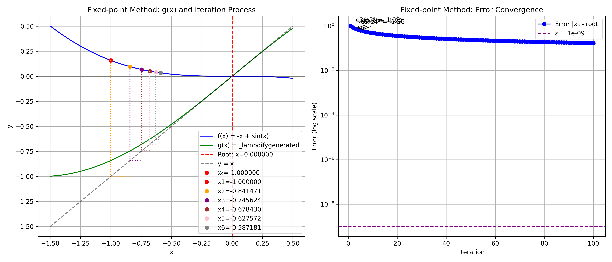

##### Fixed-point Method with Relative Criterion (ε = 0.000000001000000)

| Iteration | xₙ                  | g(xₙ)               | f(xₙ)               | Error               | Rel. Difference     | Aitken              |
|-----------|---------------------|---------------------|---------------------|---------------------|---------------------|---------------------|
| 1 | -1.000000000000000 | -0.841470984807897 | 0.158529015192103 | 1.000000000000000 | N/A | N/A |
| 2 | -0.841470984807897 | -0.745624141665558 | 0.095846843142339 | 0.841470984807897 | 0.188395105778121 | N/A |
| 3 | -0.745624141665558 | -0.678430477360740 | 0.067193664304818 | 0.745624141665558 | 0.128545788402503 | -0.5990654465862197 |
| 4 | -0.678430477360740 | -0.627571832049159 | 0.050858645311581 | 0.678430477360740 | 0.099042815066648 | -0.5208567383940799 |
| 5 | -0.627571832049159 | -0.587180996573431 | 0.040390835475728 | 0.627571832049159 | 0.081040356998683 | -0.46922479835423725 |
| 6 | -0.587180996573431 | -0.554016390755630 | 0.033164605817801 | 0.587180996573431 | 0.068787708920135 | -0.43132990489238066 |
| 7 | -0.554016390755630 | -0.526107075502842 | 0.027909315252788 | 0.554016390755630 | 0.059862138325127 | -0.4018082364183797 |
| 8 | -0.526107075502842 | -0.502170676268555 | 0.023936399234286 | 0.526107075502842 | 0.053048735803663 | -0.377888843181844 |
| 9 | -0.502170676268555 | -0.481329355262346 | 0.020841321006209 | 0.502170676268555 | 0.047665864148319 | -0.35795639999517004 |
| 10 | -0.481329355262346 | -0.462957898537812 | 0.018371456724534 | 0.481329355262346 | 0.043299501221673 | -0.34099020087733434 |
| 11 | -0.462957898537812 | -0.446596593386982 | 0.016361305150830 | 0.462957898537812 | 0.039682780621214 | -0.3263064943753933 |
| 12 | -0.446596593386982 | -0.431898433265822 | 0.014698160121159 | 0.446596593386982 | 0.036635535051322 | -0.31342638386629484 |
| 13 | -0.431898433265822 | -0.418595660998211 | 0.013302772267612 | 0.431898433265822 | 0.034031519887717 | -0.3020024187312004 |
| 14 | -0.418595660998211 | -0.406477764984069 | 0.012117896014142 | 0.418595660998211 | 0.031779527374673 | -0.29177518627926735 |
| 15 | -0.406477764984069 | -0.395376546988835 | 0.011101217995234 | 0.406477764984069 | 0.029811952972672 | -0.2825463389136228 |
| 16 | -0.395376546988835 | -0.385155713096526 | 0.010220833892308 | 0.395376546988835 | 0.028077583457543 | -0.27416113887947624 |
| 17 | -0.385155713096526 | -0.375703446847715 | 0.009452266248811 | 0.385155713096526 | 0.026536887665864 | -0.2664967719514377 |
| 18 | -0.375703446847715 | -0.366927001062791 | 0.008776445784924 | 0.375703446847715 | 0.025158848895636 | -0.2594542942918249 |
| 19 | -0.366927001062791 | -0.358748688107810 | 0.008178312954982 | 0.366927001062791 | 0.023918778829312 | -0.2529529432595793 |
| 20 | -0.358748688107810 | -0.351102858963179 | 0.007645829144631 | 0.358748688107810 | 0.022796774527922 | -0.24692603026090693 |
| 21 | -0.351102858963179 | -0.343933594328648 | 0.007169264634530 | 0.351102858963179 | 0.021776607479670 | -0.24131791870289127 |
| 22 | -0.343933594328648 | -0.337192916936002 | 0.006740677392646 | 0.343933594328648 | 0.020844909461446 | -0.23608176249780433 |
| 23 | -0.337192916936002 | -0.330839391070358 | 0.006353525865644 | 0.337192916936002 | 0.019990566391185 | -0.2311777879928787 |
| 24 | -0.330839391070358 | -0.324837013640270 | 0.006002377430088 | 0.330839391070358 | 0.019204260547962 | -0.22657197092611697 |
| 25 | -0.324837013640270 | -0.319154327474343 | 0.005682686165927 | 0.324837013640270 | 0.018478120343560 | -0.22223500501643623 |
| 26 | -0.319154327474343 | -0.313763705915325 | 0.005390621559018 | 0.319154327474343 | 0.017805449203516 | -0.21814148889967144 |
| 27 | -0.313763705915325 | -0.308640770822766 | 0.005122935092560 | 0.313763705915325 | 0.017180513416274 | -0.21426927863729123 |
| 28 | -0.308640770822766 | -0.303763915468900 | 0.004876855353866 | 0.308640770822766 | 0.016598374475618 | -0.21059896725384694 |
| 29 | -0.303763915468900 | -0.299113910636710 | 0.004650004832190 | 0.303763915468900 | 0.016054755372565 | -0.20711346277922033 |
| 30 | -0.299113910636710 | -0.294673577256255 | 0.004440333380455 | 0.299113910636710 | 0.015545933060390 | -0.20379764343278953 |
| 31 | -0.294673577256255 | -0.290427512659243 | 0.004246064597011 | 0.294673577256255 | 0.015068651291370 | -0.20063807377466808 |
| 32 | -0.290427512659243 | -0.286361860348455 | 0.004065652310788 | 0.290427512659243 | 0.014620049451008 | -0.1976227694452417 |
| 33 | -0.286361860348455 | -0.282464115317791 | 0.003897745030665 | 0.286361860348455 | 0.014197604058867 | -0.19474100093691268 |
| 34 | -0.282464115317791 | -0.278722958597813 | 0.003741156719978 | 0.282464115317791 | 0.013799080376208 | -0.1919831289487819 |
| 35 | -0.278722958597813 | -0.275128115968017 | 0.003594842629796 | 0.278722958597813 | 0.013422492136273 | -0.18934046547267494 |
| 36 | -0.275128115968017 | -0.271670236763068 | 0.003457879204948 | 0.275128115968017 | 0.013066067846783 | -0.18680515597902086 |
| 37 | -0.271670236763068 | -0.268340789473641 | 0.003329447289428 | 0.271670236763068 | 0.012728222444052 | -0.18437007900672409 |
| 38 | -0.268340789473641 | -0.265131971453282 | 0.003208818020358 | 0.268340789473641 | 0.012407533330877 | -0.1820287601922439 |
| 39 | -0.265131971453282 | -0.262036630528281 | 0.003095340925001 | 0.265131971453282 | 0.012102720025689 | -0.17977529834087488 |
| 40 | -0.262036630528281 | -0.259048196695839 | 0.002988433832443 | 0.262036630528281 | 0.011812626802446 | -0.17760430159131085 |
| 41 | -0.259048196695839 | -0.256160622408316 | 0.002887574287522 | 0.259048196695839 | 0.011536207819857 | -0.17551083208183677 |
| 42 | -0.256160622408316 | -0.253368330194057 | 0.002792292214260 | 0.256160622408316 | 0.011272514332510 | -0.17349035780852687 |
| 43 | -0.253368330194057 | -0.250666166570835 | 0.002702163623222 | 0.253368330194057 | 0.011020683651035 | -0.17153871059385484 |
| 44 | -0.250666166570835 | -0.248049361375991 | 0.002616805194844 | 0.250666166570835 | 0.010779929578003 | -0.16965204926840205 |
| 45 | -0.248049361375991 | -0.245513491775248 | 0.002535869600743 | 0.248049361375991 | 0.010549534094054 | -0.16782682731638976 |
| 46 | -0.245513491775248 | -0.243054450326041 | 0.002459041449207 | 0.245513491775248 | 0.010328840107348 | -0.16605976435898095 |
| 47 | -0.243054450326041 | -0.240668416565461 | 0.002386033760580 | 0.243054450326041 | 0.010117245110749 | -0.16434782094617395 |
| 48 | -0.240668416565461 | -0.238351831671369 | 0.002316584894092 | 0.240668416565461 | 0.009914195616653 | -0.1626881762139675 |
| 49 | -0.238351831671369 | -0.236101375810769 | 0.002250455860600 | 0.238351831671369 | 0.009719182260305 | -0.16107820802741696 |
| 50 | -0.236101375810769 | -0.233913947844445 | 0.002187427966324 | 0.236101375810769 | 0.009531735479609 | -0.15951547528996657 |
| 51 | -0.233913947844445 | -0.231786647103119 | 0.002127300741326 | 0.233913947844445 | 0.009351421693668 | -0.15799770214375458 |
| 52 | -0.231786647103119 | -0.229716756989405 | 0.002069890113714 | 0.231786647103119 | 0.009177839914045 | -0.1565227638263093 |
| 53 | -0.229716756989405 | -0.227701730192909 | 0.002015026796497 | 0.229716756989405 | 0.009010618732571 | -0.15508867398273535 |
| 54 | -0.227701730192909 | -0.225739175333946 | 0.001962554858963 | 0.227701730192909 | 0.008849413637698 | -0.1536935732581144 |
| 55 | -0.225739175333946 | -0.223826844875308 | 0.001912330458638 | 0.225739175333946 | 0.008693904618281 | -0.15233571902080706 |
| 56 | -0.223826844875308 | -0.221962624161997 | 0.001864220713311 | 0.223826844875308 | 0.008543794019451 | -0.15101347608634447 |
| 57 | -0.221962624161997 | -0.220144521466446 | 0.001818102695551 | 0.221962624161997 | 0.008398804620143 | -0.14972530832737102 |
| 58 | -0.220144521466446 | -0.218370658931835 | 0.001773862534611 | 0.220144521466446 | 0.008258677905950 | -0.14846977107342074 |
| 59 | -0.218370658931835 | -0.216639264319163 | 0.001731394612672 | 0.218370658931835 | 0.008123172514512 | -0.14724550421155785 |
| 60 | -0.216639264319163 | -0.214948663474997 | 0.001690600844166 | 0.216639264319163 | 0.007992062833638 | -0.14605122591468755 |
| 61 | -0.214948663474997 | -0.213297273446584 | 0.001651390028413 | 0.214948663474997 | 0.007865137734911 | -0.1448857269294621 |
| 62 | -0.213297273446584 | -0.211683596179494 | 0.001613677267090 | 0.213297273446584 | 0.007742199427724 | -0.14374786536626583 |
| 63 | -0.211683596179494 | -0.210106212740356 | 0.001577383439139 | 0.211683596179494 | 0.007623062420583 | -0.14263656194109248 |
| 64 | -0.210106212740356 | -0.208563778013676 | 0.001542434726679 | 0.210106212740356 | 0.007507552578123 | -0.14155079562071735 |
| 65 | -0.208563778013676 | -0.207055015827396 | 0.001508762186280 | 0.208563778013676 | 0.007395506263692 | -0.14048959963468283 |
| 66 | -0.207055015827396 | -0.205578714466746 | 0.001476301360650 | 0.207055015827396 | 0.007286769558570 | -0.1394520578155356 |
| 67 | -0.205578714466746 | -0.204133722540338 | 0.001444991926409 | 0.205578714466746 | 0.007181197549946 | -0.13843730123665854 |
| 68 | -0.204133722540338 | -0.202718945166210 | 0.001414777374127 | 0.204133722540338 | 0.007078653680667 | -0.13744450512102152 |
| 69 | -0.202718945166210 | -0.201333340448950 | 0.001385604717260 | 0.202718945166210 | 0.006979009154608 | -0.13647288599173413 |
| 70 | -0.201333340448950 | -0.199975916221949 | 0.001357424227001 | 0.201333340448950 | 0.006882142392166 | -0.1355216990469916 |
| 71 | -0.199975916221949 | -0.198645727031511 | 0.001330189190438 | 0.199975916221949 | 0.006787938531032 | -0.1345902357338496 |
| 72 | -0.198645727031511 | -0.197341871341849 | 0.001303855689662 | 0.198645727031511 | 0.006696288967884 | -0.1336778215080676 |
| 73 | -0.197341871341849 | -0.196063488942078 | 0.001278382399770 | 0.197341871341849 | 0.006607090937145 | -0.13278381375952913 |
| 74 | -0.196063488942078 | -0.194809758538159 | 0.001253730403920 | 0.196063488942078 | 0.006520247123359 | -0.13190759989151188 |
| 75 | -0.194809758538159 | -0.193579895514375 | 0.001229863023783 | 0.194809758538159 | 0.006435665304076 | -0.13104859553848658 |
| 76 | -0.193579895514375 | -0.192373149850419 | 0.001206745663957 | 0.193579895514375 | 0.006353258020495 | -0.1302062429126415 |
| 77 | -0.192373149850419 | -0.191188804181423 | 0.001184345668996 | 0.192373149850419 | 0.006272942273362 | -0.12938000926707927 |
| 78 | -0.191188804181423 | -0.190026171989499 | 0.001162632191924 | 0.191188804181423 | 0.006194639241908 | -0.12856938546633123 |
| 79 | -0.190026171989499 | -0.188884595916346 | 0.001141576073154 | 0.190026171989499 | 0.006118274023792 | -0.12777388465533168 |
| 80 | -0.188884595916346 | -0.187763446187463 | 0.001121149728883 | 0.188884595916346 | 0.006043775394258 | -0.12699304101948344 |
| 81 | -0.187763446187463 | -0.186662119139339 | 0.001101327048124 | 0.187763446187463 | 0.005971075582857 | -0.12622640862797402 |
| 82 | -0.186662119139339 | -0.185580035841746 | 0.001082083297592 | 0.186662119139339 | 0.005900110066261 | -0.12547356035402718 |
| 83 | -0.185580035841746 | -0.184516640807959 | 0.001063395033788 | 0.185580035841746 | 0.005830817375826 | -0.12473408686571415 |
| 84 | -0.184516640807959 | -0.183471400786333 | 0.001045240021625 | 0.184516640807959 | 0.005763138918697 | -0.12400759568251564 |
| 85 | -0.183471400786333 | -0.182443803627253 | 0.001027597159080 | 0.183471400786333 | 0.005697018811355 | -0.1232937102924922 |
| 86 | -0.182443803627253 | -0.181433357219929 | 0.001010446407324 | 0.182443803627253 | 0.005632403724601 | -0.12259206932605973 |
| 87 | -0.181433357219929 | -0.180439588494031 | 0.000993768725898 | 0.181433357219929 | 0.005569242739078 | -0.12190232577894379 |
| 88 | -0.180439588494031 | -0.179462042481508 | 0.000977546012523 | 0.180439588494031 | 0.005507487210498 | -0.12122414628729555 |
| 89 | -0.179462042481508 | -0.178500281434370 | 0.000961761047138 | 0.179462042481508 | 0.005447090643826 | -0.12055721044249895 |
| 90 | -0.178500281434370 | -0.177553883994511 | 0.000946397439859 | 0.178500281434370 | 0.005388008575725 | -0.11990121015269303 |
| 91 | -0.177553883994511 | -0.176622444411982 | 0.000931439582528 | 0.177553883994511 | 0.005330198464646 | -0.11925584903784911 |
| 92 | -0.176622444411982 | -0.175705571808417 | 0.000916872603565 | 0.176622444411982 | 0.005273619587982 | -0.11862084186328592 |
| 93 | -0.175705571808417 | -0.174802889482536 | 0.000902682325881 | 0.175705571808417 | 0.005218232945765 | -0.1179959140066 |
| 94 | -0.174802889482536 | -0.173914034254936 | 0.000888855227600 | 0.174802889482536 | 0.005164001170421 | -0.1173808009526415 |
| 95 | -0.173914034254936 | -0.173038655849547 | 0.000875378405389 | 0.173914034254936 | 0.005110888442145 | -0.11677524782168361 |
| 96 | -0.173038655849547 | -0.172176416309364 | 0.000862239540183 | 0.173038655849547 | 0.005058860409495 | -0.11617900892148028 |
| 97 | -0.172176416309364 | -0.171326989444225 | 0.000849426865139 | 0.172176416309364 | 0.005007884114825 | -0.11559184732433266 |
| 98 | -0.171326989444225 | -0.170490060308578 | 0.000836929135647 | 0.171326989444225 | 0.004957927924223 | -0.11501353447011817 |
| 99 | -0.170490060308578 | -0.169665324707324 | 0.000824735601254 | 0.170490060308578 | 0.004908961461638 | -0.11444384978827728 |
| 100 | -0.169665324707324 | -0.168852488727981 | 0.000812835979343 | 0.169665324707324 | 0.004860955546906 | -0.1138825803432098 |

**Result**: Converged
**Final Value**: -0.168852488727981 in 101 iterations
**Final Error**: 0.168852488727981
**Convergence Rate**: 0.965604838324565

#### Comparison of Stopping Criteria for Fixed-point Method

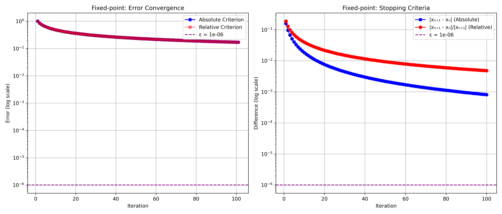

| Criterion | Iterations | Final Value         | Error               |
|-----------|------------|---------------------|---------------------|
| Absolute | 101 | -0.168852488727981 | 0.168852488727981 |
| Relative | 101 | -0.168852488727981 | 0.168852488727981 |

### 5. Aitken's Acceleration

#### Mathematical Formula

For a sequence \{p_n\} converging to limit p, Aitken's Δ^2 method produces:

p̂_n = p_n - (Δ p_n)^2⁄Δ^2 p_n

where:
- Δ p_n = p_{n+1} - p_n (forward difference)
- Δ^2 p_n = Δ p_{n+1} - Δ p_n = p_{n+2} - 2p_{n+1} + p_n (second difference)

Expanded form:
p̂_n = p_n - \frac{(p_{n+1} - p_n)^2}{p_{n+2} - 2p_{n+1} + p_n}

#### Algorithm

1. **Input**: Sequence \{p_0, p_1, p_2, \ldots\}, tolerance \epsilon
2. **For each** n ≥ 0 where p_{n+2} exists:
   - Compute Δ^2 p_n = p_{n+2} - 2p_{n+1} + p_n
   - If |Δ^2 p_n| < \text{small threshold}, skip (avoid division by zero)
   - Compute p̂_n = p_n - \frac{(p_{n+1} - p_n)^2}{Δ^2 p_n}
3. **Return** accelerated sequence

#### Implementation

```python
def aitken_acceleration(sequence, epsilon=1e-6):
    if len(sequence) < 3:
        return sequence, "Short sequence - minimum 3 elements needed"

    aitken_sequence = []

    for i in range(len(sequence) - 2):
        p0, p1, p2 = sequence[i], sequence[i + 1], sequence[i + 2]

        denominator = p0 + p2 - 2 * p1
        if abs(denominator) < 1e-19:
            accelerated = p2
        else:
            accelerated = p0 - ((p1 - p0)**2 / denominator)

        aitken_sequence.append(accelerated)

    return aitken_sequence, "First stopping condition (max iterations)"

```

### 6. Real-time Aitken's Acceleration with Fixed-point

#### Mathematical Formula

This method applies Aitken's acceleration dynamically during the Fixed-point process:

1. Generate a few iterations using Fixed-point: x_{n+1} = g(x_n)
2. When three consecutive points are available, compute the Aitken accelerated value:
   x̂_n = x_n - \frac{(x_{n+1} - x_n)^2}{x_{n+2} - 2x_{n+1} + x_n}
3. Replace the current approximation with the accelerated value and continue

#### Algorithm

1. **Input**: Function f, initial guess x₍0₎, tolerance \epsilon, max iterations
2. **Initialize**: Set n = 0, sequence = [x₍0₎]
3. **Iterate**:
   - Compute next Fixed-point value: x_{n+1} = g(x_n)
   - Add x_{n+1} to sequence
   - If at least 3 points exist in sequence, apply Aitken acceleration
   - If accelerated value meets convergence criterion, return it
   - Otherwise, continue with the next Fixed-point
4. **Return** final value and performance metrics

#### Implementation

```python
def fixed_point_with_aitken(f, x0, g, epsilon=1e-6, max_iterations=20, condition=stopping_condition_2):
    regular_sequence = [x0]
    aitken_values = {}

    x = x0

    method_info = {
        'converged': False,
        'convergence_type': None,
        'final_value': None,
        'iterations': 0,
        'aitken_applications': 0
    }

    for k in range(max_iterations):
        x_new = g(x)
        regular_sequence.append(x_new)
        method_info['iterations'] = k + 1

        if k ≥ 2:
            p0, p1, p2 = regular_sequence[k -
                                          2], regular_sequence[k - 1], regular_sequence[k]
            denominator = p2 - 2 * p1 + p0

            if abs(denominator) > 1e-19:
                aitken_val = p0 - (p1 - p0)**2 / denominator
                aitken_values[k] = aitken_val
                method_info['aitken_applications'] += 1

                if (k - 1) in aitken_values:
                    if condition(aitken_val, aitken_values[k - 1], epsilon):
                        method_info['converged'] = True
                        method_info['convergence_type'] = 'Aitken acceleration'
                        method_info['final_value'] = aitken_val
                        break

        x = x_new

        if condition(regular_sequence[-1], regular_sequence[-2], epsilon):
            method_info['converged'] = True
            method_info['convergence_type'] = 'Regular iteration'
            method_info['final_value'] = regular_sequence[-1]
            break

        if abs(x) > 1e10:
            method_info['convergence_type'] = 'Diverged'
            method_info['final_value'] = x
            break

    if not method_info['converged'] and method_info['convergence_type'] != 'Diverged':
        method_info['convergence_type'] = 'Max iterations reached'
        if aitken_values:
            last_aitken_key = max(aitken_values.keys())
            method_info['final_value'] = aitken_values[last_aitken_key]
        else:
            method_info['final_value'] = regular_sequence[-1]

    return regular_sequence, aitken_values, method_info

```

#### Examples with Real-time Aitken Acceleration

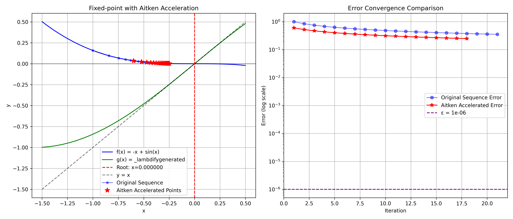

##### Fixed-point with Real-time Aitken (ε = 0.000001000000000)

| Iteration | xₙ                  | f(xₙ)               | Error               | Aitken Applied | Acceleration Effect             |
|-----------|---------------------|---------------------|---------------------|----------------|---------------------------------|
| 1 | -1.000000000000000 | 0.158529015192103 | 1.000000000000000 | Yes | N/A |
| 2 | -0.841470984807897 | 0.095846843142339 | 0.841470984807897 | Yes | 1.615551691627033x faster |
| 3 | -0.745624141665558 | 0.067193664304818 | 0.745624141665558 | Yes | 1.589055276449084x faster |
| 4 | -0.678430477360740 | 0.050858645311581 | 0.678430477360740 | Yes | 1.572880687533169x faster |
| 5 | -0.627571832049159 | 0.040390835475728 | 0.627571832049159 | Yes | 1.561869009065570x faster |
| 6 | -0.587180996573431 | 0.033164605817801 | 0.587180996573431 | Yes | 1.553845812512844x faster |
| 7 | -0.554016390755630 | 0.027909315252788 | 0.554016390755630 | Yes | 1.547720311085666x faster |
| 8 | -0.526107075502842 | 0.023936399234286 | 0.526107075502842 | Yes | 1.542880335414976x faster |
| 9 | -0.502170676268555 | 0.020841321006209 | 0.502170676268555 | Yes | 1.538953974023111x faster |
| 10 | -0.481329355262346 | 0.018371456724534 | 0.481329355262346 | Yes | 1.535701459860755x faster |
| 11 | -0.462957898537812 | 0.016361305150830 | 0.462957898537812 | Yes | 1.532960896415412x faster |
| 12 | -0.446596593386982 | 0.014698160121159 | 0.446596593386982 | Yes | 1.530618827056529x faster |
| 13 | -0.431898433265822 | 0.013302772267612 | 0.431898433265822 | Yes | 1.528593274032366x faster |
| 14 | -0.418595660998211 | 0.012117896014142 | 0.418595660998211 | Yes | 1.526823468523075x faster |
| 15 | -0.406477764984069 | 0.011101217995234 | 0.406477764984069 | Yes | 1.525263371888568x faster |
| 16 | -0.395376546988835 | 0.010220833892308 | 0.395376546988835 | Yes | 1.523877444649824x faster |
| 17 | -0.385155713096526 | 0.009452266248811 | 0.385155713096526 | Yes | 1.522637800269822x faster |
| 18 | -0.375703446847715 | 0.008776445784924 | 0.375703446847715 | Yes | 1.521522240691836x faster |
| 19 | -0.366927001062791 | 0.008178312954982 | 0.366927001062791 | No | N/A |
| 20 | -0.358748688107810 | 0.007645829144631 | 0.358748688107810 | No | N/A |
| 21 | -0.351102858963179 | 0.007169264634530 | 0.351102858963179 | No | N/A |

**Result**: Converged to -0.246926030260907 in 20 iterations
**Final Error**: 0.246926030260907
**Aitken Applications**: 18
**Acceleration Effect**: Significant improvement over basic Fixed-point

## Performance Analysis

### Summary Table

| Method                  | Avg Iterations | Avg Time (ms)       | Avg Error           | Convergence Rate    | Success Rate        |
|-------------------------|----------------|---------------------|---------------------|---------------------|---------------------|
| Bisection | 40.500000000000000 | 0.025749206542969 | 0.000000081781758 | 0.857942132400667 | 40.000000000000000% |
| Newton | 44.000000000000000 | 0.023782253265381 | 0.000000265261426 | 0.979118634546631 | 40.000000000000000% |
| Secant | 41.000000000000000 | 0.015020370483398 | 0.000001556422635 | 1.015441907862525 | 100.000000000000000% |
| Fixed-point | 101.000000000000000 | 0.054001808166504 | 0.168852488727981 | 0.965604838324565 | 40.000000000000000% |
| Bisection + Aitken | 38.500000000000000 | 0.018060207366943 | 0.000000022351742 | N/A | 40.000000000000000% |
| Fixed-point + Aitken | 99.000000000000000 | 0.038206577301025 | 0.113329520495573 | 0.966843484346439 | 40.000000000000000% |
| Real-time Aitken | 20.500000000000000 | 0.038862228393555 | 0.299014444612043 | 0.898892782253482 | 40.000000000000000% |
| Periodic Aitken | 20.000000000000000 | 0.017046928405762 | 0.060910932149880 | 1.297382707333707 | 20.000000000000000% |
