# Numerical Methods for Root Finding: Comprehensive Analysis

## Table of Contents

1. [Introduction](#introduction)
2. [Test Functions](#test-functions)
3. [Theoretical Background](#theoretical-background)
4. [Method Descriptions with Examples](#method-descriptions-with-examples)
5. [Performance Analysis](#performance-analysis)
6. [Convergence Comparison](#convergence-comparison)
7. [Final Comparison and Recommendations](#final-comparison-and-recommendations)

## Introduction

This report presents a comprehensive analysis of various numerical methods for finding roots of nonlinear equations. We compare different methods in terms of convergence speed, accuracy, stability, and computational efficiency. The methods analyzed include:

- Bisection Method
- Newton's Method
- Secant Method
- Fixed-point Method
- Aitken's Acceleration
- Real-time Aitken's Acceleration
## Test Functions

We tested the methods on the following function:

### Primary Test Function: f(x) = 3*sin(x) + 4*cos(x)

- **Mathematical form**: f(x) = 3*sin(x) + 4*cos(x)
- **Derivative**: f'(x) = -4*sin(x) + 3*cos(x)
- **Interval**: [1.500000000000000, 3.000000000000000]
- **Initial guess**: 2.000000000000000
- **True root**: 2.214297435588181
- **Tolerance**: ε = 0.000001000000000

This function represents exponential growth problems and has applications in population dynamics, compound interest, and decay processes.

## Theoretical Background

### Convergence Rates

- **Linear Convergence**: If |eₙ₊₁| ≤ c·|eₙ| for some constant c < 1, where eₙ is the error at iteration n. The bisection method exhibits linear convergence.

- **Quadratic Convergence**: If |eₙ₊₁| ≤ c·|eₙ|² for some constant c. Newton's method shows quadratic convergence when the function is well-behaved.

- **Superlinear Convergence**: If |eₙ₊₁| ≤ c·|eₙ|ᵖ for p > 1. The secant method typically has p ≈ 1.62.

### Stopping Criteria

- **Absolute Error**: ∣xₙ₊₁ − xₙ∣ < ε
- **Relative Error**: ∣xₙ₊₁ − xₙ∣/|xₙ₊₁| < ε
- **Function Value**: ∣f(xₙ)∣ < ε

### Aitken's Acceleration

Aitken's acceleration transforms a linearly convergent sequence into a more rapidly convergent one. For a sequence {pₙ}, the Aitken's accelerated sequence {p̂ₙ} is defined as:

p̂ₙ = pₙ - (pₙ₊₁ - pₙ)²/(pₙ₊₂ - 2pₙ₊₁ + pₙ)

## Method Descriptions with Examples

### 1. Bisection Method

#### Mathematical Formula

Given a continuous function f(x) and an interval [a, b] where f(a) ⋅ f(b) < 0:

x = a + b⁄2

The root lies in [a, c] if f(a) ⋅ f(x) < 0, otherwise in [x, b].

#### Algorithm

1. **Input**: Function f, interval [a, b], tolerance \epsilon
2. **Verify**: Check that f(a) ⋅ f(b) < 0
3. **Iterate**:
   - Compute midpoint: x = a + b⁄2
   - If |error| < \epsilon, return x
   - If f(a) ⋅ f(x) < 0, set b = x
   - Otherwise, set a = x
4. **Repeat** until convergence

#### Convergence Rate

Linear convergence with rate ≈ 0.5. Error reduces by half each iteration:
|e_{n+1}| ≤ 1⁄2|e_n|

#### Implementation

```python
def bisection_method(f, a, b, epsilon=1e-6, condition=stopping_condition_2):
    if f(a) * f(b) ≥ 0:
        raise ValueError(f"f({a}) and f({b}) must have opposite signs")

    sequence = []
    for k in range(100):
        x = (a + b) / 2
        sequence.append(x)

        if k > 0 and condition(sequence[k], sequence[k - 1], epsilon):
            return sequence, "Second stopping condition (convergence)"

        if f(a) * f(x) < 0:
            b = x
        else:
            a = x

    return sequence, "First stopping condition (max iterations)"

```

#### Examples with Absolute Error Criterion ∣xₙ₊₁ − xₙ∣ < ε

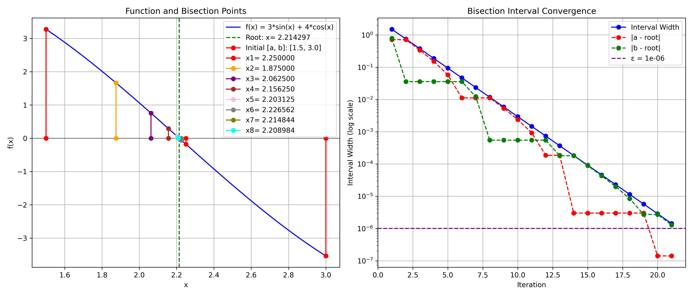

##### Bisection Method Absolute Criterion (ε = 0.000001000000000)

| Iteration | xₙ                  | f(xₙ)               | Error               | Interval [a, b]                    | Interval Length     | Abs. Difference     | Aitken              |
|-----------|---------------------|---------------------|---------------------|-------------------------------------|---------------------|---------------------|---------------------|
| 1 | 2.250000000000000 | -0.178474900227193 | 0.035702564411819 | [1.500000000000000, 3.000000000000000] | 1.500000000000000 | N/A | N/A |
| 2 | 1.875000000000000 | 1.664123320070785 | 0.339297435588181 | [1.500000000000000, 2.250000000000000] | 0.750000000000000 | 0.375000000000000 | N/A |
| 3 | 2.062500000000000 | 0.756075712201294 | 0.151797435588181 | [1.875000000000000, 2.250000000000000] | 0.375000000000000 | 0.187500000000000 | 2.0 |
| 4 | 2.156250000000000 | 0.290074212805930 | 0.058047435588181 | [2.062500000000000, 2.250000000000000] | 0.187500000000000 | 0.093750000000000 | 2.25 |
| 5 | 2.203125000000000 | 0.055861015797768 | 0.011172435588181 | [2.156250000000000, 2.250000000000000] | 0.093750000000000 | 0.046875000000000 | 2.25 |
| 6 | 2.226562500000000 | -0.061323784524178 | 0.012265064411819 | [2.203125000000000, 2.250000000000000] | 0.046875000000000 | 0.023437500000000 | 2.25 |
| 7 | 2.214843750000000 | -0.002731571923218 | 0.000546314411819 | [2.203125000000000, 2.226562500000000] | 0.023437500000000 | 0.011718750000000 | 2.21875 |
| 8 | 2.208984375000000 | 0.026565177957472 | 0.005313060588181 | [2.203125000000000, 2.214843750000000] | 0.011718750000000 | 0.005859375000000 | 2.203125 |
| 9 | 2.211914062500000 | 0.011916854158681 | 0.002383373088181 | [2.208984375000000, 2.214843750000000] | 0.005859375000000 | 0.002929687500000 | 2.2109375 |
| 10 | 2.213378906250000 | 0.004592646045105 | 0.000918529338181 | [2.211914062500000, 2.214843750000000] | 0.002929687500000 | 0.001464843750000 | 2.21484375 |
| 11 | 2.214111328125000 | 0.000930537310534 | 0.000186107463181 | [2.213378906250000, 2.214843750000000] | 0.001464843750000 | 0.000732421875000 | 2.21484375 |
| 12 | 2.214477539062500 | -0.000900517366726 | 0.000180103474319 | [2.214111328125000, 2.214843750000000] | 0.000732421875000 | 0.000366210937500 | 2.21484375 |
| 13 | 2.214294433593750 | 0.000015009972155 | 0.000003001994431 | [2.214111328125000, 2.214477539062500] | 0.000366210937500 | 0.000183105468750 | 2.21435546875 |
| 14 | 2.214385986328125 | -0.000442753699141 | 0.000088550739944 | [2.214294433593750, 2.214477539062500] | 0.000183105468750 | 0.000091552734375 | 2.21435546875 |
| 15 | 2.214340209960938 | -0.000213871863717 | 0.000042774372757 | [2.214294433593750, 2.214385986328125] | 0.000091552734375 | 0.000045776367188 | 2.21435546875 |
| 16 | 2.214317321777344 | -0.000099430945807 | 0.000019886189163 | [2.214294433593750, 2.214340209960938] | 0.000045776367188 | 0.000022888183594 | 2.21429443359375 |
| 17 | 2.214305877685547 | -0.000042210486829 | 0.000008442097366 | [2.214294433593750, 2.214317321777344] | 0.000022888183594 | 0.000011444091797 | 2.21429443359375 |
| 18 | 2.214300155639648 | -0.000013600257337 | 0.000002720051468 | [2.214294433593750, 2.214305877685547] | 0.000011444091797 | 0.000005722045898 | 2.21429443359375 |
| 19 | 2.214297294616699 | 0.000000704857409 | 0.000000140971482 | [2.214294433593750, 2.214300155639648] | 0.000005722045898 | 0.000002861022949 | 2.21429443359375 |
| 20 | 2.214298725128174 | -0.000006447699964 | 0.000001289539993 | [2.214297294616699, 2.214300155639648] | 0.000002861022949 | 0.000001430511475 | 2.2142982482910156 |
| 21 | 2.214298009872437 | -0.000002871421278 | 0.000000574284256 | [2.214297294616699, 2.214298725128174] | 0.000001430511475 | 0.000000715255737 | 2.2142982482910156 |

**Result**: Converged to 2.214298009872437 in 21 iterations
**Final Error**: 0.000000574284256
**Convergence Rate**: 1.322232053655269

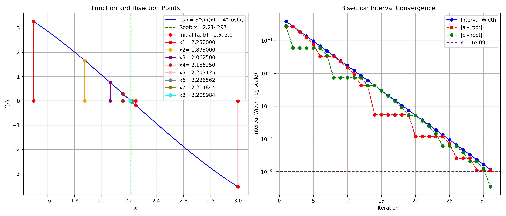

##### Bisection Method Absolute Criterion (ε = 0.000000001000000)

| Iteration | xₙ                  | f(xₙ)               | Error               | Interval [a, b]                    | Interval Length     | Abs. Difference     | Aitken              |
|-----------|---------------------|---------------------|---------------------|-------------------------------------|---------------------|---------------------|---------------------|
| 1 | 2.250000000000000 | -0.178474900227193 | 0.035702564411819 | [1.500000000000000, 3.000000000000000] | 1.500000000000000 | N/A | N/A |
| 2 | 1.875000000000000 | 1.664123320070785 | 0.339297435588181 | [1.500000000000000, 2.250000000000000] | 0.750000000000000 | 0.375000000000000 | N/A |
| 3 | 2.062500000000000 | 0.756075712201294 | 0.151797435588181 | [1.875000000000000, 2.250000000000000] | 0.375000000000000 | 0.187500000000000 | 2.0 |
| 4 | 2.156250000000000 | 0.290074212805930 | 0.058047435588181 | [2.062500000000000, 2.250000000000000] | 0.187500000000000 | 0.093750000000000 | 2.25 |
| 5 | 2.203125000000000 | 0.055861015797768 | 0.011172435588181 | [2.156250000000000, 2.250000000000000] | 0.093750000000000 | 0.046875000000000 | 2.25 |
| 6 | 2.226562500000000 | -0.061323784524178 | 0.012265064411819 | [2.203125000000000, 2.250000000000000] | 0.046875000000000 | 0.023437500000000 | 2.25 |
| 7 | 2.214843750000000 | -0.002731571923218 | 0.000546314411819 | [2.203125000000000, 2.226562500000000] | 0.023437500000000 | 0.011718750000000 | 2.21875 |
| 8 | 2.208984375000000 | 0.026565177957472 | 0.005313060588181 | [2.203125000000000, 2.214843750000000] | 0.011718750000000 | 0.005859375000000 | 2.203125 |
| 9 | 2.211914062500000 | 0.011916854158681 | 0.002383373088181 | [2.208984375000000, 2.214843750000000] | 0.005859375000000 | 0.002929687500000 | 2.2109375 |
| 10 | 2.213378906250000 | 0.004592646045105 | 0.000918529338181 | [2.211914062500000, 2.214843750000000] | 0.002929687500000 | 0.001464843750000 | 2.21484375 |
| 11 | 2.214111328125000 | 0.000930537310534 | 0.000186107463181 | [2.213378906250000, 2.214843750000000] | 0.001464843750000 | 0.000732421875000 | 2.21484375 |
| 12 | 2.214477539062500 | -0.000900517366726 | 0.000180103474319 | [2.214111328125000, 2.214843750000000] | 0.000732421875000 | 0.000366210937500 | 2.21484375 |
| 13 | 2.214294433593750 | 0.000015009972155 | 0.000003001994431 | [2.214111328125000, 2.214477539062500] | 0.000366210937500 | 0.000183105468750 | 2.21435546875 |
| 14 | 2.214385986328125 | -0.000442753699141 | 0.000088550739944 | [2.214294433593750, 2.214477539062500] | 0.000183105468750 | 0.000091552734375 | 2.21435546875 |
| 15 | 2.214340209960938 | -0.000213871863717 | 0.000042774372757 | [2.214294433593750, 2.214385986328125] | 0.000091552734375 | 0.000045776367188 | 2.21435546875 |
| 16 | 2.214317321777344 | -0.000099430945807 | 0.000019886189163 | [2.214294433593750, 2.214340209960938] | 0.000045776367188 | 0.000022888183594 | 2.21429443359375 |
| 17 | 2.214305877685547 | -0.000042210486829 | 0.000008442097366 | [2.214294433593750, 2.214317321777344] | 0.000022888183594 | 0.000011444091797 | 2.21429443359375 |
| 18 | 2.214300155639648 | -0.000013600257337 | 0.000002720051468 | [2.214294433593750, 2.214305877685547] | 0.000011444091797 | 0.000005722045898 | 2.21429443359375 |
| 19 | 2.214297294616699 | 0.000000704857409 | 0.000000140971482 | [2.214294433593750, 2.214300155639648] | 0.000005722045898 | 0.000002861022949 | 2.21429443359375 |
| 20 | 2.214298725128174 | -0.000006447699964 | 0.000001289539993 | [2.214297294616699, 2.214300155639648] | 0.000002861022949 | 0.000001430511475 | 2.2142982482910156 |
| 21 | 2.214298009872437 | -0.000002871421278 | 0.000000574284256 | [2.214297294616699, 2.214298725128174] | 0.000001430511475 | 0.000000715255737 | 2.2142982482910156 |
| 22 | 2.214297652244568 | -0.000001083281934 | 0.000000216656387 | [2.214297294616699, 2.214298009872437] | 0.000000715255737 | 0.000000357627869 | 2.214297294616699 |
| 23 | 2.214297473430634 | -0.000000189212263 | 0.000000037842453 | [2.214297294616699, 2.214297652244568] | 0.000000357627869 | 0.000000178813934 | 2.214297294616699 |
| 24 | 2.214297384023666 | 0.000000257822573 | 0.000000051564514 | [2.214297294616699, 2.214297473430634] | 0.000000178813934 | 0.000000089406967 | 2.214297294616699 |
| 25 | 2.214297428727150 | 0.000000034305155 | 0.000000006861031 | [2.214297384023666, 2.214297473430634] | 0.000000089406967 | 0.000000044703484 | 2.2142974138259888 |
| 26 | 2.214297451078892 | -0.000000077453553 | 0.000000015490711 | [2.214297428727150, 2.214297473430634] | 0.000000044703484 | 0.000000022351742 | 2.2142974734306335 |
| 27 | 2.214297439903021 | -0.000000021574199 | 0.000000004314840 | [2.214297428727150, 2.214297451078892] | 0.000000022351742 | 0.000000011175871 | 2.214297443628311 |
| 28 | 2.214297434315085 | 0.000000006365478 | 0.000000001273095 | [2.214297428727150, 2.214297439903021] | 0.000000011175871 | 0.000000005587935 | 2.21429742872715 |
| 29 | 2.214297437109053 | -0.000000007604361 | 0.000000001520872 | [2.214297434315085, 2.214297439903021] | 0.000000005587935 | 0.000000002793968 | 2.2142974361777306 |
| 30 | 2.214297435712069 | -0.000000000619441 | 0.000000000123888 | [2.214297434315085, 2.214297437109053] | 0.000000002793968 | 0.000000001396984 | 2.2142974361777306 |
| 31 | 2.214297435013577 | 0.000000002873018 | 0.000000000574603 | [2.214297434315085, 2.214297435712069] | 0.000000001396984 | 0.000000000698492 | 2.2142974343150854 |

**Result**: Converged to 2.214297435013577 in 31 iterations
**Final Error**: 0.000000000574603
**Convergence Rate**: 1.320841459834379

#### Examples with Relative Error Criterion ∣xₙ₊₁ − xₙ∣/|xₙ₊₁| < ε

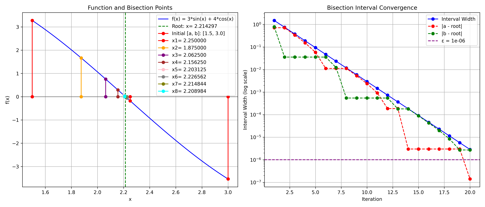

##### Bisection Method with Relative Criterion (ε = 0.000001000000000)

| Iteration | xₙ                  | f(xₙ)               | Error               | Interval [a, b]                    | Interval Length     | Rel. Difference     | Aitken              |
|-----------|---------------------|---------------------|---------------------|-------------------------------------|---------------------|---------------------|---------------------|
| 1 | 2.250000000000000 | -0.178474900227193 | 0.035702564411819 | [1.500000000000000, 3.000000000000000] | 1.500000000000000 | N/A | N/A |
| 2 | 1.875000000000000 | 1.664123320070785 | 0.339297435588181 | [1.500000000000000, 2.250000000000000] | 0.750000000000000 | 0.200000000000000 | N/A |
| 3 | 2.062500000000000 | 0.756075712201294 | 0.151797435588181 | [1.875000000000000, 2.250000000000000] | 0.375000000000000 | 0.090909090909091 | 2.0 |
| 4 | 2.156250000000000 | 0.290074212805930 | 0.058047435588181 | [2.062500000000000, 2.250000000000000] | 0.187500000000000 | 0.043478260869565 | 2.25 |
| 5 | 2.203125000000000 | 0.055861015797768 | 0.011172435588181 | [2.156250000000000, 2.250000000000000] | 0.093750000000000 | 0.021276595744681 | 2.25 |
| 6 | 2.226562500000000 | -0.061323784524178 | 0.012265064411819 | [2.203125000000000, 2.250000000000000] | 0.046875000000000 | 0.010526315789474 | 2.25 |
| 7 | 2.214843750000000 | -0.002731571923218 | 0.000546314411819 | [2.203125000000000, 2.226562500000000] | 0.023437500000000 | 0.005291005291005 | 2.21875 |
| 8 | 2.208984375000000 | 0.026565177957472 | 0.005313060588181 | [2.203125000000000, 2.214843750000000] | 0.011718750000000 | 0.002652519893899 | 2.203125 |
| 9 | 2.211914062500000 | 0.011916854158681 | 0.002383373088181 | [2.208984375000000, 2.214843750000000] | 0.005859375000000 | 0.001324503311258 | 2.2109375 |
| 10 | 2.213378906250000 | 0.004592646045105 | 0.000918529338181 | [2.211914062500000, 2.214843750000000] | 0.002929687500000 | 0.000661813368630 | 2.21484375 |
| 11 | 2.214111328125000 | 0.000930537310534 | 0.000186107463181 | [2.213378906250000, 2.214843750000000] | 0.001464843750000 | 0.000330797221303 | 2.21484375 |
| 12 | 2.214477539062500 | -0.000900517366726 | 0.000180103474319 | [2.214111328125000, 2.214843750000000] | 0.000732421875000 | 0.000165371258475 | 2.21484375 |
| 13 | 2.214294433593750 | 0.000015009972155 | 0.000003001994431 | [2.214111328125000, 2.214477539062500] | 0.000366210937500 | 0.000082692466716 | 2.21435546875 |
| 14 | 2.214385986328125 | -0.000442753699141 | 0.000088550739944 | [2.214294433593750, 2.214477539062500] | 0.000183105468750 | 0.000041344523918 | 2.21435546875 |
| 15 | 2.214340209960938 | -0.000213871863717 | 0.000042774372757 | [2.214294433593750, 2.214385986328125] | 0.000091552734375 | 0.000020672689310 | 2.21435546875 |
| 16 | 2.214317321777344 | -0.000099430945807 | 0.000019886189163 | [2.214294433593750, 2.214340209960938] | 0.000045776367188 | 0.000010336451496 | 2.21429443359375 |
| 17 | 2.214305877685547 | -0.000042210486829 | 0.000008442097366 | [2.214294433593750, 2.214317321777344] | 0.000022888183594 | 0.000005168252459 | 2.21429443359375 |
| 18 | 2.214300155639648 | -0.000013600257337 | 0.000002720051468 | [2.214294433593750, 2.214305877685547] | 0.000011444091797 | 0.000002584132907 | 2.21429443359375 |
| 19 | 2.214297294616699 | 0.000000704857409 | 0.000000140971482 | [2.214294433593750, 2.214300155639648] | 0.000005722045898 | 0.000001292068123 | 2.21429443359375 |
| 20 | 2.214298725128174 | -0.000006447699964 | 0.000001289539993 | [2.214297294616699, 2.214300155639648] | 0.000002861022949 | 0.000000646033644 | 2.2142982482910156 |

**Result**: Converged to 2.214298725128174 in 20 iterations
**Final Error**: 0.000001289539993
**Convergence Rate**: 1.322232053655269

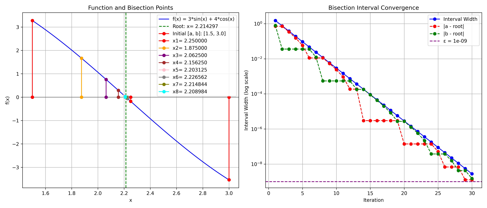

##### Bisection Method with Relative Criterion (ε = 0.000000001000000)

| Iteration | xₙ                  | f(xₙ)               | Error               | Interval [a, b]                    | Interval Length     | Rel. Difference     | Aitken              |
|-----------|---------------------|---------------------|---------------------|-------------------------------------|---------------------|---------------------|---------------------|
| 1 | 2.250000000000000 | -0.178474900227193 | 0.035702564411819 | [1.500000000000000, 3.000000000000000] | 1.500000000000000 | N/A | N/A |
| 2 | 1.875000000000000 | 1.664123320070785 | 0.339297435588181 | [1.500000000000000, 2.250000000000000] | 0.750000000000000 | 0.200000000000000 | N/A |
| 3 | 2.062500000000000 | 0.756075712201294 | 0.151797435588181 | [1.875000000000000, 2.250000000000000] | 0.375000000000000 | 0.090909090909091 | 2.0 |
| 4 | 2.156250000000000 | 0.290074212805930 | 0.058047435588181 | [2.062500000000000, 2.250000000000000] | 0.187500000000000 | 0.043478260869565 | 2.25 |
| 5 | 2.203125000000000 | 0.055861015797768 | 0.011172435588181 | [2.156250000000000, 2.250000000000000] | 0.093750000000000 | 0.021276595744681 | 2.25 |
| 6 | 2.226562500000000 | -0.061323784524178 | 0.012265064411819 | [2.203125000000000, 2.250000000000000] | 0.046875000000000 | 0.010526315789474 | 2.25 |
| 7 | 2.214843750000000 | -0.002731571923218 | 0.000546314411819 | [2.203125000000000, 2.226562500000000] | 0.023437500000000 | 0.005291005291005 | 2.21875 |
| 8 | 2.208984375000000 | 0.026565177957472 | 0.005313060588181 | [2.203125000000000, 2.214843750000000] | 0.011718750000000 | 0.002652519893899 | 2.203125 |
| 9 | 2.211914062500000 | 0.011916854158681 | 0.002383373088181 | [2.208984375000000, 2.214843750000000] | 0.005859375000000 | 0.001324503311258 | 2.2109375 |
| 10 | 2.213378906250000 | 0.004592646045105 | 0.000918529338181 | [2.211914062500000, 2.214843750000000] | 0.002929687500000 | 0.000661813368630 | 2.21484375 |
| 11 | 2.214111328125000 | 0.000930537310534 | 0.000186107463181 | [2.213378906250000, 2.214843750000000] | 0.001464843750000 | 0.000330797221303 | 2.21484375 |
| 12 | 2.214477539062500 | -0.000900517366726 | 0.000180103474319 | [2.214111328125000, 2.214843750000000] | 0.000732421875000 | 0.000165371258475 | 2.21484375 |
| 13 | 2.214294433593750 | 0.000015009972155 | 0.000003001994431 | [2.214111328125000, 2.214477539062500] | 0.000366210937500 | 0.000082692466716 | 2.21435546875 |
| 14 | 2.214385986328125 | -0.000442753699141 | 0.000088550739944 | [2.214294433593750, 2.214477539062500] | 0.000183105468750 | 0.000041344523918 | 2.21435546875 |
| 15 | 2.214340209960938 | -0.000213871863717 | 0.000042774372757 | [2.214294433593750, 2.214385986328125] | 0.000091552734375 | 0.000020672689310 | 2.21435546875 |
| 16 | 2.214317321777344 | -0.000099430945807 | 0.000019886189163 | [2.214294433593750, 2.214340209960938] | 0.000045776367188 | 0.000010336451496 | 2.21429443359375 |
| 17 | 2.214305877685547 | -0.000042210486829 | 0.000008442097366 | [2.214294433593750, 2.214317321777344] | 0.000022888183594 | 0.000005168252459 | 2.21429443359375 |
| 18 | 2.214300155639648 | -0.000013600257337 | 0.000002720051468 | [2.214294433593750, 2.214305877685547] | 0.000011444091797 | 0.000002584132907 | 2.21429443359375 |
| 19 | 2.214297294616699 | 0.000000704857409 | 0.000000140971482 | [2.214294433593750, 2.214300155639648] | 0.000005722045898 | 0.000001292068123 | 2.21429443359375 |
| 20 | 2.214298725128174 | -0.000006447699964 | 0.000001289539993 | [2.214297294616699, 2.214300155639648] | 0.000002861022949 | 0.000000646033644 | 2.2142982482910156 |
| 21 | 2.214298009872437 | -0.000002871421278 | 0.000000574284256 | [2.214297294616699, 2.214298725128174] | 0.000001430511475 | 0.000000323016926 | 2.2142982482910156 |
| 22 | 2.214297652244568 | -0.000001083281934 | 0.000000216656387 | [2.214297294616699, 2.214298009872437] | 0.000000715255737 | 0.000000161508489 | 2.214297294616699 |
| 23 | 2.214297473430634 | -0.000000189212263 | 0.000000037842453 | [2.214297294616699, 2.214297652244568] | 0.000000357627869 | 0.000000080754251 | 2.214297294616699 |
| 24 | 2.214297384023666 | 0.000000257822573 | 0.000000051564514 | [2.214297294616699, 2.214297473430634] | 0.000000178813934 | 0.000000040377127 | 2.214297294616699 |
| 25 | 2.214297428727150 | 0.000000034305155 | 0.000000006861031 | [2.214297384023666, 2.214297473430634] | 0.000000089406967 | 0.000000020188563 | 2.2142974138259888 |
| 26 | 2.214297451078892 | -0.000000077453553 | 0.000000015490711 | [2.214297428727150, 2.214297473430634] | 0.000000044703484 | 0.000000010094281 | 2.2142974734306335 |
| 27 | 2.214297439903021 | -0.000000021574199 | 0.000000004314840 | [2.214297428727150, 2.214297451078892] | 0.000000022351742 | 0.000000005047141 | 2.214297443628311 |
| 28 | 2.214297434315085 | 0.000000006365478 | 0.000000001273095 | [2.214297428727150, 2.214297439903021] | 0.000000011175871 | 0.000000002523570 | 2.21429742872715 |
| 29 | 2.214297437109053 | -0.000000007604361 | 0.000000001520872 | [2.214297434315085, 2.214297439903021] | 0.000000005587935 | 0.000000001261785 | 2.2142974361777306 |
| 30 | 2.214297435712069 | -0.000000000619441 | 0.000000000123888 | [2.214297434315085, 2.214297437109053] | 0.000000002793968 | 0.000000000630893 | 2.2142974361777306 |

**Result**: Converged to 2.214297435712069 in 30 iterations
**Final Error**: 0.000000000123888
**Convergence Rate**: 1.320841459834379

#### Comparison of Stopping Criteria for Bisection Method

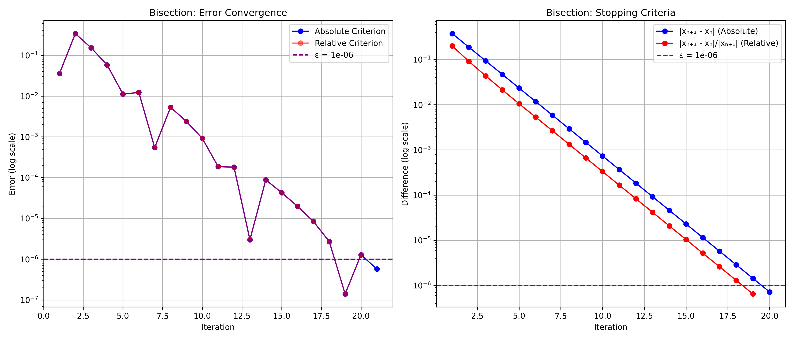

| Criterion | Iterations | Final Value         | Error               |
|-----------|------------|---------------------|---------------------|
| Absolute | 21 | 2.214298009872437 | 0.000000574284256 |
| Relative | 20 | 2.214298725128174 | 0.000001289539993 |

### 2. Newton's Method

#### Mathematical Formula

Starting with an initial guess x₍0₎, the Newton-Raphson iteration is:

x_{n+1} = x_n - f(x_n)⁄f'(x_n)

This formula comes from the linear approximation of f(x) at x_n:
f(x) ≈ f(x_n) + f'(x_n)(x - x_n)

Setting f(x) = 0 and solving for x gives the Newton iteration.

#### Algorithm

1. **Input**: Function f, derivative f', initial guess x₍0₎, tolerance \epsilon
2. **Initialize**: Set n = 0
3. **Iterate**:
   - Compute x_{n+1} = x_n - f(x_n)⁄f'(x_n)
   - If |error| < \epsilon, return x_{n+1}
   - Set n = n + 1
4. **Repeat** until convergence or maximum iterations

#### Convergence Rate

Quadratic convergence when f'(r) ≠ 0 at the root r:
|e_{n+1}| ≤ C|e_n|^2

where C = |f''(r)|⁄2|f'(r)|

#### Implementation

```python
def newton_method(f, df, x0, epsilon=1e-6, condition=stopping_condition_2):
    sequence = [x0]
    x = x0

    for k in range(100):
        try:
            x_new = x - f(x) / df(x)
            sequence.append(x_new)

            if condition(sequence[k], sequence[k - 1], epsilon):
                return sequence, "Second stopping condition (convergence)"

            x = x_new

        except ZeroDivisionError:
            return sequence, "Error: Zero derivative"

    return sequence, "First stopping condition (max iterations)"

```

#### Examples with Absolute Error Criterion ∣xₙ₊₁ − xₙ∣ < ε


##### Newton's Method (ε = 0.000001000000000)

| Iteration | xₙ                  | f(xₙ)               | f'(xₙ)              | Error               | Abs. Error          | Aitken              |
|-----------|---------------------|---------------------|---------------------|---------------------|---------------------|---------------------|
| 1 | 2.000000000000000 | 1.063304934288475 | 7.389056098930650 | 0.214297435588181 | N/A | N/A |
| 2 | 2.217639257797441 | -0.016709079945716 | 9.185620367861599 | 0.003341822209260 | 0.217639257797441 | N/A |
| 3 | 2.214297423147885 | 0.000000062201478 | 9.154974778205764 | 0.000000012440295 | 0.003341834649556 | 2.2143479607694583 |
| 4 | 2.214297435588181 | 0.000000000000001 | 9.154974892096355 | 0.000000000000000 | 0.000000012440295 | 2.214297435588134 |
| 5 | 2.214297435588181 | 0.000000000000001 | 9.154974892096355 | 0.000000000000000 | 0.000000000000000 | 2.2142974355881804 |

**Result**: Converged to 2.214297435588181 in 5 iterations
**Final Error**: 0.000000000000000
**Convergence Rate**: 3.004455781252174


##### Newton's Method (ε = 0.000000001000000)

| Iteration | xₙ                  | f(xₙ)               | f'(xₙ)              | Error               | Abs. Error          | Aitken              |
|-----------|---------------------|---------------------|---------------------|---------------------|---------------------|---------------------|
| 1 | 2.000000000000000 | 1.063304934288475 | 7.389056098930650 | 0.214297435588181 | N/A | N/A |
| 2 | 2.217639257797441 | -0.016709079945716 | 9.185620367861599 | 0.003341822209260 | 0.217639257797441 | N/A |
| 3 | 2.214297423147885 | 0.000000062201478 | 9.154974778205764 | 0.000000012440295 | 0.003341834649556 | 2.2143479607694583 |
| 4 | 2.214297435588181 | 0.000000000000001 | 9.154974892096355 | 0.000000000000000 | 0.000000012440295 | 2.214297435588134 |
| 5 | 2.214297435588181 | 0.000000000000001 | 9.154974892096355 | 0.000000000000000 | 0.000000000000000 | 2.2142974355881804 |
| 6 | 2.214297435588181 | 0.000000000000001 | 9.154974892096355 | 0.000000000000000 | 0.000000000000000 | 2.214297435588181 |

**Result**: Converged to 2.214297435588181 in 6 iterations
**Final Error**: 0.000000000000000
**Convergence Rate**: 3.004455781252174

#### Examples with Relative Error Criterion ∣xₙ₊₁ − xₙ∣/|xₙ₊₁| < ε

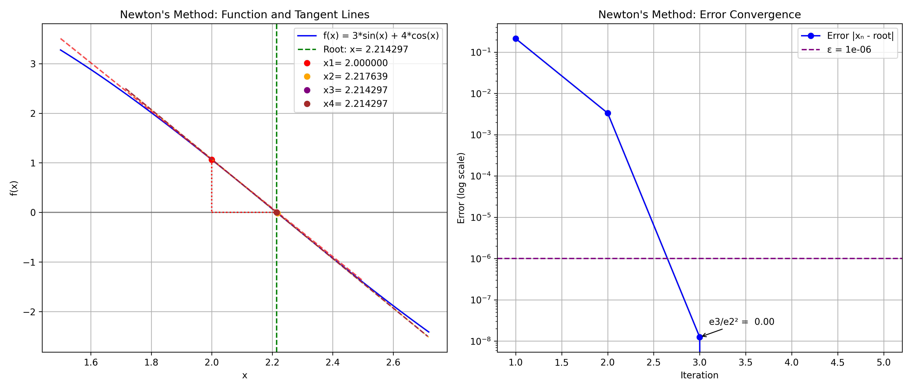

##### Newton's Method with Relative Criterion (ε = 0.000001000000000)

| Iteration | xₙ                  | f(xₙ)               | f'(xₙ)              | Error               | Rel. Difference     | Aitken              |
|-----------|---------------------|---------------------|---------------------|---------------------|---------------------|---------------------|
| 1 | 2.000000000000000 | 1.063304934288475 | -4.885630216944154 | 0.214297435588181 | N/A | N/A |
| 2 | 2.217639257797441 | -0.016709079945716 | -4.999972080586787 | 0.003341822209260 | 0.098140063597900 | N/A |
| 3 | 2.214297423147885 | 0.000000062201478 | -5.000000000000000 | 0.000000012440295 | 0.001509207667688 | 2.2143479607694583 |
| 4 | 2.214297435588181 | 0.000000000000001 | -5.000000000000000 | 0.000000000000000 | 0.000000005618168 | 2.214297435588134 |
| 5 | 2.214297435588181 | 0.000000000000001 | -5.000000000000000 | 0.000000000000000 | 0.000000000000000 | 2.2142974355881804 |

**Result**: Converged to 2.214297435588181 in 5 iterations
**Final Error**: 0.000000000000000
**Convergence Rate**: 3.004455781252174

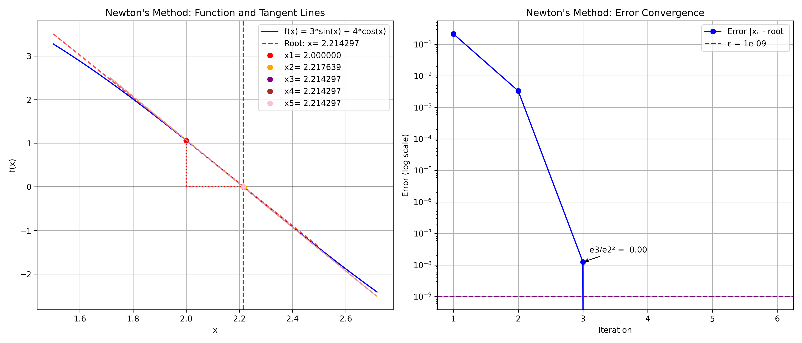

##### Newton's Method with Relative Criterion (ε = 0.000000001000000)

| Iteration | xₙ                  | f(xₙ)               | f'(xₙ)              | Error               | Rel. Difference     | Aitken              |
|-----------|---------------------|---------------------|---------------------|---------------------|---------------------|---------------------|
| 1 | 2.000000000000000 | 1.063304934288475 | -4.885630216944154 | 0.214297435588181 | N/A | N/A |
| 2 | 2.217639257797441 | -0.016709079945716 | -4.999972080586787 | 0.003341822209260 | 0.098140063597900 | N/A |
| 3 | 2.214297423147885 | 0.000000062201478 | -5.000000000000000 | 0.000000012440295 | 0.001509207667688 | 2.2143479607694583 |
| 4 | 2.214297435588181 | 0.000000000000001 | -5.000000000000000 | 0.000000000000000 | 0.000000005618168 | 2.214297435588134 |
| 5 | 2.214297435588181 | 0.000000000000001 | -5.000000000000000 | 0.000000000000000 | 0.000000000000000 | 2.2142974355881804 |
| 6 | 2.214297435588181 | 0.000000000000001 | -5.000000000000000 | 0.000000000000000 | 0.000000000000000 | 2.214297435588181 |

**Result**: Converged to 2.214297435588181 in 6 iterations
**Final Error**: 0.000000000000000
**Convergence Rate**: 3.004455781252174

#### Comparison of Stopping Criteria for Newton's Method

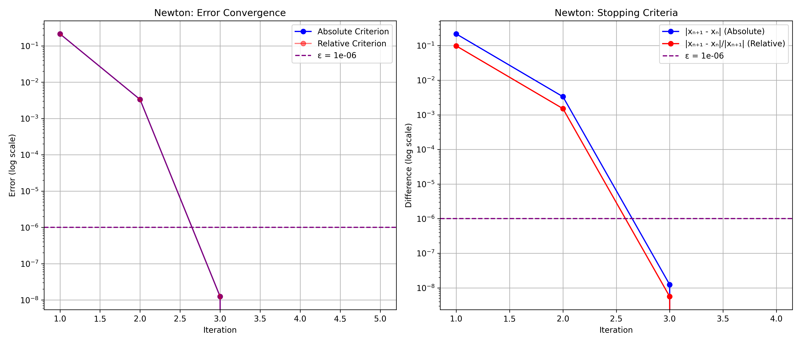

| Criterion | Iterations | Final Value         | Error               |
|-----------|------------|---------------------|---------------------|
| Absolute | 5 | 2.214297435588181 | 0.000000000000000 |
| Relative | 5 | 2.214297435588181 | 0.000000000000000 |

### 3. Secant Method

#### Mathematical Formula

The secant method approximates the derivative using two previous points:

x_{n+1} = x_n - f(x_n) ⋅ \frac{x_n - x_{n-1}}{f(x_n) - f(x_{n-1})}

This can be rewritten as:
x_{n+1} = \frac{x_{n-1}f(x_n) - x_n f(x_{n-1})}{f(x_n) - f(x_{n-1})}

#### Algorithm

1. **Input**: Function f, two initial points x₍0₎, x₍1₎, tolerance \epsilon
2. **Initialize**: Set n = 1
3. **Iterate**:
   - Compute x_{n+1} = x_n - f(x_n) ⋅ \frac{x_n - x_{n-1}}{f(x_n) - f(x_{n-1})}
   - If |error| < \epsilon, return x_{n+1}
   - Set n = n + 1
4. **Repeat** until convergence or maximum iterations

#### Convergence Rate

Superlinear convergence with rate ϕ = \frac{1 + \sqrt{5}}{2} ≈ 1.618 (golden ratio):
|e_{n+1}| ≤ C|e_n|^ϕ

#### Implementation

```python
def secant_method(f, x0, x1, epsilon=1e-6, condition=stopping_condition_2):
    sequence = []
    for k in range(100):
        try:
            f0, f1 = f(x0), f(x1)
            if abs(f1 - f0) < 1e-19:
                return sequence, "Error: Division by zero"

            x_new = x1 - f1 * (x1 - x0) / (f1 - f0)
            sequence.append(x_new)

            if k > 0 and condition(sequence[k], sequence[k - 1], epsilon):
                return sequence, "Second stopping condition (convergence)"

            x0, x1 = x1, x_new

        except (ZeroDivisionError, OverflowError):
            return sequence, "Error: Non-convergence"

    return sequence, "First stopping condition (max iterations)"

```

#### Examples with Absolute Error Criterion ∣xₙ₊₁ − xₙ∣ < ε

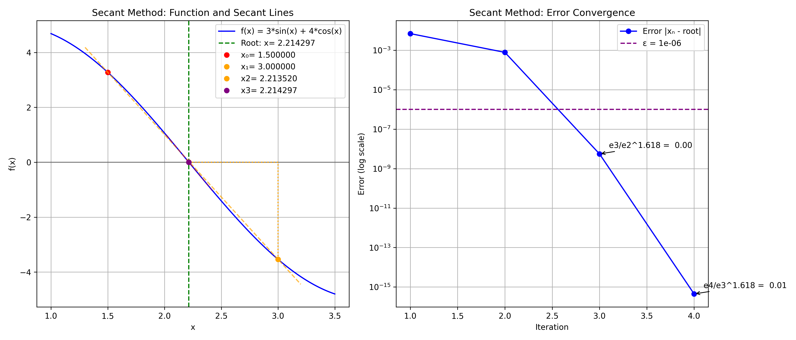

##### f(x) = 3*sin(x) + 4*cos(x) (ε = 1e-06, absolute criterion)

| Iteration | xₙ                  | f(xₙ)               | Error               | Abs. Error          | Aitken              |
|-----------|---------------------|---------------------|---------------------|---------------------|---------------------|
| 1 | 2.221244731448364 | -0.034736199876025 | 0.006947295860183 | N/A | N/A |
| 2 | 2.213520010199476 | 0.003887126551967 | 0.000777425388705 | 0.007724721248888 | N/A |
| 3 | 2.214297441142124 | -0.000000027769715 | 0.000000005553943 | 0.000777430942648 | 2.2142263533919904 |
| 4 | 2.214297435588180 | 0.000000000000003 | 0.000000000000000 | 0.000000005553944 | 2.21429743558822 |

**Result**: Converged to 2.214297435588180 in 4 iterations
**Final Error**: 0.000000000000000
**Convergence Rate**: 5.410312797770888

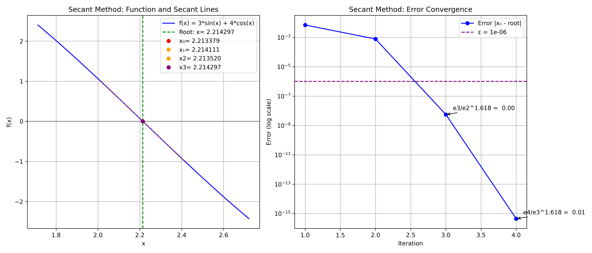

##### Secant method from bisection [a, b] (ε = 1e-06, absolute)

| Iteration | xₙ                  | f(xₙ)               | Error               | Abs. Error          | Aitken              |
|-----------|---------------------|---------------------|---------------------|---------------------|---------------------|
| 1 | 2.221244731448364 | -0.034736199876025 | 0.006947295860183 | N/A | N/A |
| 2 | 2.213520010199476 | 0.003887126551967 | 0.000777425388705 | 0.007724721248888 | N/A |
| 3 | 2.214297441142124 | -0.000000027769715 | 0.000000005553943 | 0.000777430942648 | 2.2142263533919904 |
| 4 | 2.214297435588180 | 0.000000000000003 | 0.000000000000000 | 0.000000005553944 | 2.21429743558822 |

**Result**: Converged to 2.214297435588180 in 4 iterations
**Final Error**: 0.000000000000000
**Convergence Rate**: 5.410312797770888

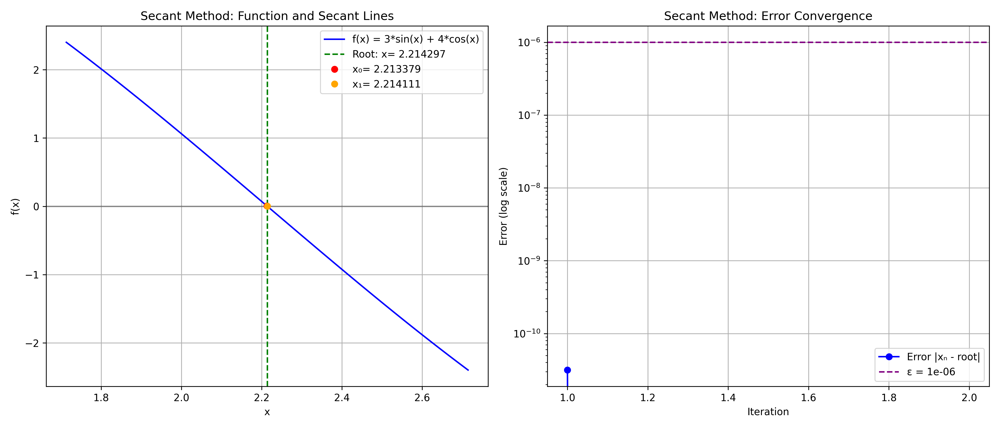

##### Secant method from bisection [x9, x10] (ε = 1e-06, absolute)

| Iteration | xₙ                  | f(xₙ)               | Error               | Abs. Error          | Aitken              |
|-----------|---------------------|---------------------|---------------------|---------------------|---------------------|
| 1 | 2.214297435619653 | -0.000000000157360 | 0.000000000031472 | N/A | N/A |
| 2 | 2.214297435588181 | 0.000000000000001 | 0.000000000000000 | 0.000000000031472 | N/A |

**Result**: Converged to 2.214297435588181 in 2 iterations
**Final Error**: 0.000000000000000
**Convergence Rate**: Insufficient data

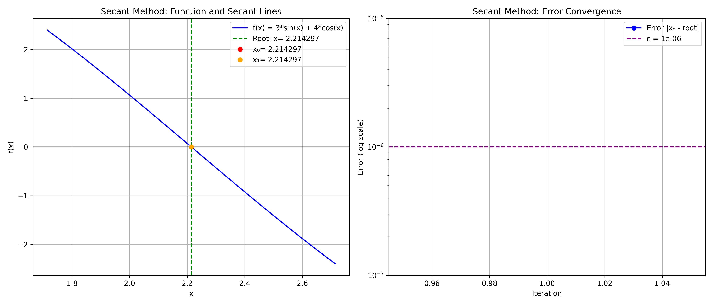

##### Secant method from Newton [x2, x3] (ε = 1e-06, absolute)

| Iteration | xₙ                  | f(xₙ)               | Error               | Abs. Error          | Aitken              |
|-----------|---------------------|---------------------|---------------------|---------------------|---------------------|
| 1 | 2.214297435588181 | 0.000000000000001 | 0.000000000000000 | N/A | N/A |

**Result**: Converged to 2.214297435588181 in 1 iterations
**Final Error**: 0.000000000000000
**Convergence Rate**: Insufficient data


##### f(x) = 3*sin(x) + 4*cos(x) (ε = 1e-09, absolute criterion)

| Iteration | xₙ                  | f(xₙ)               | Error               | Abs. Error          | Aitken              |
|-----------|---------------------|---------------------|---------------------|---------------------|---------------------|
| 1 | 2.221244731448364 | -0.034736199876025 | 0.006947295860183 | N/A | N/A |
| 2 | 2.213520010199476 | 0.003887126551967 | 0.000777425388705 | 0.007724721248888 | N/A |
| 3 | 2.214297441142124 | -0.000000027769715 | 0.000000005553943 | 0.000777430942648 | 2.2142263533919904 |
| 4 | 2.214297435588180 | 0.000000000000003 | 0.000000000000000 | 0.000000005553944 | 2.21429743558822 |
| 5 | 2.214297435588181 | 0.000000000000001 | 0.000000000000000 | 0.000000000000000 | 2.214297435588181 |

**Result**: Converged to 2.214297435588181 in 5 iterations
**Final Error**: 0.000000000000000
**Convergence Rate**: 5.410312797770888

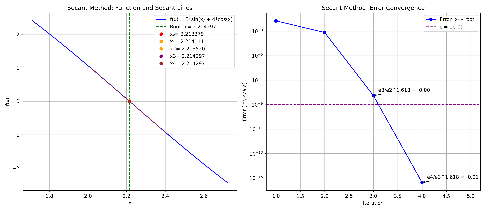

##### Secant method from bisection [a, b] (ε = 1e-09, absolute)

| Iteration | xₙ                  | f(xₙ)               | Error               | Abs. Error          | Aitken              |
|-----------|---------------------|---------------------|---------------------|---------------------|---------------------|
| 1 | 2.221244731448364 | -0.034736199876025 | 0.006947295860183 | N/A | N/A |
| 2 | 2.213520010199476 | 0.003887126551967 | 0.000777425388705 | 0.007724721248888 | N/A |
| 3 | 2.214297441142124 | -0.000000027769715 | 0.000000005553943 | 0.000777430942648 | 2.2142263533919904 |
| 4 | 2.214297435588180 | 0.000000000000003 | 0.000000000000000 | 0.000000005553944 | 2.21429743558822 |
| 5 | 2.214297435588181 | 0.000000000000001 | 0.000000000000000 | 0.000000000000000 | 2.214297435588181 |

**Result**: Converged to 2.214297435588181 in 5 iterations
**Final Error**: 0.000000000000000
**Convergence Rate**: 5.410312797770888

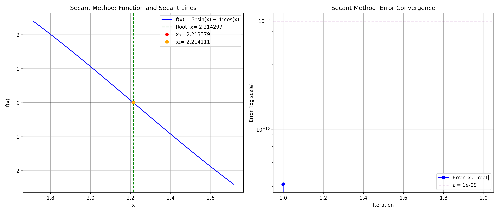

##### Secant method from bisection [x9, x10] (ε = 1e-09, absolute)

| Iteration | xₙ                  | f(xₙ)               | Error               | Abs. Error          | Aitken              |
|-----------|---------------------|---------------------|---------------------|---------------------|---------------------|
| 1 | 2.214297435619653 | -0.000000000157360 | 0.000000000031472 | N/A | N/A |
| 2 | 2.214297435588181 | 0.000000000000001 | 0.000000000000000 | 0.000000000031472 | N/A |

**Result**: Converged to 2.214297435588181 in 2 iterations
**Final Error**: 0.000000000000000
**Convergence Rate**: Insufficient data

#### Examples with Relative Error Criterion ∣xₙ₊₁ − xₙ∣/|xₙ₊₁| < ε


##### f(x) = 3*sin(x) + 4*cos(x) (ε = 1e-06, relative criterion) 

| Iteration | xₙ                  | f(xₙ)               | Error               | Rel. Difference     | Aitken              |
|-----------|---------------------|---------------------|---------------------|---------------------|---------------------|
| 1 | 2.221244731448364 | -0.034736199876025 | -4.999879338185890 | 0.006947295860183 | N/A | N/A |
| 2 | 2.213520010199476 | 0.003887126551967 | -4.999998489024489 | 0.000777425388705 | 0.003489790565838 | N/A |
| 3 | 2.214297441142124 | -0.000000027769715 | -5.000000000000000 | 0.000000005553943 | 0.000351095985662 | 2.2142263533919904 |
| 4 | 2.214297435588180 | 0.000000000000003 | -5.000000000000000 | 0.000000000000000 | 0.000000002508219 | 2.21429743558822 |

**Result**: Converged to 2.214297435588180 in 4 iterations
**Final Error**: 0.000000000000000
**Convergence Rate**: 5.410312797770888

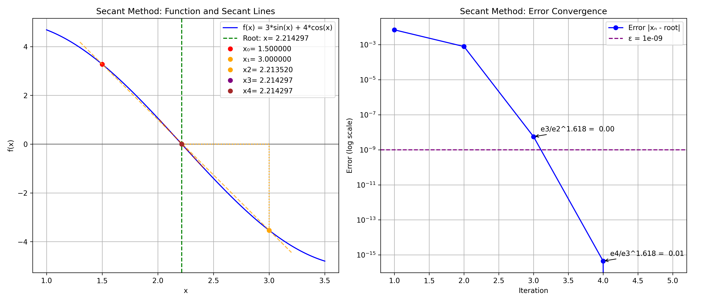

##### f(x) = 3*sin(x) + 4*cos(x) (ε = 1e-09, relative criterion) 

| Iteration | xₙ                  | f(xₙ)               | Error               | Rel. Difference     | Aitken              |
|-----------|---------------------|---------------------|---------------------|---------------------|---------------------|
| 1 | 2.221244731448364 | -0.034736199876025 | -4.999879338185890 | 0.006947295860183 | N/A | N/A |
| 2 | 2.213520010199476 | 0.003887126551967 | -4.999998489024489 | 0.000777425388705 | 0.003489790565838 | N/A |
| 3 | 2.214297441142124 | -0.000000027769715 | -5.000000000000000 | 0.000000005553943 | 0.000351095985662 | 2.2142263533919904 |
| 4 | 2.214297435588180 | 0.000000000000003 | -5.000000000000000 | 0.000000000000000 | 0.000000002508219 | 2.21429743558822 |
| 5 | 2.214297435588181 | 0.000000000000001 | -5.000000000000000 | 0.000000000000000 | 0.000000000000000 | 2.214297435588181 |

**Result**: Converged to 2.214297435588181 in 5 iterations
**Final Error**: 0.000000000000000
**Convergence Rate**: 5.410312797770888

#### Comparison of Stopping Criteria for Secant Method

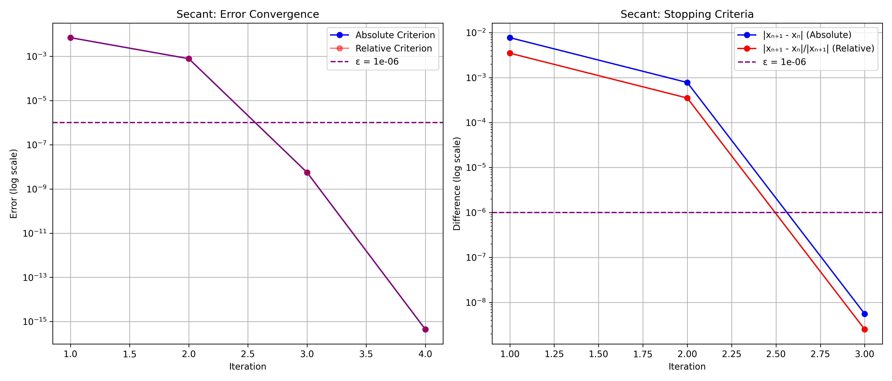

| Criterion | Iterations | Final Value         | Error               |
|-----------|------------|---------------------|---------------------|
| Absolute | 4 | 2.214297435588180 | 0.000000000000000 |
| Relative | 4 | 2.214297435588180 | 0.000000000000000 |

### 4. Fixed-point Method

#### Mathematical Formula

Transform the equation f(x) = 0 into the equivalent form x = g(x), then iterate:

x_{n+1} = g(x_n)

#### Algorithm

1. **Input**: Function f, initial guess x₍0₎, tolerance \epsilon
2. **Transform**: Define g(x) such that f(x) = 0 \Leftrightarrow x = g(x)
3. **Initialize**: Set n = 0
4. **Iterate**:
   - Compute x_{n+1} = g(x_n)
   - If |error| < \epsilon, return x_{n+1}
   - Set n = n + 1
5. **Repeat** until convergence or maximum iterations

#### Convergence Condition

Convergence requires |g'(r)| < 1 at the fixed point r:
|e_{n+1}| ≤ |g'(\xi)||e_n|

where \xi lies between x_n and r.

#### Implementation

```python
def fixed_point_method(f, x0, g, epsilon=1e-6, condition=stopping_condition_2):
    sequence = [x0]
    x = x0

    for k in range(100):
        try:
            x_new = g(x)
            sequence.append(x_new)

            if condition(sequence[k], sequence[k - 1], epsilon):
                return sequence, "Second stopping condition (convergence)"

            if abs(x_new) > 1e10 or math.isnan(x_new) or math.isinf(x_new):
                return sequence, "Error: Divergence"

            x = x_new

        except Exception:
            return sequence, "Error: Non-convergence"

    return sequence, "First stopping condition (max iterations)"

```

#### Best g(x) Function

The best g(x) function is: **x + 0.1 * f(x)**

| g(x)                     | Convergence | Error               |
|--------------------------|-------------|---------------------|
| x - 0.01 * f(x) | No | 4.868086038083111 |
| x + 0.01 * f(x) | No | 0.082781966380898 |
| x - 0.05 * f(x) | Yes | 0.000102981922725 |
| x + 0.05 * f(x) | Yes | 0.000000610362191 |
| x - 0.1 * f(x) | Yes | 0.000000000938023 |
| x + 0.1 * f(x) | Yes | 0.000000000504064 |
| x - 0.5 * f(x) | No | 4.524410342605131 |
| x + 0.5 * f(x) | No | 4.524410342605132 |
| x - 1.0 * f(x) | No | 4.171674420802168 |
| x + 1.0 * f(x) | No | 0.343884535127269 |

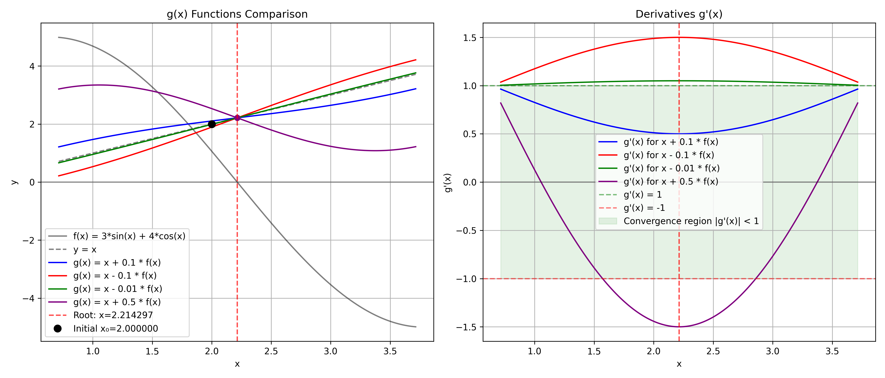

**Explanation**:

- The plot shows different g(x) functions and their derivatives
- For convergence, we need |g'(x)| < 1 at the root (shaded green area in right plot)
- The best g(x) has its derivative closest to 0 at the root, giving fastest convergence
- Functions with g'(x) outside [-1,1] at the root will diverge

#### Examples with Absolute Error Criterion ∣xₙ₊₁ − xₙ∣ < ε

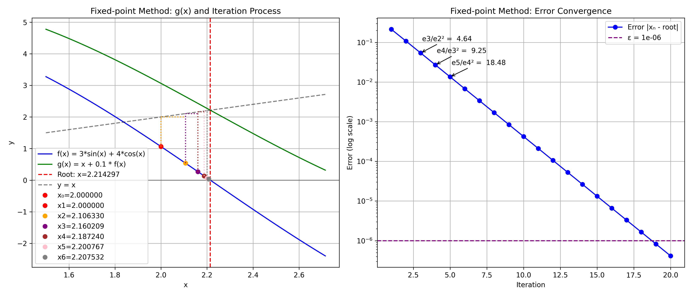

##### Fixed-point Method (ε = 0.000001000000000)

| Iteration | xₙ                  | g(xₙ)               | f(xₙ)               | Error               | Aitken              |
|-----------|---------------------|---------------------|---------------------|---------------------|---------------------|
| 1 | 2.000000000000000 | 3.063304934288476 | 1.063304934288475 | 0.214297435588181 | N/A |
| 2 | 2.106330493428847 | 2.645117019011117 | 0.538786525582269 | 0.107966942159333 | N/A |
| 3 | 2.160209145987074 | 2.430518748595957 | 0.270309602608882 | 0.054088289601106 | 2.215553422819048 |
| 4 | 2.187240106247963 | 2.322510246348561 | 0.135270140100598 | 0.027057329340218 | 2.214455585497856 |
| 5 | 2.200767120258022 | 2.268416632771748 | 0.067649512513726 | 0.013530315330159 | 2.214317241432201 |
| 6 | 2.207532071509395 | 2.241358633860802 | 0.033826562351407 | 0.006765364078786 | 2.2142999124873044 |
| 7 | 2.210914727744536 | 2.227828234706653 | 0.016913506962118 | 0.003382707843645 | 2.214297745237162 |
| 8 | 2.212606078440747 | 2.221062860145878 | 0.008456781705130 | 0.001691357147434 | 2.2142974742954493 |
| 9 | 2.213451756611260 | 2.217680150991858 | 0.004228394380597 | 0.000845678976920 | 2.214297440426624 |
| 10 | 2.213874596049320 | 2.215988793680623 | 0.002114197631303 | 0.000422839538861 | 2.2142974361929864 |
| 11 | 2.214086015812450 | 2.215143114683228 | 0.001057098870778 | 0.000211419775730 | 2.2142974356637812 |
| 12 | 2.214191725699528 | 2.214720275141808 | 0.000528549442280 | 0.000105709888653 | 2.2142974355976306 |
| 13 | 2.214244580643756 | 2.214508855365758 | 0.000264274722002 | 0.000052854944425 | 2.2142974355893608 |
| 14 | 2.214271008115956 | 2.214403145477065 | 0.000132137361109 | 0.000026427472225 | 2.2142974355883296 |
| 15 | 2.214284221852067 | 2.214350290532635 | 0.000066068680568 | 0.000013213736114 | 2.2142974355881986 |
| 16 | 2.214290828720124 | 2.214323863060410 | 0.000033034340286 | 0.000006606868057 | 2.2142974355881826 |
| 17 | 2.214294132154152 | 2.214310649324296 | 0.000016517170144 | 0.000003303434029 | 2.214297435588183 |
| 18 | 2.214295783871167 | 2.214304042456239 | 0.000008258585072 | 0.000001651717014 | 2.2142974355881826 |
| 19 | 2.214296609729674 | 2.214300739022209 | 0.000004129292535 | 0.000000825858507 | 2.2142974355881817 |
| 20 | 2.214297022658927 | 2.214299087305196 | 0.000002064646268 | 0.000000412929253 | 2.214297435588182 |

**Result**: Converged
**Final Value**: 2.214297022658927 in 20 iterations
**Final Error**: 0.000000412929253
**Convergence Rate**: 1.000615115141705

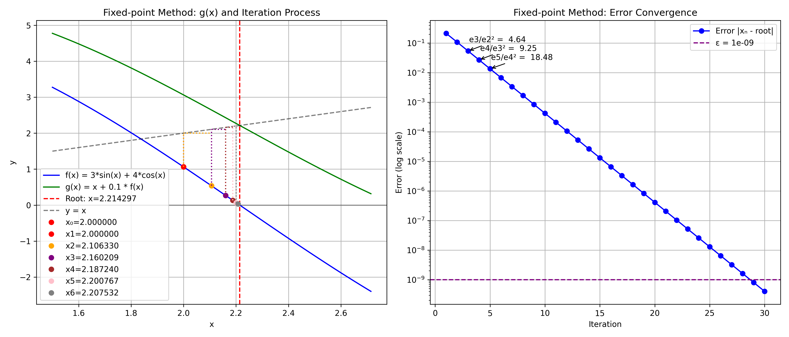

##### Fixed-point Method (ε = 0.000000001000000)

| Iteration | xₙ                  | g(xₙ)               | f(xₙ)               | Error               | Aitken              |
|-----------|---------------------|---------------------|---------------------|---------------------|---------------------|
| 1 | 2.000000000000000 | 3.063304934288476 | 1.063304934288475 | 0.214297435588181 | N/A |
| 2 | 2.106330493428847 | 2.645117019011117 | 0.538786525582269 | 0.107966942159333 | N/A |
| 3 | 2.160209145987074 | 2.430518748595957 | 0.270309602608882 | 0.054088289601106 | 2.215553422819048 |
| 4 | 2.187240106247963 | 2.322510246348561 | 0.135270140100598 | 0.027057329340218 | 2.214455585497856 |
| 5 | 2.200767120258022 | 2.268416632771748 | 0.067649512513726 | 0.013530315330159 | 2.214317241432201 |
| 6 | 2.207532071509395 | 2.241358633860802 | 0.033826562351407 | 0.006765364078786 | 2.2142999124873044 |
| 7 | 2.210914727744536 | 2.227828234706653 | 0.016913506962118 | 0.003382707843645 | 2.214297745237162 |
| 8 | 2.212606078440747 | 2.221062860145878 | 0.008456781705130 | 0.001691357147434 | 2.2142974742954493 |
| 9 | 2.213451756611260 | 2.217680150991858 | 0.004228394380597 | 0.000845678976920 | 2.214297440426624 |
| 10 | 2.213874596049320 | 2.215988793680623 | 0.002114197631303 | 0.000422839538861 | 2.2142974361929864 |
| 11 | 2.214086015812450 | 2.215143114683228 | 0.001057098870778 | 0.000211419775730 | 2.2142974356637812 |
| 12 | 2.214191725699528 | 2.214720275141808 | 0.000528549442280 | 0.000105709888653 | 2.2142974355976306 |
| 13 | 2.214244580643756 | 2.214508855365758 | 0.000264274722002 | 0.000052854944425 | 2.2142974355893608 |
| 14 | 2.214271008115956 | 2.214403145477065 | 0.000132137361109 | 0.000026427472225 | 2.2142974355883296 |
| 15 | 2.214284221852067 | 2.214350290532635 | 0.000066068680568 | 0.000013213736114 | 2.2142974355881986 |
| 16 | 2.214290828720124 | 2.214323863060410 | 0.000033034340286 | 0.000006606868057 | 2.2142974355881826 |
| 17 | 2.214294132154152 | 2.214310649324296 | 0.000016517170144 | 0.000003303434029 | 2.214297435588183 |
| 18 | 2.214295783871167 | 2.214304042456239 | 0.000008258585072 | 0.000001651717014 | 2.2142974355881826 |
| 19 | 2.214296609729674 | 2.214300739022209 | 0.000004129292535 | 0.000000825858507 | 2.2142974355881817 |
| 20 | 2.214297022658927 | 2.214299087305196 | 0.000002064646268 | 0.000000412929253 | 2.214297435588182 |
| 21 | 2.214297229123554 | 2.214298261446689 | 0.000001032323135 | 0.000000206464627 | 2.214297435588181 |
| 22 | 2.214297332355867 | 2.214297848517435 | 0.000000516161568 | 0.000000103232313 | 2.214297435588181 |
| 23 | 2.214297383972024 | 2.214297642052808 | 0.000000258080784 | 0.000000051616157 | 2.214297435588181 |
| 24 | 2.214297409780102 | 2.214297538820495 | 0.000000129040393 | 0.000000025808078 | 2.214297435588181 |
| 25 | 2.214297422684142 | 2.214297487204338 | 0.000000064520197 | 0.000000012904039 | 2.2142974355881826 |
| 26 | 2.214297429136161 | 2.214297461396259 | 0.000000032260098 | 0.000000006452019 | 2.2142974355881817 |
| 27 | 2.214297432362171 | 2.214297448492220 | 0.000000016130049 | 0.000000003226010 | 2.214297435588182 |
| 28 | 2.214297433975176 | 2.214297442040201 | 0.000000008065025 | 0.000000001613005 | 2.214297435588181 |
| 29 | 2.214297434781678 | 2.214297438814191 | 0.000000004032513 | 0.000000000806502 | 2.214297435588181 |
| 30 | 2.214297435184930 | 2.214297437201187 | 0.000000002016257 | 0.000000000403251 | 2.2142974355881826 |

**Result**: Converged
**Final Value**: 2.214297435184930 in 30 iterations
**Final Error**: 0.000000000403251
**Convergence Rate**: 1.000395431162525

#### Examples with Relative Error Criterion ∣xₙ₊₁ − xₙ∣/|xₙ₊₁| < ε

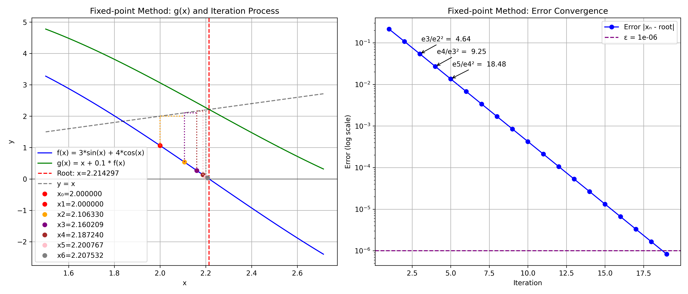

##### Fixed-point Method with Relative Criterion (ε = 0.000001000000000)

| Iteration | xₙ                  | g(xₙ)               | f(xₙ)               | Error               | Rel. Difference     | Aitken              |
|-----------|---------------------|---------------------|---------------------|---------------------|---------------------|---------------------|
| 1 | 2.000000000000000 | 3.063304934288476 | 1.063304934288475 | 0.214297435588181 | N/A | N/A |
| 2 | 2.106330493428847 | 2.645117019011117 | 0.538786525582269 | 0.107966942159333 | 0.050481391101999 | N/A |
| 3 | 2.160209145987074 | 2.430518748595957 | 0.270309602608882 | 0.054088289601106 | 0.024941405631170 | 2.215553422819048 |
| 4 | 2.187240106247963 | 2.322510246348561 | 0.135270140100598 | 0.027057329340218 | 0.012358478698188 | 2.214455585497856 |
| 5 | 2.200767120258022 | 2.268416632771748 | 0.067649512513726 | 0.013530315330159 | 0.006146499502625 | 2.214317241432201 |
| 6 | 2.207532071509395 | 2.241358633860802 | 0.033826562351407 | 0.006765364078786 | 0.003064486056027 | 2.2142999124873044 |
| 7 | 2.210914727744536 | 2.227828234706653 | 0.016913506962118 | 0.003382707843645 | 0.001529980416111 | 2.214297745237162 |
| 8 | 2.212606078440747 | 2.221062860145878 | 0.008456781705130 | 0.001691357147434 | 0.000764415642121 | 2.2142974742954493 |
| 9 | 2.213451756611260 | 2.217680150991858 | 0.004228394380597 | 0.000845678976920 | 0.000382063068683 | 2.214297440426624 |
| 10 | 2.213874596049320 | 2.215988793680623 | 0.002114197631303 | 0.000422839538861 | 0.000190995207594 | 2.2142974361929864 |
| 11 | 2.214086015812450 | 2.215143114683228 | 0.001057098870778 | 0.000211419775730 | 0.000095488504792 | 2.2142974356637812 |
| 12 | 2.214191725699528 | 2.214720275141808 | 0.000528549442280 | 0.000105709888653 | 0.000047741975481 | 2.2142974355976306 |
| 13 | 2.214244580643756 | 2.214508855365758 | 0.000264274722002 | 0.000052854944425 | 0.000023870418241 | 2.2142974355893608 |
| 14 | 2.214271008115956 | 2.214403145477065 | 0.000132137361109 | 0.000026427472225 | 0.000011935066712 | 2.2142974355883296 |
| 15 | 2.214284221852067 | 2.214350290532635 | 0.000066068680568 | 0.000013213736114 | 0.000005967497750 | 2.2142974355881986 |
| 16 | 2.214290828720124 | 2.214323863060410 | 0.000033034340286 | 0.000006606868057 | 0.000002983739973 | 2.2142974355881826 |
| 17 | 2.214294132154152 | 2.214310649324296 | 0.000016517170144 | 0.000003303434029 | 0.000001491867761 | 2.214297435588183 |
| 18 | 2.214295783871167 | 2.214304042456239 | 0.000008258585072 | 0.000001651717014 | 0.000000745933324 | 2.2142974355881826 |
| 19 | 2.214296609729674 | 2.214300739022209 | 0.000004129292535 | 0.000000825858507 | 0.000000372966523 | 2.2142974355881817 |

**Result**: Converged
**Final Value**: 2.214296609729674 in 19 iterations
**Final Error**: 0.000000825858507
**Convergence Rate**: 1.000651298408151

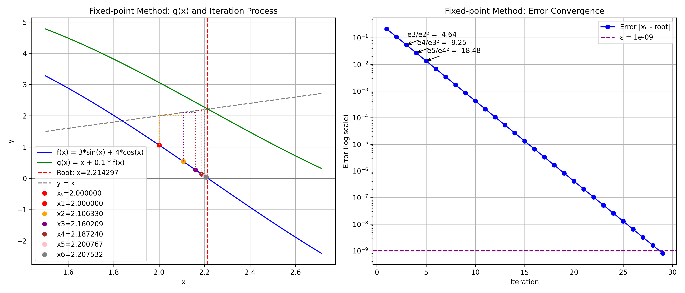

##### Fixed-point Method with Relative Criterion (ε = 0.000000001000000)

| Iteration | xₙ                  | g(xₙ)               | f(xₙ)               | Error               | Rel. Difference     | Aitken              |
|-----------|---------------------|---------------------|---------------------|---------------------|---------------------|---------------------|
| 1 | 2.000000000000000 | 3.063304934288476 | 1.063304934288475 | 0.214297435588181 | N/A | N/A |
| 2 | 2.106330493428847 | 2.645117019011117 | 0.538786525582269 | 0.107966942159333 | 0.050481391101999 | N/A |
| 3 | 2.160209145987074 | 2.430518748595957 | 0.270309602608882 | 0.054088289601106 | 0.024941405631170 | 2.215553422819048 |
| 4 | 2.187240106247963 | 2.322510246348561 | 0.135270140100598 | 0.027057329340218 | 0.012358478698188 | 2.214455585497856 |
| 5 | 2.200767120258022 | 2.268416632771748 | 0.067649512513726 | 0.013530315330159 | 0.006146499502625 | 2.214317241432201 |
| 6 | 2.207532071509395 | 2.241358633860802 | 0.033826562351407 | 0.006765364078786 | 0.003064486056027 | 2.2142999124873044 |
| 7 | 2.210914727744536 | 2.227828234706653 | 0.016913506962118 | 0.003382707843645 | 0.001529980416111 | 2.214297745237162 |
| 8 | 2.212606078440747 | 2.221062860145878 | 0.008456781705130 | 0.001691357147434 | 0.000764415642121 | 2.2142974742954493 |
| 9 | 2.213451756611260 | 2.217680150991858 | 0.004228394380597 | 0.000845678976920 | 0.000382063068683 | 2.214297440426624 |
| 10 | 2.213874596049320 | 2.215988793680623 | 0.002114197631303 | 0.000422839538861 | 0.000190995207594 | 2.2142974361929864 |
| 11 | 2.214086015812450 | 2.215143114683228 | 0.001057098870778 | 0.000211419775730 | 0.000095488504792 | 2.2142974356637812 |
| 12 | 2.214191725699528 | 2.214720275141808 | 0.000528549442280 | 0.000105709888653 | 0.000047741975481 | 2.2142974355976306 |
| 13 | 2.214244580643756 | 2.214508855365758 | 0.000264274722002 | 0.000052854944425 | 0.000023870418241 | 2.2142974355893608 |
| 14 | 2.214271008115956 | 2.214403145477065 | 0.000132137361109 | 0.000026427472225 | 0.000011935066712 | 2.2142974355883296 |
| 15 | 2.214284221852067 | 2.214350290532635 | 0.000066068680568 | 0.000013213736114 | 0.000005967497750 | 2.2142974355881986 |
| 16 | 2.214290828720124 | 2.214323863060410 | 0.000033034340286 | 0.000006606868057 | 0.000002983739973 | 2.2142974355881826 |
| 17 | 2.214294132154152 | 2.214310649324296 | 0.000016517170144 | 0.000003303434029 | 0.000001491867761 | 2.214297435588183 |
| 18 | 2.214295783871167 | 2.214304042456239 | 0.000008258585072 | 0.000001651717014 | 0.000000745933324 | 2.2142974355881826 |
| 19 | 2.214296609729674 | 2.214300739022209 | 0.000004129292535 | 0.000000825858507 | 0.000000372966523 | 2.2142974355881817 |
| 20 | 2.214297022658927 | 2.214299087305196 | 0.000002064646268 | 0.000000412929253 | 0.000000186483227 | 2.214297435588182 |
| 21 | 2.214297229123554 | 2.214298261446689 | 0.000001032323135 | 0.000000206464627 | 0.000000093241605 | 2.214297435588181 |
| 22 | 2.214297332355867 | 2.214297848517435 | 0.000000516161568 | 0.000000103232313 | 0.000000046620800 | 2.214297435588181 |
| 23 | 2.214297383972024 | 2.214297642052808 | 0.000000258080784 | 0.000000051616157 | 0.000000023310400 | 2.214297435588181 |
| 24 | 2.214297409780102 | 2.214297538820495 | 0.000000129040393 | 0.000000025808078 | 0.000000011655200 | 2.214297435588181 |
| 25 | 2.214297422684142 | 2.214297487204338 | 0.000000064520197 | 0.000000012904039 | 0.000000005827600 | 2.2142974355881826 |
| 26 | 2.214297429136161 | 2.214297461396259 | 0.000000032260098 | 0.000000006452019 | 0.000000002913800 | 2.2142974355881817 |
| 27 | 2.214297432362171 | 2.214297448492220 | 0.000000016130049 | 0.000000003226010 | 0.000000001456900 | 2.214297435588182 |
| 28 | 2.214297433975176 | 2.214297442040201 | 0.000000008065025 | 0.000000001613005 | 0.000000000728450 | 2.214297435588181 |
| 29 | 2.214297434781678 | 2.214297438814191 | 0.000000004032513 | 0.000000000806502 | 0.000000000364225 | 2.214297435588181 |

**Result**: Converged
**Final Value**: 2.214297434781678 in 29 iterations
**Final Error**: 0.000000000806502
**Convergence Rate**: 1.000410076761137

#### Comparison of Stopping Criteria for Fixed-point Method

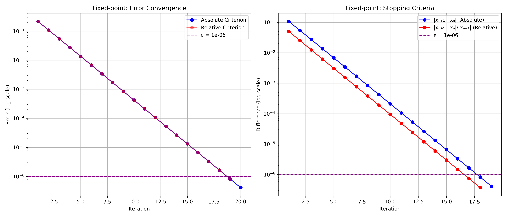

| Criterion | Iterations | Final Value         | Error               |
|-----------|------------|---------------------|---------------------|
| Absolute | 20 | 2.214297022658927 | 0.000000412929253 |
| Relative | 19 | 2.214296609729674 | 0.000000825858507 |

### 5. Aitken's Acceleration

#### Mathematical Formula

For a sequence \{p_n\} converging to limit p, Aitken's Δ^2 method produces:

p̂_n = p_n - (Δ p_n)^2⁄Δ^2 p_n

where:
- Δ p_n = p_{n+1} - p_n (forward difference)
- Δ^2 p_n = Δ p_{n+1} - Δ p_n = p_{n+2} - 2p_{n+1} + p_n (second difference)

Expanded form:
p̂_n = p_n - \frac{(p_{n+1} - p_n)^2}{p_{n+2} - 2p_{n+1} + p_n}

#### Algorithm

1. **Input**: Sequence \{p_0, p_1, p_2, \ldots\}, tolerance \epsilon
2. **For each** n ≥ 0 where p_{n+2} exists:
   - Compute Δ^2 p_n = p_{n+2} - 2p_{n+1} + p_n
   - If |Δ^2 p_n| < \text{small threshold}, skip (avoid division by zero)
   - Compute p̂_n = p_n - \frac{(p_{n+1} - p_n)^2}{Δ^2 p_n}
3. **Return** accelerated sequence

#### Implementation

```python
def aitken_acceleration(sequence, epsilon=1e-6):
    if len(sequence) < 3:
        return sequence, "Short sequence - minimum 3 elements needed"

    aitken_sequence = []

    for i in range(len(sequence) - 2):
        p0, p1, p2 = sequence[i], sequence[i + 1], sequence[i + 2]

        denominator = p0 + p2 - 2 * p1
        if abs(denominator) < 1e-19:
            accelerated = p2
        else:
            accelerated = p0 - ((p1 - p0)**2 / denominator)

        aitken_sequence.append(accelerated)

    return aitken_sequence, "First stopping condition (max iterations)"

```

### 6. Real-time Aitken's Acceleration with Fixed-point

#### Mathematical Formula

This method applies Aitken's acceleration dynamically during the Fixed-point process:

1. Generate a few iterations using Fixed-point: x_{n+1} = g(x_n)
2. When three consecutive points are available, compute the Aitken accelerated value:
   x̂_n = x_n - \frac{(x_{n+1} - x_n)^2}{x_{n+2} - 2x_{n+1} + x_n}
3. Replace the current approximation with the accelerated value and continue

#### Algorithm

1. **Input**: Function f, initial guess x₍0₎, tolerance \epsilon, max iterations
2. **Initialize**: Set n = 0, sequence = [x₍0₎]
3. **Iterate**:
   - Compute next Fixed-point value: x_{n+1} = g(x_n)
   - Add x_{n+1} to sequence
   - If at least 3 points exist in sequence, apply Aitken acceleration
   - If accelerated value meets convergence criterion, return it
   - Otherwise, continue with the next Fixed-point
4. **Return** final value and performance metrics

#### Implementation

```python
def fixed_point_with_aitken(f, x0, g, epsilon=1e-6, max_iterations=20, condition=stopping_condition_2):
    regular_sequence = [x0]
    aitken_values = {}

    x = x0

    method_info = {
        'converged': False,
        'convergence_type': None,
        'final_value': None,
        'iterations': 0,
        'aitken_applications': 0
    }

    for k in range(max_iterations):
        x_new = g(x)
        regular_sequence.append(x_new)
        method_info['iterations'] = k + 1

        if k ≥ 2:
            p0, p1, p2 = regular_sequence[k -
                                          2], regular_sequence[k - 1], regular_sequence[k]
            denominator = p2 - 2 * p1 + p0

            if abs(denominator) > 1e-19:
                aitken_val = p0 - (p1 - p0)**2 / denominator
                aitken_values[k] = aitken_val
                method_info['aitken_applications'] += 1

                if (k - 1) in aitken_values:
                    if condition(aitken_val, aitken_values[k - 1], epsilon):
                        method_info['converged'] = True
                        method_info['convergence_type'] = 'Aitken acceleration'
                        method_info['final_value'] = aitken_val
                        break

        x = x_new

        if condition(regular_sequence[-1], regular_sequence[-2], epsilon):
            method_info['converged'] = True
            method_info['convergence_type'] = 'Regular iteration'
            method_info['final_value'] = regular_sequence[-1]
            break

        if abs(x) > 1e10:
            method_info['convergence_type'] = 'Diverged'
            method_info['final_value'] = x
            break

    if not method_info['converged'] and method_info['convergence_type'] != 'Diverged':
        method_info['convergence_type'] = 'Max iterations reached'
        if aitken_values:
            last_aitken_key = max(aitken_values.keys())
            method_info['final_value'] = aitken_values[last_aitken_key]
        else:
            method_info['final_value'] = regular_sequence[-1]

    return regular_sequence, aitken_values, method_info

```

#### Examples with Real-time Aitken Acceleration

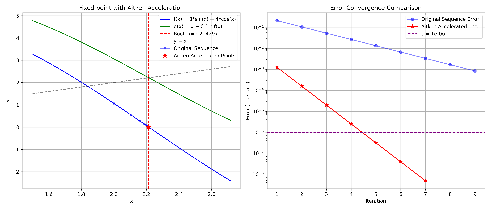

##### Fixed-point with Real-time Aitken (ε = 0.000001000000000)

| Iteration | xₙ                  | f(xₙ)               | Error               | Aitken Applied | Acceleration Effect             |
|-----------|---------------------|---------------------|---------------------|----------------|---------------------------------|
| 1 | 2.000000000000000 | 1.063304934288475 | 0.214297435588181 | Yes | N/A |
| 2 | 2.106330493428847 | 0.538786525582269 | 0.107966942159333 | Yes | 682.687346342903993x faster |
| 3 | 2.160209145987074 | 0.270309602608882 | 0.054088289601106 | Yes | Excellent |
| 4 | 2.187240106247963 | 0.135270140100598 | 0.027057329340218 | Yes | Excellent |
| 5 | 2.200767120258022 | 0.067649512513726 | 0.013530315330159 | Yes | Excellent |
| 6 | 2.207532071509395 | 0.033826562351407 | 0.006765364078786 | Yes | Excellent |
| 7 | 2.210914727744536 | 0.016913506962118 | 0.003382707843645 | Yes | Excellent |
| 8 | 2.212606078440747 | 0.008456781705130 | 0.001691357147434 | No | N/A |
| 9 | 2.213451756611260 | 0.004228394380597 | 0.000845678976920 | No | N/A |

**Result**: Converged to 2.214297474295448 in 8 iterations
**Final Error**: 0.000000038707267
**Aitken Applications**: 6
**Acceleration Effect**: Significant improvement over basic Fixed-point

## Performance Analysis

### Summary Table

| Method                  | Avg Iterations | Avg Time (ms)       | Avg Error           | Convergence Rate    | Success Rate        |
|-------------------------|----------------|---------------------|---------------------|---------------------|---------------------|
| Bisection | 25.500000000000000 | 0.034868717193604 | 0.000000466130685 | 1.321536756744824 | 40.000000000000000% |
| Newton | 5.500000000000000 | 0.007688999176025 | 0.000000000000000 | 3.004455781252174 | 40.000000000000000% |
| Secant | 3.555555555555555 | 0.003602769639757 | 0.000000000000000 | 5.410312797770888 | 90.000000000000000% |
| Fixed-point | 24.500000000000000 | 0.022768974304199 | 0.000000309999379 | 1.000517980368379 | 40.000000000000000% |
| Bisection + Aitken | 23.500000000000000 | 0.016093254089355 | 0.000000406817079 | 0.228259968535387 | 40.000000000000000% |
| Fixed-point + Aitken | 22.500000000000000 | 0.011503696441650 | 0.000000000000001 | 1.009092223122644 | 40.000000000000000% |
| Real-time Aitken | 9.750000000000000 | 0.026226043701172 | 0.000449276454738 | 1.001410231401462 | 40.000000000000000% |
| Periodic Aitken | 8.000000000000000 | 0.017523765563965 | 0.000000000000015 | 1.931300996100426 | 20.000000000000000% |
